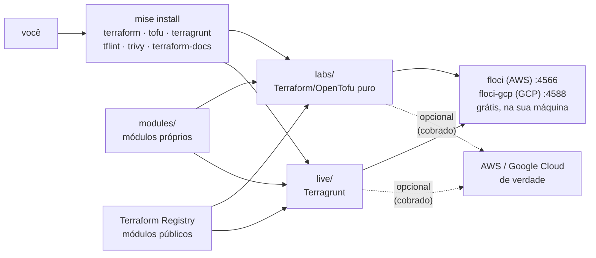

<!-- TOC -->

- [learning-terraform](#learning-terraform)
  - [O que você vai encontrar](#o-que-você-vai-encontrar)
  - [Como tudo se encaixa](#como-tudo-se-encaixa)
  - [Início rápido (local e gratuito)](#início-rápido-local-e-gratuito)
  - [A trilha de aprendizado](#a-trilha-de-aprendizado)
  - [Estrutura do repositório](#estrutura-do-repositório)
  - [Versões utilizadas](#versões-utilizadas)
  - [Documentação](#documentação)
  - [Exemplos legados (Terraform 0.11)](#exemplos-legados-terraform-011)
  - [Contribuindo](#contribuindo)
  - [Desenvolvedores](#desenvolvedores)
  - [Licença](#licença)

<!-- TOC -->

# learning-terraform

[](https://app.codeac.io/github/aeciopires/terraform)

Uma trilha **do zero ao avançado** para aprender **Terraform**, **OpenTofu** e
**Terragrunt** criando infraestrutura na **AWS** e no **Google Cloud (GCP)** —
tudo rodando **na sua máquina, de graça**, com os emuladores
[floci](https://floci.io) (AWS) e [floci-gcp](https://github.com/floci-io/floci-gcp)
(GCP). O mesmo código, sem nenhuma alteração, também funciona na nuvem real.

> **Para quem é:** pessoas iniciantes em Infraestrutura como Código (IaC).
> Cada conceito difícil vem com uma analogia, um diagrama, um exemplo que
> roda e um teste que prova que funciona.

## O que você vai encontrar

- **10 lições** em [`docs/`](docs/00-TRILHA.md): de "o que é IaC" a
  Terragrunt com DRY, testes, documentação automática e boas práticas.
- **4 laboratórios** em [`labs/`](labs/) que você executa passo a passo,
  do primeiro `terraform apply` (sem nuvem) ao consumo de módulos.
- **2 módulos próprios** em [`modules/`](modules/): mensageria fan-out na
  AWS (SNS + SQS + DLQ) e no GCP (Pub/Sub + dead-letter), cada um com
  **wrapper** (o padrão dos
  [terraform-aws-modules](https://github.com/terraform-aws-modules/terraform-aws-lambda/tree/master/wrappers)),
  exemplo, testes unitários e de integração e documentação gerada pelo
  [terraform-docs](https://terraform-docs.io).
- **Uma stack completa com Terragrunt** em [`live/`](live/README.md) —
  VPC, S3, SNS/SQS, ALB, ECS Fargate e RDS PostgreSQL na AWS; GCS,
  Pub/Sub, Cloud Run, VPC e Cloud SQL no GCP — usando módulos públicos e
  os módulos próprios, parametrizada por **nuvem / conta / ambiente /
  região**.
- **Testes em várias camadas**: `fmt`, `validate`, `tflint`, `trivy`,
  `terraform test`/`tofu test` com *mocks*, testes de integração nos
  emuladores, *smoke tests* em Python e detecção de *drift*.
- **Um `Makefile`** para executar tudo em massa, **mise** para instalar as
  ferramentas nas versões fixadas e **uv** para os pacotes Python.

## Como tudo se encaixa



A troca entre emulador e nuvem real é feita **apenas por variáveis de
ambiente** (`AWS_ENDPOINT_URL`, `GOOGLE_*_CUSTOM_ENDPOINT`): nenhuma linha de
código muda. Os detalhes estão em
[`docs/04-providers-e-floci.md`](docs/04-providers-e-floci.md).

## Início rápido (local e gratuito)

Pré-requisitos: Docker, [mise](https://mise.jdx.dev) e git — veja
[`REQUIREMENTS.md`](REQUIREMENTS.md) (`make check` diz o que falta).

```bash
git clone https://github.com/aeciopires/terraform.git learning-terraform
cd learning-terraform
mise trust && mise install        # terraform, tofu, terragrunt, tflint, trivy, uv...
make install                      # pacotes Python (uv) e plugins do tflint
cp .env.example .env
make floci-start floci-bootstrap  # emuladores + buckets de state

make test                         # verificações sem nuvem (fmt, lint, testes unitários...)
make tg-apply ENV=dev             # cria a stack dev (AWS + GCP) nos emuladores
make test-smoke                   # o ALB e o Cloud Run respondem?
make list-resources PREFIX=lt-dev # o que foi criado
make tg-destroy ENV=dev           # apaga tudo
```

Depois comece a trilha por [`docs/00-TRILHA.md`](docs/00-TRILHA.md).

## A trilha de aprendizado

| # | Lição | Prática |
|---|---|---|
| 1 | [IaC, Terraform e OpenTofu](docs/01-iac-terraform-opentofu.md) | — |
| 2 | [A linguagem HCL](docs/02-hcl-basico.md) | [lab 01](labs/01-primeiros-passos/README.md) (sem nuvem) |
| 3 | [State e backends](docs/03-state-e-backends.md) | lab 01 e lab 02 |
| 4 | [Providers e os emuladores floci](docs/04-providers-e-floci.md) | [lab 02 (AWS)](labs/02-aws-floci/README.md), [lab 03 (GCP)](labs/03-gcp-floci/README.md) |
| 5 | [Módulos e o padrão wrapper](docs/05-modulos.md) | [lab 04](labs/04-modulos/README.md), [`modules/`](modules/) |
| 6 | [Terragrunt](docs/06-terragrunt.md) | [`live/`](live/README.md) |
| 7 | [Testes](docs/07-testes.md) | `make test`, `make test-integration`, `make test-smoke` |
| 8 | [Documentação com terraform-docs](docs/08-terraform-docs.md) | `make docs`, `make docs-check` |
| 9 | [Boas práticas](docs/09-boas-praticas.md) | todo o repositório |
| 10 | [Verificar e listar recursos](docs/10-verificar-recursos.md) | AWS CLI, gcloud, `make list-resources` |

## Estrutura do repositório

```text
.
├── README.md · REQUIREMENTS.md · CONTRIBUTING.md · CHANGELOG.md · CLAUDE.md
├── mise.toml              # versões fixadas de todas as ferramentas
├── pyproject.toml uv.lock # pacotes Python (scripts e testes)
├── docker-compose.yml     # floci 2.1.0 + floci-gcp 0.9.0
├── .env.example           # variáveis que apontam as ferramentas para os emuladores
├── Makefile               # atalhos para executar tudo em massa
├── .tflint.hcl .terraform-docs.yml .pre-commit-config.yaml
├── docs/                  # as lições (pt-BR)
├── labs/                  # laboratórios guiados
├── modules/               # módulos próprios (README e comentários em en-US)
│   ├── aws-messaging/     # SNS + SQS + DLQ  · wrappers/ · examples/ · tests/
│   └── gcp-messaging/     # Pub/Sub + DLQ    · wrappers/ · examples/ · tests/
├── live/                  # Terragrunt: <nuvem>/<conta>/<ambiente>/<região>/<unidade>
├── scripts/               # check-deps.sh, list_resources.py
└── tests/                 # testes Python (unitários e smoke)
```

## Versões utilizadas

Versões estáveis mais recentes em **03/10/2026**, conferidas nas páginas de
release de cada projeto. Elas mudam com frequência: confira antes de
atualizar ([`CONTRIBUTING.md`](CONTRIBUTING.md#atualizando-versões)).

| Ferramenta / módulo | Versão |
|---|---|
| Terraform | 1.16.5 |
| OpenTofu | 1.13.1 |
| Terragrunt | 1.1.6 |
| Provider `hashicorp/aws` | 6.67.0 |
| Provider `hashicorp/google` / `google-beta` | 8.5.0 (7.46.1 na unidade Cloud Run — veja [`docs/06-terragrunt.md`](docs/06-terragrunt.md#versões-de-provider-por-unidade)) |
| tflint · trivy · terraform-docs | 0.64.0 · 0.75.0 · 0.24.0 |
| floci · floci-gcp | 2.1.0 · 0.9.0 |
| `terraform-aws-modules`: vpc · s3-bucket · alb · ecs · rds · security-group | 6.7.3 · 5.16.1 · 10.5.1 · 7.6.1 · 7.2.2 · 6.0.0 |
| `terraform-google-modules`: network · cloud-storage · sql-db · `GoogleCloudPlatform/cloud-run` | 18.3.0 · 12.4.0 · 28.3.0 · 0.34.1 |

## Documentação

| Arquivo | Conteúdo |
|---|---|
| [`REQUIREMENTS.md`](REQUIREMENTS.md) | sistemas operacionais, instalação, emuladores, portas, nomes e tags, floci vs nuvem real |
| [`docs/`](docs/00-TRILHA.md) | as lições, na ordem |
| [`docs/TROUBLESHOOTING.md`](docs/TROUBLESHOOTING.md) | erros reais encontrados ao construir este repositório, com causa e solução |
| [`live/README.md`](live/README.md) | o mapa da stack Terragrunt |
| [`CLAUDE.md`](CLAUDE.md) | convenções e regras para quem mantém o repositório (pessoas ou assistentes de IA) |
| [`CONTRIBUTING.md`](CONTRIBUTING.md) · [`CHANGELOG.md`](CHANGELOG.md) | como contribuir · histórico de mudanças |

## Exemplos legados (Terraform 0.11)

Os diretórios [`aws_docker_openproject/`](aws_docker_openproject/README.md),
[`docker-wordpress/`](docker-wordpress/README.md),
[`docker-zabbix/`](docker-zabbix/README.md) e
[`google_cloud/`](google_cloud/README.md) são os exemplos originais deste
repositório, escritos com a sintaxe do **Terraform 0.11** e mantidos como
referência histórica (tutorial: <http://blog.aeciopires.com/conhecendo-o-terraform>).
Eles **não** fazem parte da trilha e não funcionam com as versões atuais;
o `Makefile` não os inclui.

## Contribuindo

Contribuições são bem-vindas — veja [`CONTRIBUTING.md`](CONTRIBUTING.md).
Criar recursos em uma conta AWS ou projeto GCP real **gera custos**: destrua
o que criar.

## Desenvolvedores

- Aecio dos Santos Pires - [https://linktr.ee/aeciopires](https://linktr.ee/aeciopires)

## Licença

GPL-3.0 - General Public License v3.0 — veja [`LICENSE`](LICENSE).
