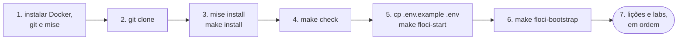

<!-- TOC -->

- [Requisitos](#requisitos)
  - [0. Do zero ao primeiro apply, em ordem](#0-do-zero-ao-primeiro-apply-em-ordem)
  - [1. Sistemas operacionais suportados](#1-sistemas-operacionais-suportados)
  - [2. Hardware recomendado](#2-hardware-recomendado)
  - [3. Software necessário](#3-software-necessário)
    - [3.1 - Instalar no Ubuntu (amd64)](#31---instalar-no-ubuntu-amd64)
    - [3.2 - Instalar no macOS (arm64 e amd64)](#32---instalar-no-macos-arm64-e-amd64)
    - [3.3 - Gerenciando as ferramentas com o mise](#33---gerenciando-as-ferramentas-com-o-mise)
    - [3.4 - Executando e lendo o make check](#34---executando-e-lendo-o-make-check)
  - [4. Pacotes Python com o uv](#4-pacotes-python-com-o-uv)
  - [5. Os emuladores floci e floci-gcp](#5-os-emuladores-floci-e-floci-gcp)
    - [5.1 - Subindo com docker compose](#51---subindo-com-docker-compose)
    - [5.2 - Apontando as ferramentas para os emuladores](#52---apontando-as-ferramentas-para-os-emuladores)
    - [5.3 - O domínio localhost.floci.io](#53---o-domínio-localhostflociio)
    - [5.4 - Atalhos do Makefile](#54---atalhos-do-makefile)
    - [5.5 - Buckets de state](#55---buckets-de-state)
  - [6. Portas de rede usadas](#6-portas-de-rede-usadas)
  - [7. Do emulador para a nuvem real](#7-do-emulador-para-a-nuvem-real)
  - [8. Política de nomes e tags](#8-política-de-nomes-e-tags)
  - [9. Configuração flexível](#9-configuração-flexível)
  - [10. floci vs nuvem real](#10-floci-vs-nuvem-real)
  - [11. Referências](#11-referências)

<!-- TOC -->

# Requisitos

Este documento lista o software e o hardware necessários para a trilha em
[`docs/00-TRILHA.md`](docs/00-TRILHA.md) e as convenções que todo o código
segue. Tudo foi pensado para rodar **primeiro nos emuladores** (grátis, sem
conta em nuvem); usar uma conta AWS ou um projeto GCP real é opcional.

**Nunca usou Terraform, Docker ou mise? Comece pela seção 0.** O restante é
material de referência.

## 0. Do zero ao primeiro apply, em ordem



1. **Instale o Docker, o git e o mise** — [seção 3](#3-software-necessário)
   ([3.1](#31---instalar-no-ubuntu-amd64) Ubuntu,
   [3.2](#32---instalar-no-macos-arm64-e-amd64) macOS).
2. **Baixe o código:**
   ```bash
   git clone https://github.com/aeciopires/terraform.git learning-terraform
   cd learning-terraform
   ```
3. **Instale as ferramentas nas versões fixadas** ([seção 3.3](#33---gerenciando-as-ferramentas-com-o-mise))
   e os pacotes Python ([seção 4](#4-pacotes-python-com-o-uv)):
   ```bash
   mise trust
   mise install
   make install
   ```
4. **Confira a máquina** ([seção 3.4](#34---executando-e-lendo-o-make-check)):
   ```bash
   make check
   ```
5. **Suba os emuladores** ([seção 5](#5-os-emuladores-floci-e-floci-gcp)):
   ```bash
   cp .env.example .env
   make floci-start
   ```
6. **Crie os buckets de state** que o Terragrunt usa ([seção 5.5](#55---buckets-de-state)):
   ```bash
   make floci-bootstrap
   ```
7. **Siga a trilha** a partir de [`docs/00-TRILHA.md`](docs/00-TRILHA.md).
8. **Ao terminar o dia:** `make floci-stop` (os dados ficam em `./.floci`).

## 1. Sistemas operacionais suportados

| Sistema | Arquitetura | Situação |
|---|---|---|
| Ubuntu 22.04 / 24.04 / 26.04 LTS | `amd64` (`x86_64`) | Suportado |
| macOS 13+ | `arm64` (Apple Silicon) e `amd64` (Intel) | Suportado |
| Windows | - | Sem suporte direto - use o WSL2 (Ubuntu) |

Todas as ferramentas do [`mise.toml`](mise.toml) publicam binários `amd64`
e `arm64` para Linux e macOS, e as imagens `floci/floci` e
`floci/floci-gcp` são multi-arquitetura. Este repositório foi testado em
Ubuntu 22.04 `amd64`.

## 2. Hardware recomendado

| Recurso | Mínimo | Confortável | Observação |
|---|---|---|---|
| RAM livre | 8 GB | 16 GB | as tarefas ECS, o RDS e o Cloud Run viram contêineres reais; a stack completa (dev + stg, AWS + GCP) roda vários ao mesmo tempo |
| Disco livre | 10 GB | 20 GB | imagens dos emuladores, `nginx`, `postgres` e os providers baixados |
| CPU | 2 vCPU | 4+ vCPU | providers e contêineres |
| Rede | - | - | acesso ao Docker Hub, ao Terraform/OpenTofu Registry e ao GitHub (plugins do tflint) |

## 3. Software necessário

Rode `make check` ([seção 3.4](#34---executando-e-lendo-o-make-check)) para
ver o que falta. Com o **mise**, um único `mise install` instala tudo o que
está marcado com ✔ na coluna "mise".

| Software | Versão | mise | Obrigatório? | Para quê |
|---|---|:---:|---|---|
| [mise](https://mise.jdx.dev) | a mais recente | - | recomendado | instala e fixa as versões de todas as ferramentas abaixo |
| [Terraform](https://developer.hashicorp.com/terraform) | 1.16.5 | ✔ | sim | o CLI do Terraform |
| [OpenTofu](https://opentofu.org) | 1.13.1 | ✔ | sim | o CLI do OpenTofu (`tofu`) - padrão do Terragrunt |
| [Terragrunt](https://docs.terragrunt.com) | 1.1.6 | ✔ | sim | orquestra as unidades de [`live/`](live/README.md) |
| [TFLint](https://github.com/terraform-linters/tflint) | 0.64.0 | ✔ | sim | `make lint` |
| [Trivy](https://trivy.dev) | 0.75.0 | ✔ | sim | `make security` |
| [terraform-docs](https://terraform-docs.io) | 0.24.0 | ✔ | sim | `make docs` |
| Python | 3.14 | ✔ | sim | scripts e testes (`.python-version`) |
| [uv](https://docs.astral.sh/uv/) | 0.12 | ✔ | sim | pacotes Python ([seção 4](#4-pacotes-python-com-o-uv)) |
| AWS CLI | v2 | ✔ | sim | comandos de verificação ([`docs/10-verificar-recursos.md`](docs/10-verificar-recursos.md)) |
| jq | 1.8.2 | ✔ | sim | lê JSON nos comandos da documentação |
| [pre-commit](https://pre-commit.com) | 4.6.2 | ✔ | opcional | hooks de git ([`docs/07-testes.md`](docs/07-testes.md#pre-commit)) |
| ShellCheck | 0.11.0 | ✔ | opcional | verifica `scripts/check-deps.sh` |
| Docker Engine / Docker Desktop, ou [Colima](https://github.com/abiosoft/colima) | 24+ | - | sim | executa os emuladores e os contêineres que eles criam |
| Docker Compose v2 | 2.20+ | - | sim | [`docker-compose.yml`](docker-compose.yml) |
| git, curl, make | qualquer | - | sim | - |
| Google Cloud CLI (`gcloud`) | a mais recente | - | opcional | comandos `gcloud` no floci-gcp e no GCP real |

> **Guardrail:** as versões acima eram as mais recentes em **03/10/2026**.
> Elas mudam com frequência - confira as páginas de release (links no
> [`mise.toml`](mise.toml)) antes de confiar nelas.

### 3.1 - Instalar no Ubuntu (amd64)

Docker Engine e Compose, pelo repositório oficial
([docs.docker.com/engine/install/ubuntu](https://docs.docker.com/engine/install/ubuntu/)):

```bash
sudo apt-get update
sudo apt-get install -y ca-certificates curl git make
sudo install -m 0755 -d /etc/apt/keyrings
sudo curl -fsSL https://download.docker.com/linux/ubuntu/gpg -o /etc/apt/keyrings/docker.asc
sudo chmod a+r /etc/apt/keyrings/docker.asc
echo "deb [arch=$(dpkg --print-architecture) signed-by=/etc/apt/keyrings/docker.asc] https://download.docker.com/linux/ubuntu $(. /etc/os-release && echo "$VERSION_CODENAME") stable" \
  | sudo tee /etc/apt/sources.list.d/docker.list > /dev/null
sudo apt-get update
sudo apt-get install -y docker-ce docker-ce-cli containerd.io docker-buildx-plugin docker-compose-plugin
sudo usermod -aG docker "$USER"   # saia e entre na sessão para valer
```

mise ([mise.jdx.dev/installing-mise.html](https://mise.jdx.dev/installing-mise.html)):

```bash
curl https://mise.run | sh
echo 'eval "$(~/.local/bin/mise activate bash)"' >> ~/.bashrc
source ~/.bashrc
```

### 3.2 - Instalar no macOS (arm64 e amd64)

Com o [Homebrew](https://brew.sh):

```bash
brew install git mise
brew install --cask docker        # Docker Desktop; ou: brew install colima docker docker-compose && colima start
echo 'eval "$(mise activate zsh)"' >> ~/.zshrc
source ~/.zshrc
```

O [`Makefile`](Makefile) usa apenas recursos presentes no GNU Make 3.81
(a versão que acompanha o macOS) e o [`scripts/check-deps.sh`](scripts/check-deps.sh)
foi escrito para o bash 3.2 do macOS, mas esta versão do repositório foi
testada apenas no Ubuntu 22.04 - relate problemas no macOS
([`CONTRIBUTING.md`](CONTRIBUTING.md#reportando-problemas)).

### 3.3 - Gerenciando as ferramentas com o mise

**Analogia:** o mise é como a lista de material escolar com marca e
tamanho: todo mundo que usa este repositório recebe exatamente as mesmas
versões. Ele lê o [`mise.toml`](mise.toml) da pasta atual.

```bash
mise trust          # autoriza o mise.toml deste repositório (uma vez)
mise install        # instala as versões fixadas
mise ls             # mostra o que está instalado e ativo
mise ls-remote terragrunt | tail -3   # versões disponíveis de uma ferramenta
mise exec -- terraform version        # roda com a versão fixada, mesmo sem "activate"
```

O [`Makefile`](Makefile) executa tudo via `mise exec --` quando o mise está
instalado, então os alvos usam as versões fixadas mesmo que o seu shell não
tenha ativado o mise.

### 3.4 - Executando e lendo o make check

```bash
make check
```

`[ OK ]` está tudo certo; `[WARN]` funciona, mas difere do testado (versão
mais antiga, distribuição não testada); `[FAIL]` falta algo obrigatório - a
mensagem diz como resolver. O script também confere se o domínio
`localhost.floci.io` resolve ([seção 5.3](#53---o-domínio-localhostflociio)).

## 4. Pacotes Python com o uv

Os scripts ([`scripts/list_resources.py`](scripts/list_resources.py)) e os
testes Python ([`tests/`](tests/)) usam pacotes do PyPI (boto3, pytest, ruff,
mypy), declarados em [`pyproject.toml`](pyproject.toml) e travados em
[`uv.lock`](uv.lock):

```bash
uv sync                     # cria .venv/ com as versões do uv.lock
uv run pytest               # roda dentro do .venv, sem "activate"
uv add <pacote>             # adiciona uma dependência (atualiza o uv.lock)
uv lock --upgrade           # atualiza tudo dentro das faixas do pyproject.toml
```

## 5. Os emuladores floci e floci-gcp

**Analogia:** o floci é um simulador de voo. Os botões, os instrumentos e
os procedimentos são os da aeronave real (as **APIs** da AWS e do GCP),
então o que você aprende vale no voo de verdade - mas se errar, ninguém
se machuca e nada é cobrado.

| Emulador | Nuvem | Porta | Versão testada | Documentação |
|---|---|---|---|---|
| floci | AWS | 4566 | 2.1.0 | <https://floci.io> · <https://github.com/floci-io/floci> |
| floci-gcp | GCP | 4588 | 0.9.0 | <https://github.com/floci-io/floci-gcp> |

Os dois criam **contêineres Docker reais** quando o serviço precisa (tarefas
ECS, RDS, Cloud Run), por isso o `docker-compose.yml` monta o
`/var/run/docker.sock`.

### 5.1 - Subindo com docker compose

```bash
docker compose up -d        # sobe floci e floci-gcp
docker compose ps           # estado
docker compose logs -f floci-gcp
docker compose stop         # para, mantendo os dados em ./.floci
```

### 5.2 - Apontando as ferramentas para os emuladores

O arquivo [`.env.example`](.env.example) define as variáveis que fazem
Terraform/OpenTofu, AWS CLI, boto3 e `gcloud` falarem com os emuladores.
Carregue-o em **cada terminal novo** usado nos labs:

```bash
cp .env.example .env
set -a; source .env; set +a
aws sts get-caller-identity --query Account --output text   # 000000000000 = floci
```

O Terragrunt **não** precisa desse arquivo: o
[`live/root.hcl`](live/root.hcl) define as variáveis por conta (só nas
contas com `target = "floci"`).

### 5.3 - O domínio localhost.floci.io

`AWS_ENDPOINT_URL` usa `http://localhost.floci.io:4566`, e não
`http://localhost:4566`. A documentação do floci (`docs/services/s3.md`)
informa que `*.localhost.floci.io` resolve, via DNS público, para a sua
própria máquina. Com isso funcionam as requisições S3 *virtual-hosted*
(`<bucket>.localhost.floci.io`) e a API S3 Control
(`<conta>.localhost.floci.io`), que o provider AWS usa para tags de
bucket - sem nenhum ajuste no código (como `s3_use_path_style`). Com
`localhost` puro, observamos o erro `lookup <bucket>.localhost ... no such
host` ([`docs/TROUBLESHOOTING.md`](docs/TROUBLESHOOTING.md)).

Se a sua rede bloquear o domínio, adicione ao `/etc/hosts`:

```text
127.0.0.1 localhost.floci.io 000000000000.localhost.floci.io
```

### 5.4 - Atalhos do Makefile

Os alvos são **atalhos** para comandos ensinados na documentação; aprenda a
forma longa primeiro. `make help` lista todos.

| Alvo | O que faz |
|---|---|
| `make floci-start` / `floci-stop` / `floci-status` | sobe, para e mostra os emuladores |
| `make floci-bootstrap` | cria os buckets de state ([5.5](#55---buckets-de-state)) |
| `make floci-destroy` | remove os emuladores e **todos** os dados em `./.floci` (pede confirmação) |
| `make test` · `test-integration` · `test-smoke` · `test-all` | testes ([`docs/07-testes.md`](docs/07-testes.md)) |
| `make tg-plan` · `tg-apply` · `tg-destroy` · `tg-drift` | Terragrunt em massa; filtre com `CLOUD=aws\|gcp ENV=dev\|stg` |
| `make list-resources PREFIX=lt-dev` | lista o que foi criado |
| `make docs` · `docs-check` | terraform-docs ([`docs/08-terraform-docs.md`](docs/08-terraform-docs.md)) |

`TF=terraform` troca o binário (o padrão é `tofu`): `make test TF=terraform`.

### 5.5 - Buckets de state

O Terragrunt guarda o state de cada unidade em um bucket por conta/projeto
(`lt-tfstate-<conta ou projeto>`). Em uma conta real ele cria o bucket com
`--backend-bootstrap` ([`docs/06-terragrunt.md`](docs/06-terragrunt.md)).
Nos emuladores, `make floci-bootstrap` cria os dois buckets pelas APIs dos
próprios emuladores - no floci-gcp **não** use `--backend-bootstrap`: com o
Terragrunt 1.1.6 ele tentou criar o bucket no Google Cloud real
([`docs/TROUBLESHOOTING.md`](docs/TROUBLESHOOTING.md#o---backend-bootstrap-tenta-criar-o-bucket-gcs-no-google-real)).

## 6. Portas de rede usadas

| Porta no host | Variável para mudar | Uso |
|---|---|---|
| 4566 | `FLOCI_AWS_PORT` | API da AWS emulada |
| 4588 | `FLOCI_GCP_PORT` | APIs do GCP emuladas e proxy do Cloud Run |
| 8080-8089 | `FLOCI_ALB_HOST_PORTS` | listeners dos ALBs no floci: `dev` = 8080, `stg` = 8081 (`floci_alb_port` em `live/aws/*/<env>/env.hcl`) |
| 7001+ | - | proxy do RDS no floci (dentro da rede Docker) |

Se outra aplicação (por exemplo, outro projeto com floci) já usar essas
portas, mude-as no `.env` e ajuste também `AWS_ENDPOINT_URL`,
`FLOCI_AWS_ENDPOINT` e `FLOCI_GCP_ENDPOINT`. Os alvos `make tg-*` leem
`FLOCI_AWS_ENDPOINT`/`FLOCI_GCP_ENDPOINT` do `.env`; ao rodar o
`terragrunt` diretamente, exporte essas duas variáveis no shell - sem
elas, o `live/root.hcl` usa as portas padrão e o `init` falha com
`Backend configuration changed`.

## 7. Do emulador para a nuvem real

Nenhuma linha de código muda; mudam as **variáveis de ambiente** e as
credenciais. Criar recursos reais **gera custos**.

| Onde | Emulador | Nuvem real |
|---|---|---|
| labs e `terraform test` | `set -a; source .env; set +a` | um terminal **novo**, sem o `.env`, com `AWS_PROFILE`/SSO ou `gcloud auth application-default login` |
| Terragrunt (`live/`) | conta com `target = "floci"` | copie a conta para `live/<nuvem>/<nome-da-conta>/` com `target = "real"` e o ID real ([`docs/06-terragrunt.md`](docs/06-terragrunt.md#adicionando-uma-conta-ou-projeto-real)) |

Proteções que já estão no código:

- O provider AWS gerado pelo Terragrunt tem `allowed_account_ids`: ele se
  recusa a rodar em outra conta.
- Para contas reais, o `live/root.hcl` define
  `AWS_IGNORE_CONFIGURED_ENDPOINT_URLS=true` e esvazia as variáveis
  `GOOGLE_*_CUSTOM_ENDPOINT`, de modo que variáveis do floci esquecidas no
  shell não desviem as chamadas.

## 8. Política de nomes e tags

**Nomes:** `<prefixo>-<ambiente>-<componente>[-<propósito>]`, por exemplo
`lt-dev-vpc`, `lt-dev-orders-billing-dlq`. Recursos de nome global (buckets)
recebem também a conta/projeto e a região:
`lt-dev-000000000000-us-east-1-assets`. O prefixo `lt` (learning-terraform)
fica em [`live/common.hcl`](live/common.hcl).

**Tags (AWS) e labels (GCP)** aplicadas a todo recurso pelo provider
(`default_tags` / `default_labels`, gerado pelo `live/root.hcl`):

| AWS (tag) | GCP (label) | Valor |
|---|---|---|
| `Product` | `product` | `learning-terraform` |
| `Environment` | `environment` | `dev`, `stg` ou `prd` |
| `Team` | `team` | `platform-engineering` |
| `CostCenter` | `cost-center` | `learning` |
| `ManagedBy` | `managed-by` | `terragrunt` |
| `Repository` | - | `github.com/aeciopires/terraform` |
| `Unit` | `unit` | caminho da unidade (AWS) / nome da unidade (GCP) |

Labels do GCP só aceitam letras minúsculas, números, `_` e `-`.

## 9. Configuração flexível

Nada de conta, região, CIDR, tamanho ou versão "chumbado" nos módulos:
tudo vem da hierarquia de arquivos do Terragrunt (cada nível acrescenta
uma camada):

| Arquivo | Exemplo de conteúdo |
|---|---|
| [`live/common.hcl`](live/common.hcl) | produto, prefixo, time, centro de custo |
| `live/<nuvem>/cloud.hcl` | versões dos providers e exceções por unidade |
| `live/<nuvem>/<conta>/account.hcl` | ID da conta/projeto, `target` (`floci`/`real`), região do state |
| `live/<nuvem>/<conta>/<env>/env.hcl` | ambiente, tamanhos (instâncias, réplicas), porta do ALB no floci |
| `live/<nuvem>/<conta>/<env>/<região>/region.hcl` | região, CIDR, zonas |
| `live/_envcommon/<nuvem>/<componente>.hcl` | configuração comum de um componente em todos os ambientes |

Nos labs, a mesma ideia aparece com `variables.tf` + arquivos `.tfvars`
por ambiente (`envs/dev.tfvars`, `envs/stg.tfvars`).

## 10. floci vs nuvem real

Comportamentos **observados** com floci 2.1.0 e floci-gcp 0.9.0 ao aplicar
este repositório (não suposições). Os emuladores evoluem rápido; confira as
notas de versão ao atualizar.

| Assunto | No emulador | Na nuvem real | Como o repositório lida |
|---|---|---|---|
| Conta AWS | sempre `000000000000` | a sua conta | `allowed_account_ids` no provider |
| Credenciais | quaisquer valores (`test`) | credenciais reais | só por variáveis de ambiente |
| S3 virtual-hosted e S3 Control | exigem `*.localhost.floci.io` | normal | `AWS_ENDPOINT_URL=http://localhost.floci.io:4566` |
| NACL padrão da VPC | não devolve os campos IPv6/ICMP das regras: diff em todo `plan` | normal | `manage_default_network_acl = false` só no floci |
| Definição de tarefa ECS | não devolve todos os campos de `container_definitions`: `plan` sempre propõe nova revisão | normal | documentado; a unidade `ecs` aparece no `make tg-drift` |
| Porta do RDS | o state recebe a porta do proxy (`7001`), o `plan` propõe voltar a `5432` | 5432 | documentado; a unidade `rds` aparece no `make tg-drift` |
| `aws_vpc_security_group_rules_exclusive` (módulo security-group v6) | a regra de saída padrão volta a aparecer | removida e não volta | documentado; a unidade `sg-database` aparece no `make tg-drift` |
| Listener do ALB | cada listener precisa de uma porta própria no contêiner do floci | todos podem usar 80 | `floci_alb_port` por ambiente |
| Resource Groups Tagging API | `get-resources` volta vazio | lista por tag | `list_resources.py` filtra por prefixo de nome |
| GCS `uniform_bucket_level_access = true` | não é mantido: diff em todo `plan` | normal | desligado só no floci |
| Compute Engine (VPC, firewall, zonas) | não existe no 0.9.0 (adicionado ao floci-gcp depois desse release) | normal | unidades `network` e `cloud-sql` excluídas no floci (`exclude`) |
| Cloud Billing (`data "google_project"`) | não existe | normal | variável `project_number` no módulo `gcp-messaging` |
| Cloud Run | executa o contêiner; URL pelo proxy `/run/v2/projects/<p>/locations/<r>/services/<s>/` | URL `*.run.app` | [`docs/10-verificar-recursos.md`](docs/10-verificar-recursos.md) |
| Bucket de state GCS | o Terragrunt não consegue criá-lo | `--backend-bootstrap` cria | `make floci-bootstrap` |

## 11. Referências

- floci: <https://floci.io> · <https://github.com/floci-io/floci/tree/2.1.0/docs>
- floci-gcp: <https://github.com/floci-io/floci-gcp/tree/0.9.0/docs>
- Provider AWS - endpoints customizados: <https://registry.terraform.io/providers/hashicorp/aws/latest/docs/guides/custom-service-endpoints>
- Provider Google - referência de configuração: <https://registry.terraform.io/providers/hashicorp/google/latest/docs/guides/provider_reference>
- mise: <https://mise.jdx.dev> · uv: <https://docs.astral.sh/uv/>
- Docker Engine no Ubuntu: <https://docs.docker.com/engine/install/ubuntu/>
