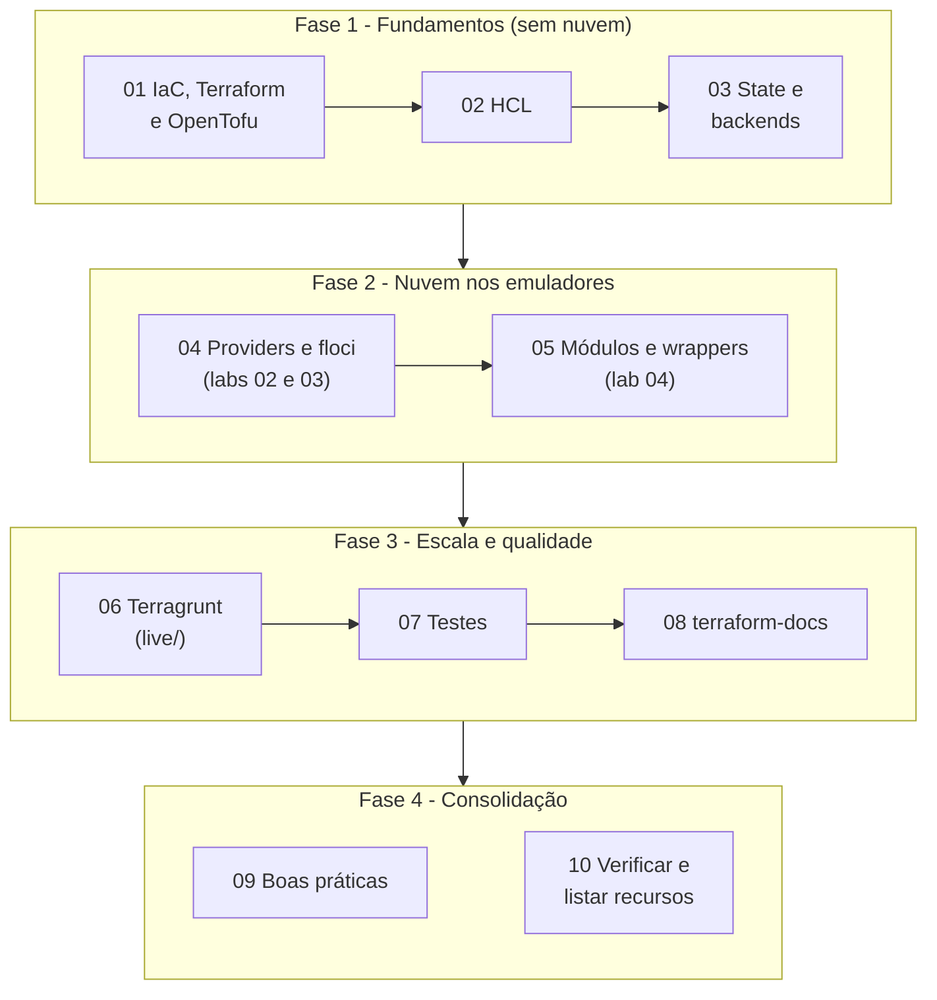
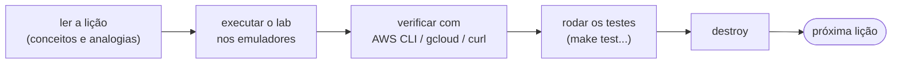

<!-- TOC -->

- [Trilha de aprendizado](#trilha-de-aprendizado)
  - [Como usar esta trilha](#como-usar-esta-trilha)
  - [As fases](#as-fases)
  - [O ciclo de cada lição](#o-ciclo-de-cada-lição)
  - [Lições](#lições)
  - [Glossário rápido](#glossário-rápido)

<!-- TOC -->

# Trilha de aprendizado

Dez lições, do "o que é Infraestrutura como Código" até uma stack
multi-nuvem com Terragrunt, testes e documentação automática. Prepare a
máquina antes com o [`REQUIREMENTS.md`, seção 0](../REQUIREMENTS.md#0-do-zero-ao-primeiro-apply-em-ordem).

## Como usar esta trilha

- **Siga a ordem na primeira vez.** Cada lição usa o vocabulário da anterior.
- **Digite os comandos** em vez de só ler: os erros que você vai ver são
  parte do aprendizado (os mais comuns estão em
  [`TROUBLESHOOTING.md`](TROUBLESHOOTING.md)).
- **Tudo roda nos emuladores** (grátis). A nuvem real é opcional e cobrada.
- **Destrua o que criar** antes de passar para a próxima lição
  (`terraform destroy`, `make tg-destroy`).

## As fases

## O ciclo de cada lição

## Lições

| # | Lição | Você aprende | Prática |
|---|---|---|---|
| 01 | [IaC, Terraform e OpenTofu](01-iac-terraform-opentofu.md) | por que IaC; como Terraform/OpenTofu funcionam; o fluxo `init → plan → apply → destroy`; diferenças entre os dois | - |
| 02 | [A linguagem HCL](02-hcl-basico.md) | blocos, tipos, variáveis, `locals`, `output`, `count`, `for_each`, funções, validações | [lab 01](../labs/01-primeiros-passos/README.md) |
| 03 | [State e backends](03-state-e-backends.md) | o arquivo de state, *locking*, backends S3 e GCS, comandos `state`, `import`, `moved`, *drift* | labs 01 e 02 |
| 04 | [Providers e os emuladores floci](04-providers-e-floci.md) | providers, restrições de versão, lock file, como apontar para o floci sem mudar código | [lab 02](../labs/02-aws-floci/README.md), [lab 03](../labs/03-gcp-floci/README.md) |
| 05 | [Módulos e o padrão wrapper](05-modulos.md) | criar um módulo para AWS e GCP, consumir módulos públicos, `for_each` em módulos, wrappers, instâncias fora do loop | [lab 04](../labs/04-modulos/README.md), [`modules/`](../modules/) |
| 06 | [Terragrunt](06-terragrunt.md) | unidades, `include`, DRY por nuvem/conta/ambiente/região, `dependency`, `generate`, `remote_state`, `run --all`, `exclude` | [`live/`](../live/README.md) |
| 07 | [Testes](07-testes.md) | a pirâmide de testes de IaC: `fmt`, `validate`, tflint, trivy, `terraform test` com *mocks*, integração, *smoke*, *drift*, pre-commit | `make test`, `make test-integration` |
| 08 | [Documentação com terraform-docs](08-terraform-docs.md) | gerar e verificar a documentação dos módulos automaticamente | `make docs` |
| 09 | [Boas práticas](09-boas-praticas.md) | o porquê de cada decisão deste repositório | - |
| 10 | [Verificar e listar recursos](10-verificar-recursos.md) | comandos da AWS CLI, gcloud e REST para ver o que foi criado | `make list-resources` |

## Glossário rápido

| Termo | Significado |
|---|---|
| **IaC** | Infraestrutura como Código: descrever servidores, redes e serviços em arquivos de texto versionados |
| **Provider** | plugin que traduz o seu código em chamadas de API de uma plataforma (AWS, Google, ...) |
| **Resource** | um objeto gerenciado (um bucket, uma fila) |
| **Data source** | uma consulta de leitura a algo que já existe |
| **Module** | um pacote reutilizável de recursos com entradas (`variable`) e saídas (`output`) |
| **Root module** | o diretório onde você roda `terraform init/plan/apply` |
| **State** | o registro do que o Terraform/OpenTofu criou e de como isso está mapeado ao código |
| **Backend** | onde o state fica guardado (arquivo local, S3, GCS, ...) |
| **Plan** | a lista de mudanças que o `apply` faria |
| **Drift** | diferença entre a infraestrutura real e o código |
| **Unit (Terragrunt)** | um diretório com `terragrunt.hcl`: uma chamada de módulo com seu próprio state |
| **Stack (Terragrunt)** | um conjunto de unidades executadas juntas |
| **Wrapper** | um módulo que chama outro módulo em loop a partir de um mapa `items` com valores padrão `defaults` |
