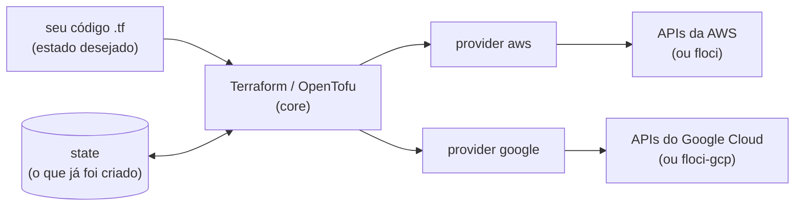
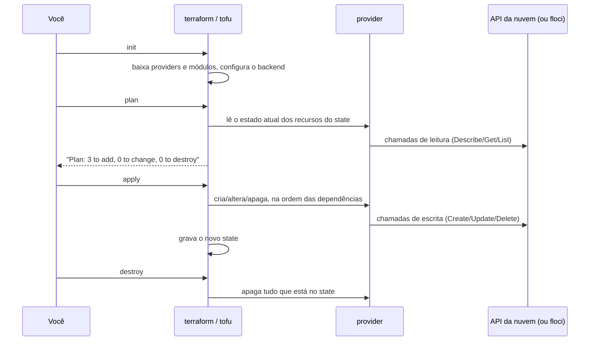

<!-- TOC -->

- [01 - IaC, Terraform e OpenTofu](#01---iac-terraform-e-opentofu)
  - [O problema que a IaC resolve](#o-problema-que-a-iac-resolve)
  - [Declarativo vs imperativo](#declarativo-vs-imperativo)
  - [Como o Terraform/OpenTofu funciona](#como-o-terraformopentofu-funciona)
  - [O fluxo de trabalho](#o-fluxo-de-trabalho)
  - [Terraform ou OpenTofu?](#terraform-ou-opentofu)
  - [E o Terragrunt?](#e-o-terragrunt)
  - [Experimente](#experimente)
  - [Referências](#referências)

<!-- TOC -->

# 01 - IaC, Terraform e OpenTofu

## O problema que a IaC resolve

Imagine montar um ambiente clicando no console da nuvem: uma rede, duas
sub-redes, um banco, um balanceador. Funciona - até você precisar de um
segundo ambiente igual, de lembrar o que mudou há três meses ou de
descobrir quem abriu aquela porta no firewall.

**Infraestrutura como Código (IaC)** é descrever essa infraestrutura em
arquivos de texto, que podem ser versionados no git, revisados em *pull
requests*, testados e aplicados repetidas vezes com o mesmo resultado.

> **Analogia:** o console é cozinhar "de cabeça"; IaC é a **receita
> escrita**. Qualquer pessoa reproduz o prato, você sabe exatamente o que
> mudou entre a versão 1 e a 2, e pode testar a receita antes de servir.

| Sem IaC (cliques) | Com IaC |
|---|---|
| cada ambiente fica um pouco diferente | ambientes idênticos a partir do mesmo código |
| "quem mudou isso?" | histórico no git, revisão em *pull request* |
| recriar é lento e sujeito a erro | `apply` recria em minutos |
| difícil de testar | testes automatizados ([lição 07](07-testes.md)) |

## Declarativo vs imperativo

Terraform e OpenTofu são **declarativos**: você descreve o **estado
desejado** ("quero 2 filas com estes nomes") e a ferramenta descobre os
passos para chegar lá. Um script com a AWS CLI é **imperativo**: você
escreve cada passo ("crie a fila A, depois a fila B...").

> **Analogia:** declarativo é dizer ao GPS **o destino**; imperativo é
> ditar "vire à esquerda, siga 200 m, vire à direita". Se você já está no
> meio do caminho, o GPS recalcula sozinho; a lista de instruções, não.

Na prática: rodar o mesmo `apply` duas vezes não cria nada em dobro. Na
segunda vez a ferramenta compara o desejado com o que existe e responde
`No changes`. Essa propriedade se chama **idempotência**, e este
repositório a testa ([lição 07](07-testes.md#detecção-de-drift)).

## Como o Terraform/OpenTofu funciona



- O **core** lê o código, compara com o **state** e com a realidade, e
  monta um plano.
- Os **providers** são plugins baixados no `init`; cada um conhece as APIs
  de uma plataforma. O core não sabe nada de AWS ou GCP - quem sabe é o
  provider.
- O **state** é o "caderno de anotações" que liga cada bloco do código a um
  objeto real (o bloco `aws_sqs_queue.this["billing"]` é a fila com URL
  `http://...`). Ele é tão importante que tem uma lição só para ele
  ([lição 03](03-state-e-backends.md)).

## O fluxo de trabalho



| Comando | O que faz | Altera a nuvem? |
|---|---|---|
| `init` | baixa providers e módulos; configura o backend do state | não |
| `fmt` | formata os arquivos no estilo padrão | não |
| `validate` | verifica sintaxe e tipos | não |
| `plan` | mostra o que mudaria | não |
| `apply` | executa as mudanças (pede confirmação) | **sim** |
| `destroy` | apaga tudo o que está no state | **sim** |
| `output` | mostra as saídas | não |
| `state list` / `state show` | inspeciona o state | não |
| `test` | executa os arquivos `.tftest.hcl` ([lição 07](07-testes.md)) | depende do teste |

> **Regra de ouro:** leia o `plan` com atenção. Um `-/+` (destroy and
> create) em um banco de dados significa **perder os dados**.

## Terraform ou OpenTofu?

Em 10/08/2023 a HashiCorp anunciou a troca da licença dos seus produtos -
incluindo o Terraform - da *Mozilla Public License v2.0* (MPL 2.0) para a
*Business Source License* (BSL) v1.1, nas versões futuras. Em resposta,
um grupo de empresas (Gruntwork, Spacelift, Harness, env0, Scalr e outras)
criou o **OpenTofu**, um *fork* do Terraform hospedado pela **Linux
Foundation**, sob a MPL 2.0. A primeira versão estável, a 1.6.0, saiu em
10/01/2024.

> **Analogia:** é a mesma receita que passou a ser publicada por duas
> editoras. O português é o mesmo (a linguagem HCL, os providers, os
> módulos), mas cada editora agora acrescenta capítulos próprios.

| | Terraform | OpenTofu |
|---|---|---|
| Mantido por | HashiCorp | comunidade, na Linux Foundation |
| Licença | BSL 1.1 (desde as versões lançadas após 10/08/2023) | MPL 2.0 |
| Comando | `terraform` | `tofu` |
| Versão usada aqui | 1.16.5 | 1.13.1 |
| Registry padrão | `registry.terraform.io` | `registry.opentofu.org` |
| Linguagem, providers, módulos | HCL; mesmos providers (`hashicorp/aws`, `hashicorp/google`) | idem |
| Recursos exclusivos (exemplos) | integração com HCP Terraform | criptografia do state (desde 1.7), módulos e providers em registries OCI (desde 1.10) |
| Padrão do Terragrunt | - | sim (o Terragrunt chama `tofu` se nada for dito) |

**Neste repositório todo o código roda com os dois** - o
[`Makefile`](../Makefile) aceita `TF=terraform` ou `TF=tofu`, e `make
test-all` executa os testes com ambos. Duas consequências práticas que
você vai encontrar:

- Os dois usam registries diferentes, então um diretório inicializado com
  um (`.terraform/`, `.terraform.lock.hcl`) precisa de um novo `init` antes
  de usar o outro ([TROUBLESHOOTING](TROUBLESHOOTING.md#unknown-provider-registryterraformiohashicorpaws)).
- A FAQ do OpenTofu informa compatibilidade com arquivos de state criados
  até o Terraform 1.5.x; depois disso os projetos evoluem separadamente.
  Escolha um binário por projeto e mantenha.

## E o Terragrunt?

O Terragrunt (Gruntwork, licença MIT) **não substitui** o Terraform nem o
OpenTofu: ele os **orquestra**. Quando a infraestrutura cresce para várias
contas, ambientes e regiões, ele evita repetir a configuração de backend,
providers e entradas, e executa dezenas de diretórios na ordem certa das
dependências. A [lição 06](06-terragrunt.md) é toda sobre ele.

> **Analogia:** se o Terraform/OpenTofu é o músico que toca a partitura
> (o módulo), o Terragrunt é o maestro que diz quem toca, em que ordem e
> com qual afinação (conta, ambiente, região).

## Experimente

```bash
terraform version
tofu version
terraform -help plan | head -20
tofu -help plan | head -20
```

Depois siga para a [lição 02](02-hcl-basico.md) e o
[lab 01](../labs/01-primeiros-passos/README.md).

## Referências

- Terraform - introdução: <https://developer.hashicorp.com/terraform/intro>
- Terraform - fluxo principal: <https://developer.hashicorp.com/terraform/intro/core-workflow>
- HashiCorp - anúncio da BSL (10/08/2023): <https://www.hashicorp.com/en/blog/hashicorp-adopts-business-source-license>
- OpenTofu - FAQ: <https://opentofu.org/faq/>
- OpenTofu 1.6.0 (CHANGELOG): <https://github.com/opentofu/opentofu/blob/v1.6.0/CHANGELOG.md>
- OpenTofu - criptografia de state: <https://opentofu.org/docs/language/state/encryption/>
- Terragrunt - visão geral: <https://docs.terragrunt.com/getting-started/overview/>
