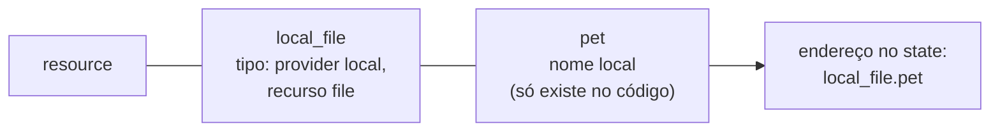

<!-- TOC -->

- [02 - A linguagem HCL](#02---a-linguagem-hcl)
  - [Anatomia de um bloco](#anatomia-de-um-bloco)
  - [Os arquivos de um diretório](#os-arquivos-de-um-diretório)
  - [Tipos](#tipos)
  - [Variáveis de entrada](#variáveis-de-entrada)
  - [locals e outputs](#locals-e-outputs)
  - [Referências e dependências](#referências-e-dependências)
  - [count vs for\_each](#count-vs-for_each)
  - [Expressões e funções úteis](#expressões-e-funções-úteis)
  - [Blocos dynamic](#blocos-dynamic)
  - [lifecycle](#lifecycle)
  - [Pratique](#pratique)
  - [Referências](#referências)

<!-- TOC -->

# 02 - A linguagem HCL

Terraform e OpenTofu usam a **HCL** (HashiCorp Configuration Language).
Ela foi feita para ser lida por pessoas: blocos, atributos e expressões.
Todos os exemplos desta lição estão no
[lab 01](../labs/01-primeiros-passos/README.md), que roda sem nuvem.

## Anatomia de um bloco

```hcl
resource "local_file" "pet" {          # tipo do bloco, tipo do recurso, nome local
  filename = "output/dev/cat.txt"      # atributo = expressão
  content  = "miau"
}
```



O par **tipo + nome** forma o endereço do recurso (`local_file.pet`), usado
para referenciá-lo e para encontrá-lo no state. Renomear o nome local é,
para o Terraform, apagar um recurso e criar outro - a menos que você use
um bloco `moved` ([lição 03](03-state-e-backends.md#renomear-sem-recriar-moved)).

Blocos de primeiro nível mais usados:

| Bloco | Para quê |
|---|---|
| `terraform { }` | versão do Terraform/OpenTofu, providers exigidos, backend |
| `provider "aws" { }` | configuração de um provider (região, tags padrão) |
| `resource "tipo" "nome" { }` | algo que o Terraform cria e gerencia |
| `data "tipo" "nome" { }` | uma consulta (leitura) a algo existente |
| `variable "nome" { }` | uma entrada |
| `locals { }` | valores calculados internos |
| `output "nome" { }` | uma saída |
| `module "nome" { }` | chamada a um módulo ([lição 05](05-modulos.md)) |

## Os arquivos de um diretório

O Terraform lê **todos os `.tf` do diretório** como se fossem um só - os
nomes dos arquivos são convenção, não regra. A convenção usada aqui (e
recomendada pela HashiCorp no guia de estilo):

| Arquivo | Conteúdo |
|---|---|
| `versions.tf` | bloco `terraform { required_version, required_providers }` |
| `providers.tf` | blocos `provider` (só em *root modules*) |
| `main.tf` | recursos e chamadas de módulos |
| `variables.tf` | blocos `variable` |
| `outputs.tf` | blocos `output` |
| `*.tfvars` | valores das variáveis (por ambiente: `envs/dev.tfvars`) |
| `tests/*.tftest.hcl` | testes ([lição 07](07-testes.md)) |

## Tipos

| Tipo | Exemplo |
|---|---|
| `string` | `"dev"` |
| `number` | `30` |
| `bool` | `true` |
| `list(string)` | `["a", "b"]` (ordem importa, permite repetidos) |
| `set(string)` | `["a", "b"]` (sem ordem, sem repetidos) |
| `map(number)` | `{ cat = 2, dog = 3 }` |
| `object({...})` | `{ name = "x", port = 80 }` com atributos tipados |
| `optional(tipo, padrão)` | atributo opcional dentro de um `object` |

O módulo [`aws-messaging`](../modules/aws-messaging/variables.tf) usa
`map(object({ ... optional(...) }))`: cada fila é um objeto, e todo
atributo tem um padrão. Quem chama escreve só o que difere.

## Variáveis de entrada

```hcl
variable "environment" {
  description = "Environment name: dev, stg or prd."
  type        = string
  default     = "dev"

  validation {
    condition     = contains(["dev", "stg", "prd"], var.environment)
    error_message = "environment must be dev, stg or prd."
  }
}
```

- `description` sempre: o terraform-docs a publica ([lição 08](08-terraform-docs.md))
  e o tflint exige ([`.tflint.hcl`](../.tflint.hcl)).
- `validation` falha **antes** de qualquer chamada à nuvem, com uma
  mensagem clara. Os testes provam isso com `expect_failures`.
- Sem `default`, a variável é obrigatória.

Formas de passar valores, da menor para a maior precedência (a última
vence):

1. variáveis de ambiente `TF_VAR_<nome>`;
2. arquivo `terraform.tfvars` (e `terraform.tfvars.json`);
3. arquivos `*.auto.tfvars` (em ordem alfabética);
4. `-var` e `-var-file` na linha de comando, na ordem em que aparecem.

```bash
terraform plan -var-file=envs/stg.tfvars -var 'environment=stg'
```

> **Analogia:** variáveis são os campos de um formulário; `default` é o
> valor já preenchido; `validation` é o campo que não aceita CPF inválido.

## locals e outputs

```hcl
locals {
  output_dir = "${path.module}/output/${var.environment}"
}

output "pet_names" {
  description = "Random name of every pet."
  value       = { for k, p in random_pet.this : k => p.id }
}
```

`locals` evita repetir uma expressão; `output` expõe valores para quem
chama o módulo, para o Terragrunt (`dependency`) e para você
(`terraform output`).

## Referências e dependências

Ao escrever `random_pet.this[each.key].id` dentro de `local_file.pet`, você
cria uma **dependência implícita**: o Terraform monta um grafo e cria o
`random_pet` antes do arquivo. Raramente é preciso `depends_on` - use-o só
quando a dependência não aparece em nenhuma referência (o módulo
`aws-messaging` usa para garantir que a política da fila exista antes da
assinatura SNS).

```bash
terraform graph | head -20     # o grafo em formato DOT
```

## count vs for_each

Ambos criam várias cópias de um recurso. A diferença está em **como cada
cópia é identificada**:

| | `count = 3` | `for_each = { cat = 2, dog = 3 }` |
|---|---|---|
| Endereços | `x[0]`, `x[1]`, `x[2]` | `x["cat"]`, `x["dog"]` |
| Remover o primeiro item | todos os seguintes "mudam de número": recria em cascata | só `x["cat"]` é destruído |
| Uso típico | **ligar/desligar** um recurso: `count = var.create ? 1 : 0` | **coleções** de coisas com nome |

> **Analogia:** `count` são cadeiras numeradas num cinema - se a pessoa da
> cadeira 1 sai e todo mundo anda uma cadeira para a esquerda, todos
> "trocaram de lugar". `for_each` são lugares marcados com o nome: quem
> sai libera só o seu lugar.

No [lab 01](../labs/01-primeiros-passos/main.tf): `for_each` para os
animais, `count` para o README opcional.

## Expressões e funções úteis

| Expressão | Exemplo neste repositório |
|---|---|
| condicional | `force_destroy = var.environment != "prd"` |
| `for` em mapa | `{ for k, q in aws_sqs_queue.this : k => q.url }` |
| `for` com filtro | `{ for k, q in local.queues : k => q if q.create_dlq }` |
| splat | `local_file.readme[*].filename` |
| `merge()` | tags padrão + tags do item, no wrapper |
| `try()` | `try(each.value.name, var.defaults.name, each.key)`: o primeiro que existir |
| `jsonencode()` | políticas IAM e `filter_policy` do SNS |
| `templatefile()` | `templates/pet.txt.tftpl` no lab 01 |
| `cidrsubnet()` | sub-redes `/24` a partir da VPC `/16` em `live/_envcommon/aws/vpc.hcl` |

Teste expressões sem criar nada:

```bash
cd labs/01-primeiros-passos
terraform init
echo 'cidrsubnet("10.10.0.0/16", 8, 10)' | terraform console     # "10.10.10.0/24"
echo 'merge({a = 1}, {b = 2})' | terraform console
```

## Blocos dynamic

Quando um **bloco aninhado** é opcional ou repetido, use `dynamic`. No
[`gcp-messaging`](../modules/gcp-messaging/main.tf):

```hcl
dynamic "dead_letter_policy" {
  for_each = each.value.create_dead_letter ? [1] : []

  content {
    dead_letter_topic     = google_pubsub_topic.dead_letter[each.key].id
    max_delivery_attempts = each.value.max_delivery_attempts
  }
}
```

Lista com um elemento = o bloco existe; lista vazia = não existe.

## lifecycle

| Argumento | Quando usar |
|---|---|
| `prevent_destroy = true` | recursos que nunca devem ser apagados por engano (state, dados de produção) |
| `create_before_destroy = true` | trocar sem indisponibilidade |
| `ignore_changes = [tags]` | atributos alterados fora do Terraform de propósito |
| `replace_triggered_by = [...]` | recriar quando outra coisa mudar |

Use `ignore_changes` com parcimônia: ele esconde *drift*.

## Pratique

Faça o [lab 01](../labs/01-primeiros-passos/README.md): ele usa cada
conceito desta lição e tem testes que você pode quebrar de propósito.

## Referências

- Sintaxe da linguagem: <https://developer.hashicorp.com/terraform/language/syntax/configuration>
- Variáveis e precedência: <https://developer.hashicorp.com/terraform/language/values/variables>
- `count`: <https://developer.hashicorp.com/terraform/language/meta-arguments/count>
- `for_each`: <https://developer.hashicorp.com/terraform/language/meta-arguments/for_each>
- Funções: <https://developer.hashicorp.com/terraform/language/functions>
- Blocos `dynamic`: <https://developer.hashicorp.com/terraform/language/expressions/dynamic-blocks>
- `lifecycle`: <https://developer.hashicorp.com/terraform/language/meta-arguments/lifecycle>
- Guia de estilo: <https://developer.hashicorp.com/terraform/language/style>
- OpenTofu - linguagem: <https://opentofu.org/docs/language/>
