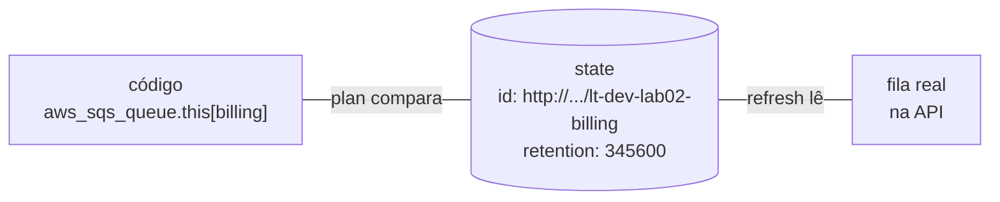
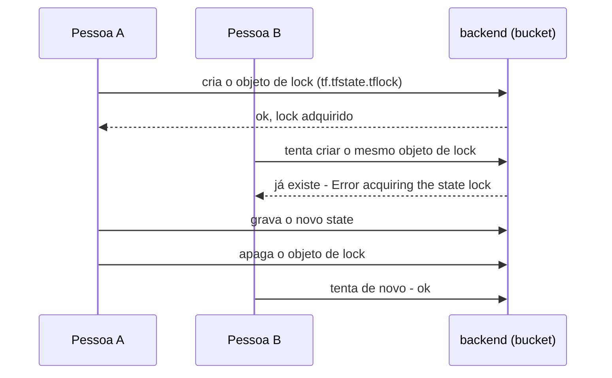

<!-- TOC -->

- [03 - State e backends](#03---state-e-backends)
  - [O que é o state](#o-que-é-o-state)
  - [Por que o state local não basta](#por-que-o-state-local-não-basta)
  - [Locking: um de cada vez](#locking-um-de-cada-vez)
  - [Backend S3 (AWS)](#backend-s3-aws)
  - [Backend GCS (GCP)](#backend-gcs-gcp)
  - [Um state por unidade](#um-state-por-unidade)
  - [Inspecionando o state](#inspecionando-o-state)
  - [Drift: quando a realidade muda](#drift-quando-a-realidade-muda)
  - [Adotar o que já existe: import](#adotar-o-que-já-existe-import)
  - [Renomear sem recriar: moved](#renomear-sem-recriar-moved)
  - [Cuidados](#cuidados)
  - [Referências](#referências)

<!-- TOC -->

# 03 - State e backends

## O que é o state

O **state** é um arquivo JSON em que o Terraform/OpenTofu anota, para cada
bloco do código, qual objeto real ele criou e quais atributos esse objeto
tinha no último `apply`.

> **Analogia:** o state é o **inventário do almoxarifado**. O código diz
> "devemos ter 2 filas"; o inventário diz "temos a fila X (etiqueta 123) e a
> fila Y (etiqueta 456)". Sem o inventário, o Terraform não saberia que
> aquelas filas são "dele" e tentaria criá-las de novo.



## Por que o state local não basta

Por padrão o state fica em `terraform.tfstate`, no diretório. Isso serve
para estudar ([lab 01](../labs/01-primeiros-passos/README.md),
[lab 02](../labs/02-aws-floci/README.md)), mas em equipe não:

- cada pessoa teria a sua cópia - e cada uma "acharia" que é dona dos recursos;
- o arquivo pode conter **segredos** (senhas geradas, chaves) em texto claro;
- se o disco morrer, o inventário se perde.

A solução é um **backend remoto**: o state fica em um bucket, com
versionamento, criptografia e acesso controlado.

## Locking: um de cada vez

Se duas pessoas rodarem `apply` ao mesmo tempo, uma sobrescreve o state da
outra. O **lock** impede isso: quem começa primeiro "pega a chave"; o outro
recebe `Error acquiring the state lock` e espera.

> **Analogia:** é a chave do banheiro de um posto de gasolina - só entra
> quem está com ela.



## Backend S3 (AWS)

Desde o Terraform 1.10 e o OpenTofu 1.10 o backend S3 faz lock **nativo**,
com um objeto `.tflock` gravado por escrita condicional no próprio bucket
(`use_lockfile = true`) - não é mais preciso uma tabela DynamoDB:

```hcl
terraform {
  backend "s3" {
    bucket       = "lt-tfstate-000000000000"
    key          = "aws/floci-sandbox/dev/us-east-1/vpc/tf.tfstate"
    region       = "us-east-1"
    encrypt      = true
    use_lockfile = true
  }
}
```

Neste repositório você **não escreve** esse bloco: o
[`live/root.hcl`](../live/root.hcl) o gera para cada unidade, com uma `key`
diferente por unidade ([lição 06](06-terragrunt.md#remote_state-um-state-por-unidade-sem-repetir)).

## Backend GCS (GCP)

```hcl
terraform {
  backend "gcs" {
    bucket = "lt-tfstate-floci-local"
    prefix = "gcp/floci-local/dev/us-central1/gcs"
  }
}
```

O backend GCS faz lock com um objeto `<prefixo>/<workspace>.tflock` no
bucket. No floci-gcp ele funciona com a variável
`GOOGLE_STORAGE_CUSTOM_ENDPOINT` (verificado com `terraform` e `tofu`).

## Um state por unidade

Colocar toda a infraestrutura em um único state ("terralith") é perigoso:
cada `plan` lê tudo, cada erro pode atingir tudo, e duas equipes não
conseguem trabalhar ao mesmo tempo.

> **Analogia:** um navio tem **compartimentos estanques**. Se um alaga, os
> outros continuam secos. Separar o state em unidades (rede, banco,
> aplicação) limita o "raio de explosão" de um erro.

Em [`live/`](../live/README.md), cada unidade (vpc, alb, ecs, rds, ...) tem
o seu próprio state, e o Terragrunt conecta uma à outra com `dependency`.

## Inspecionando o state

```bash
cd labs/02-aws-floci
set -a; source ../../.env; set +a
terraform init
terraform apply -var-file=envs/dev.tfvars

terraform state list                                  # todos os endereços
terraform state show 'aws_sqs_queue.this["billing"]'  # atributos de um recurso
terraform output                                      # as saídas
terraform show -json | jq '.values.root_module.resources | length'
```

Comandos que **alteram** o state (use com cuidado, de preferência com
backup): `state mv`, `state rm`, `force-unlock`. Hoje há alternativas
declarativas e revisáveis em *pull request*: os blocos `moved`, `import` e
`removed` (abaixo).

## Drift: quando a realidade muda

*Drift* é quando alguém altera um recurso fora do Terraform. No floci:

```bash
Q=$(aws sqs get-queue-url --queue-name lt-dev-lab02-billing --query QueueUrl --output text)
aws sqs set-queue-attributes --queue-url "$Q" --attributes MessageRetentionPeriod=60
terraform plan -var-file=envs/dev.tfvars
#  ~ resource "aws_sqs_queue" "this" {
#      ~ message_retention_seconds = 60 -> 345600
```

O `plan` detecta a diferença e o `apply` volta ao que o código diz. Para
apenas **atualizar o state** com a realidade, sem mudar nada:
`terraform apply -refresh-only`. O `make tg-drift` usa
`plan -detailed-exitcode` (código 2 = há diferenças) para detectar drift em
todas as unidades ([lição 07](07-testes.md#detecção-de-drift)).

## Adotar o que já existe: import

O bloco `import` (Terraform 1.5+) traz para o state um recurso criado fora
do Terraform, de forma declarativa - o `plan` mostra a importação antes de
acontecer:

```bash
aws s3api create-bucket --bucket lt-dev-lab02-legacy
cat > exercise_import.tf <<'EOF'
import {
  to = aws_s3_bucket.legacy
  id = "lt-dev-lab02-legacy"
}

resource "aws_s3_bucket" "legacy" {
  bucket = "lt-dev-lab02-legacy"
}
EOF
terraform plan -var-file=envs/dev.tfvars     # Plan: 1 to import, ...
terraform apply -var-file=envs/dev.tfvars    # Resources: 1 imported, ...
```

Dica: `terraform plan -generate-config-out=generated.tf` escreve o bloco
`resource` a partir do recurso real.

> No floci 2.1.0, importar uma **fila SQS** falha: o provider não reconhece
> a URL que o floci devolve (`http://floci:4566/000000000000/<fila>`) como
> URL do SQS. Na AWS real a URL tem o formato esperado. Por isso o
> exercício usa um bucket.

## Renomear sem recriar: moved

Renomear `aws_sns_topic.events` para `aws_sns_topic.orders` faria o
Terraform apagar o tópico e criar outro. O bloco `moved` (Terraform 1.1+)
diz que é **o mesmo objeto**, com outro endereço:

```hcl
moved {
  from = aws_sns_topic.events
  to   = aws_sns_topic.orders
}
```

```text
  # aws_sns_topic.events has moved to aws_sns_topic.orders
Plan: 0 to add, 0 to change, 0 to destroy.
```

Para **tirar** um recurso do controle do Terraform sem apagá-lo, use o
bloco `removed` (Terraform 1.7+, OpenTofu 1.7+).

## Cuidados

- **Nunca** edite o state à mão nem o versione no git (o
  [`.gitignore`](../.gitignore) ignora `*.tfstate`).
- Ative **versionamento** no bucket de state (o `make floci-bootstrap` e o
  `--backend-bootstrap` do Terragrunt fazem isso) - é o seu "desfazer".
- Restrinja quem lê o bucket: o state pode conter segredos. O OpenTofu
  (1.7+) oferece **criptografia do state** no próprio cliente.
- Use `prevent_destroy` no que não pode sumir.

## Referências

- State: <https://developer.hashicorp.com/terraform/language/state>
- Backend S3 (inclui `use_lockfile`): <https://developer.hashicorp.com/terraform/language/backend/s3>
- Backend GCS: <https://developer.hashicorp.com/terraform/language/backend/gcs>
- Bloco `import`: <https://developer.hashicorp.com/terraform/language/import>
- Bloco `moved` e refatoração: <https://developer.hashicorp.com/terraform/language/modules/develop/refactoring>
- Bloco `removed`: <https://developer.hashicorp.com/terraform/language/resources/syntax#removing-resources>
- `-refresh-only`: <https://developer.hashicorp.com/terraform/cli/commands/plan#planning-modes>
- OpenTofu - backend S3: <https://opentofu.org/docs/language/settings/backends/s3/>
- OpenTofu - criptografia do state: <https://opentofu.org/docs/language/state/encryption/>
