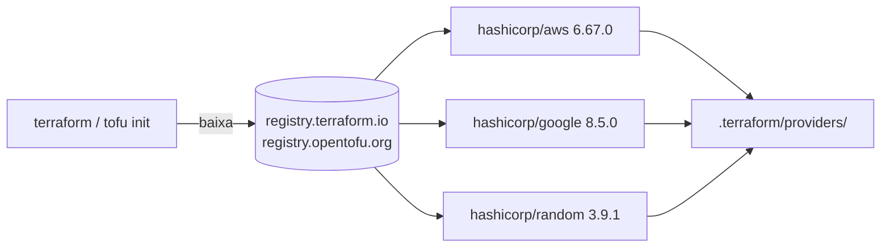
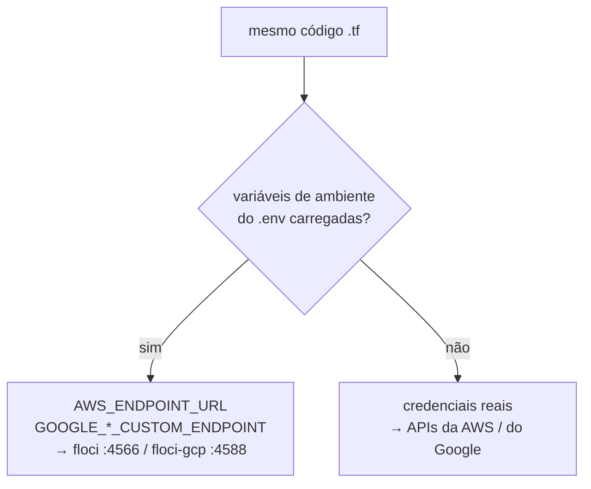

<!-- TOC -->

- [04 - Providers e os emuladores floci](#04---providers-e-os-emuladores-floci)
  - [O que é um provider](#o-que-é-um-provider)
  - [Fixando versões](#fixando-versões)
  - [O lock file](#o-lock-file)
  - [Configurando o provider](#configurando-o-provider)
  - [Apontando para o floci sem mudar o código](#apontando-para-o-floci-sem-mudar-o-código)
    - [AWS: AWS\_ENDPOINT\_URL](#aws-aws_endpoint_url)
    - [GCP: GOOGLE\_\*\_CUSTOM\_ENDPOINT](#gcp-google__custom_endpoint)
  - [Do floci para a nuvem real](#do-floci-para-a-nuvem-real)
  - [Pratique](#pratique)
  - [Referências](#referências)

<!-- TOC -->

# 04 - Providers e os emuladores floci

## O que é um provider

O core do Terraform/OpenTofu não sabe criar nada sozinho. Quem sabe é o
**provider**: um plugin (um binário separado) que traduz blocos como
`aws_sqs_queue` em chamadas de API (`CreateQueue`).

> **Analogia:** o Terraform é um controle remoto universal; os providers
> são os "códigos" de cada aparelho. Com o código da TV (provider `aws`) o
> mesmo controle liga a TV; com o do ar-condicionado (provider `google`),
> liga o ar.



## Fixando versões

```hcl
terraform {
  required_version = ">= 1.10"
  required_providers {
    aws = {
      source  = "hashicorp/aws"
      version = "6.67.0"
    }
  }
}
```

| Operador | Significa | Use em |
|---|---|---|
| `"6.67.0"` (ou `"= 6.67.0"`) | exatamente esta | **root modules**: labs e Terragrunt (`live/<nuvem>/cloud.hcl`) |
| `">= 6.0"` | esta ou mais nova | **módulos reutilizáveis** ([`modules/`](../modules/)) - quem chama decide a versão exata |
| `"~> 6.67"` | `>= 6.67, < 7.0` | quando você aceita *minor* novas automaticamente |
| `">= 6, < 8"` | faixa | módulos que sabem até onde foram testados (ex.: o módulo público do Cloud Run) |

> **Por que um módulo não fixa versão exata?** Se o módulo A exige
> `= 6.67.0` e o módulo B exige `= 6.68.0`, quem usar os dois não consegue
> rodar nada. Módulos declaram o **mínimo**; o root module escolhe a exata.

Um caso real deste repositório: o módulo público
`GoogleCloudPlatform/cloud-run` 0.34.1 declara `google >= 6, < 8`. Por isso
a unidade Cloud Run usa o provider 7.46.1, enquanto as demais usam 8.5.0
([lição 06](06-terragrunt.md#versões-de-provider-por-unidade)).

## O lock file

O `init` grava `.terraform.lock.hcl` com a versão escolhida e os *hashes* de
cada provider - garantia de que todos baixam o mesmo binário. **A
recomendação oficial é versionar o lock file dos root modules.**

Neste repositório os lock files **não** são versionados (veja o
[`.gitignore`](../.gitignore)): o mesmo código roda com `terraform` e com
`tofu`, que gravam endereços de registries diferentes
(`registry.terraform.io/hashicorp/aws` vs
`registry.opentofu.org/hashicorp/aws`). Como todas as versões estão fixadas
com `=`, o resultado é o mesmo; em um projeto que usa um único binário,
versione o lock file ([lição 09](09-boas-praticas.md)).

## Configurando o provider

Blocos `provider` ficam **só no root module** (nos labs, em `providers.tf`;
no Terragrunt, gerados pelo [`live/root.hcl`](../live/root.hcl)). Um
módulo reutilizável **nunca** tem bloco `provider`: ele herda o de quem o
chama.

```hcl
provider "aws" {
  region              = "us-east-1"
  allowed_account_ids = ["000000000000"]   # recusa outra conta

  default_tags {                           # tags em todo recurso que aceita tags
    tags = { Product = "learning-terraform", Environment = "dev" }
  }
}

provider "google" {
  project        = "floci-local"
  region         = "us-central1"
  default_labels = { product = "learning-terraform", environment = "dev" }
}
```

Para várias regiões ou contas no mesmo root module, crie providers com
`alias` (`provider "aws" { alias = "us_west_2" ... }`) e passe-os aos
módulos com `providers = { aws = aws.us_west_2 }`. Com Terragrunt, em vez
disso, cada região é uma pasta ([lição 06](06-terragrunt.md)).

## Apontando para o floci sem mudar o código

O objetivo: **o mesmo `.tf` roda no emulador e na nuvem real**. Nada de
`endpoints { }` ou `skip_credentials_validation` no código - só variáveis
de ambiente, definidas no [`.env.example`](../.env.example).



### AWS: AWS_ENDPOINT_URL

O guia oficial de endpoints customizados do provider AWS diz que
`AWS_ENDPOINT_URL` define o endpoint de **todos** os serviços (e
`AWS_ENDPOINT_URL_<SERVIÇO>`, um serviço). A AWS CLI e o boto3 leem a mesma
variável, então tudo o que você usa aponta para o floci ao mesmo tempo.

```bash
export AWS_ENDPOINT_URL=http://localhost.floci.io:4566
export AWS_ACCESS_KEY_ID=test AWS_SECRET_ACCESS_KEY=test AWS_DEFAULT_REGION=us-east-1
aws sts get-caller-identity --query Account --output text    # 000000000000
```

Por que `localhost.floci.io` e não `localhost`? Para o provider, buckets
S3 são acessados como `<bucket>.<endpoint>` e tags de bucket via S3 Control
em `<conta>.<endpoint>`. A documentação do floci informa que
`*.localhost.floci.io` resolve para a sua máquina; com `localhost` puro o
`apply` falha com `lookup lt-test-bucket.localhost ... no such host`
(observado; veja o [`REQUIREMENTS.md`, seção 5.3](../REQUIREMENTS.md#53---o-domínio-localhostflociio)).

### GCP: GOOGLE_*_CUSTOM_ENDPOINT

O provider Google aceita um endpoint por API, como argumento
(`storage_custom_endpoint`) ou como variável de ambiente. Os nomes das
variáveis estão no código do provider (`google/services/<produto>/product.go`,
campo `CustomEndpointEnvVar`) - por exemplo:

| API | Variável | Valor para o floci-gcp |
|---|---|---|
| Cloud Storage | `GOOGLE_STORAGE_CUSTOM_ENDPOINT` | `http://localhost:4588/storage/v1/` |
| Pub/Sub | `GOOGLE_PUBSUB_CUSTOM_ENDPOINT` | `http://localhost:4588/v1/` |
| Cloud Run v2 | `GOOGLE_CLOUD_RUN_V2_CUSTOM_ENDPOINT` | `http://localhost:4588/v2/` |
| IAM (service accounts) | `GOOGLE_IAM_BETA_CUSTOM_ENDPOINT` | `http://localhost:4588/v1/` |
| Resource Manager | `GOOGLE_RESOURCE_MANAGER_CUSTOM_ENDPOINT` | `http://localhost:4588/v1/` |
| Cloud SQL | `GOOGLE_SQL_CUSTOM_ENDPOINT` | `http://localhost:4588/sql/v1beta4/` |

Os caminhos (`/storage/v1/`, `/v2/`, ...) vêm dos testes de compatibilidade
com Terraform do próprio floci-gcp (`compatibility-tests/compat-terraform/provider.tf`).
O provider também precisa de **algum** token: `GOOGLE_OAUTH_ACCESS_TOKEN`
com qualquer valor (o floci-gcp não valida).

> **Cuidado observado:** recursos e *data sources* cuja API **não** foi
> apontada para o emulador vão para o Google real. Por isso o
> `.env.example` também aponta `GOOGLE_COMPUTE_CUSTOM_ENDPOINT` para o
> floci-gcp, mesmo sem o Compute existir na versão 0.9.0: é melhor um erro
> 404 local do que uma chamada à nuvem real.

## Do floci para a nuvem real

| | Emulador | Nuvem real |
|---|---|---|
| Variáveis | `set -a; source .env; set +a` | terminal novo, sem o `.env` |
| AWS | credenciais `test` | `aws sso login`, `AWS_PROFILE`, ... |
| GCP | token falso | `gcloud auth application-default login` |
| Custo | zero | cobrado - destrua ao terminar |

As diferenças de comportamento observadas estão no
[`REQUIREMENTS.md`, seção 10](../REQUIREMENTS.md#10-floci-vs-nuvem-real).

## Pratique

- [Lab 02 - AWS no floci](../labs/02-aws-floci/README.md): S3, SNS e SQS
  com recursos escritos à mão.
- [Lab 03 - GCP no floci-gcp](../labs/03-gcp-floci/README.md): Cloud
  Storage e Pub/Sub.

## Referências

- Providers: <https://developer.hashicorp.com/terraform/language/providers>
- Restrições de versão: <https://developer.hashicorp.com/terraform/language/expressions/version-constraints>
- Lock file: <https://developer.hashicorp.com/terraform/language/files/dependency-lock>
- Provider AWS - endpoints customizados: <https://registry.terraform.io/providers/hashicorp/aws/latest/docs/guides/custom-service-endpoints>
- Provider AWS - `default_tags`: <https://registry.terraform.io/providers/hashicorp/aws/latest/docs#default_tags-configuration-block>
- Provider Google - referência (custom endpoints, `default_labels`): <https://registry.terraform.io/providers/hashicorp/google/latest/docs/guides/provider_reference>
- floci - S3 e `localhost.floci.io`: <https://github.com/floci-io/floci/blob/2.1.0/docs/services/s3.md>
- floci-gcp - testes de compatibilidade com Terraform: <https://github.com/floci-io/floci-gcp/tree/main/compatibility-tests/compat-terraform>
