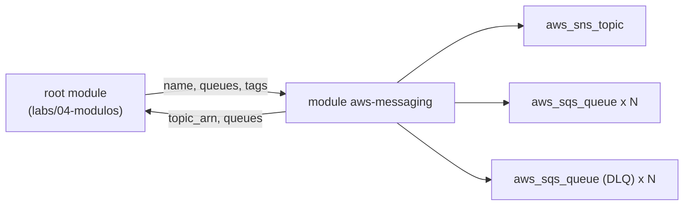
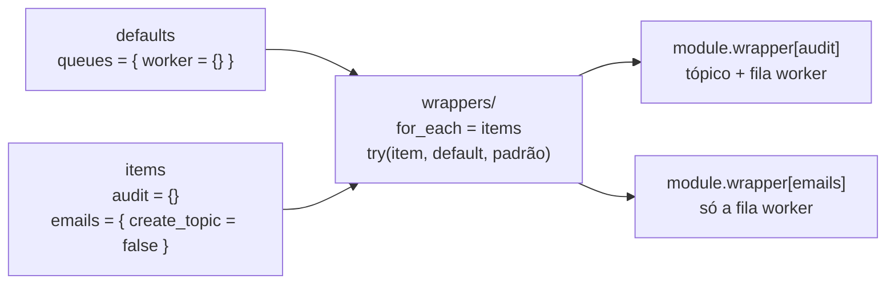
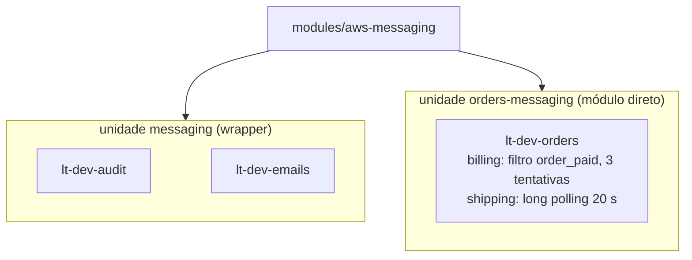

<!-- TOC -->

- [05 - Módulos e o padrão wrapper](#05---módulos-e-o-padrão-wrapper)
  - [O que é um módulo](#o-que-é-um-módulo)
  - [Estrutura de um módulo](#estrutura-de-um-módulo)
  - [Criando o módulo aws-messaging, passo a passo](#criando-o-módulo-aws-messaging-passo-a-passo)
  - [O mesmo módulo para o GCP](#o-mesmo-módulo-para-o-gcp)
  - [De onde vêm os módulos (source)](#de-onde-vêm-os-módulos-source)
  - [Módulos públicos](#módulos-públicos)
  - [Muitas instâncias: for\_each em módulos](#muitas-instâncias-for_each-em-módulos)
  - [O padrão wrapper](#o-padrão-wrapper)
  - [Recursos customizados fora do loop](#recursos-customizados-fora-do-loop)
  - [Qual usar?](#qual-usar)
  - [Versionando e publicando](#versionando-e-publicando)
  - [Pratique](#pratique)
  - [Referências](#referências)

<!-- TOC -->

# 05 - Módulos e o padrão wrapper

## O que é um módulo

Um **módulo** é um diretório com arquivos `.tf` que recebe entradas
(`variable`), cria recursos e devolve saídas (`output`). Todo diretório
onde você roda `terraform apply` já é um módulo - o *root module*. Os
outros são *child modules*, chamados com o bloco `module`.

> **Analogia:** um módulo é uma **função** em programação (ou uma peça de
> LEGO padronizada): você escreve uma vez, testa uma vez e reutiliza com
> parâmetros diferentes. `variable` são os parâmetros, `output` é o
> `return`.



## Estrutura de um módulo

A estrutura recomendada pela HashiCorp, usada em [`modules/`](../modules/):

```text
modules/aws-messaging/
├── README.md            # descrição escrita à mão + referência gerada (terraform-docs)
├── main.tf              # recursos
├── variables.tf         # entradas (com description, type, validation)
├── outputs.tf           # saídas
├── versions.tf          # required_version e required_providers (">=", nunca "=")
├── examples/complete/   # um root module que mostra como usar (e é aplicado nos testes)
├── tests/               # unit.tftest.hcl (mocks) e integration.tftest.hcl (emuladores)
└── wrappers/            # o módulo em loop: defaults + items (e seus próprios testes)
```

## Criando o módulo aws-messaging, passo a passo

O objetivo: um **fan-out** - um tópico SNS que entrega cada mensagem a
várias filas SQS, cada fila com a sua *dead-letter queue* (DLQ).

> **Analogia:** o tópico é o **alto-falante** da estação; cada fila é um
> **caderno de recados** de um setor (faturamento, entregas). Mensagem que
> o setor não consegue processar depois de N tentativas vai para a pasta
> de **pendências** (a DLQ), em vez de travar o caderno.

**1. Desenhe a interface antes do código.** O que quem usa precisa
informar? Um nome e um mapa de filas, em que cada fila tem atributos
opcionais com padrões sensatos:

```hcl
variable "queues" {
  type = map(object({
    visibility_timeout_seconds = optional(number, 30)
    max_receive_count          = optional(number, 5)
    create_dlq                 = optional(bool, true)
    filter_policy              = optional(string)
    # ...
  }))
  default = {}
}
```

**2. Valide as entradas** com os limites documentados pela AWS - o erro
aparece no `plan`, não no meio do `apply`:

```hcl
validation {
  condition     = alltrue([for q in values(var.queues) : q.visibility_timeout_seconds >= 0 && q.visibility_timeout_seconds <= 43200])
  error_message = "visibility_timeout_seconds must be between 0 and 43200 (AWS limit)."
}
```

**3. Crie os recursos com `for_each`** sobre o mapa (nunca `count` para
coleções - [lição 02](02-hcl-basico.md#count-vs-for_each)):

```hcl
resource "aws_sqs_queue" "this" {
  for_each = local.queues

  name                       = "${var.name}-${each.key}"
  visibility_timeout_seconds = each.value.visibility_timeout_seconds
  sqs_managed_sse_enabled    = var.sqs_managed_sse_enabled
  tags                       = var.tags
}
```

**4. Segurança por padrão:** criptografia das filas ligada; a política de
cada fila permite `sqs:SendMessage` **só** ao tópico deste módulo
(`aws:SourceArn`); a DLQ só aceita mensagens da sua fila de origem
(`redrive_allow_policy` com `byQueue`).

**5. Um interruptor `create`.** `count = var.create ? 1 : 0` permite
desligar uma instância sem apagar a configuração - e é o que o wrapper usa.

**6. Sem bloco `provider`.** Região, credenciais e endpoints vêm de quem
chama. É isso que permite rodar o mesmo módulo no floci e na AWS.

**7. Saídas úteis e estáveis:** `topic_arn`, `queues` (mapa com nome, ARN
e URL), `dead_letter_queues`, `subscription_arns`.

**8. Teste e documente:** testes unitários com *mocks* e de integração no
floci ([lição 07](07-testes.md)); README gerado pelo terraform-docs
([lição 08](08-terraform-docs.md)).

O código completo está em [`modules/aws-messaging/`](../modules/aws-messaging/README.md).

## O mesmo módulo para o GCP

[`modules/gcp-messaging/`](../modules/gcp-messaging/README.md) entrega a
mesma ideia no Google Cloud, com a mesma "forma" de interface:

| Conceito | AWS (`aws-messaging`) | GCP (`gcp-messaging`) |
|---|---|---|
| Canal de publicação | tópico SNS | tópico Pub/Sub |
| Consumidor | fila SQS + assinatura SNS | assinatura *pull* |
| Mensagens com falha | DLQ + `redrive_policy` (`max_receive_count`) | tópico *dead-letter* + `dead_letter_policy` (`max_delivery_attempts`, 5-100) |
| Filtro | `filter_policy` (JSON) | `filter` (expressão sobre atributos) |
| Permissões extras | política da fila para o SNS | papéis `pubsub.publisher` (tópico DLQ) e `pubsub.subscriber` (assinatura) para o agente de serviço `service-<número do projeto>@gcp-sa-pubsub.iam.gserviceaccount.com` |
| Rótulos | `tags` | `labels` (minúsculas) |

Um detalhe que só aparece ao testar: para montar o e-mail do agente de
serviço o módulo precisa do **número** do projeto. O *data source*
`google_project` o obtém, mas também lê dados de faturamento (Cloud
Billing), que o floci-gcp 0.9.0 não emula. Por isso o módulo aceita
`project_number` opcional - útil também em pipelines sem permissão de
faturamento.

## De onde vêm os módulos (source)

| `source` | Exemplo |
|---|---|
| caminho local | `source = "../../modules/aws-messaging"` |
| Terraform/OpenTofu Registry (+ `version`) | `source = "terraform-aws-modules/s3-bucket/aws"` e `version = "5.16.1"` |
| submódulo do registry | `source = "GoogleCloudPlatform/cloud-run/google//modules/v2"` |
| Git, fixado em uma tag | `source = "git::https://github.com/aeciopires/terraform.git//modules/aws-messaging?ref=<tag>"` |
| Terragrunt + registry | `source = "tfr:///terraform-aws-modules/vpc/aws?version=6.7.3"` |

O `//` separa o repositório/pacote do subdiretório. Sempre fixe a versão
(`version` ou `?ref=`): sem isso, um `init` amanhã pode trazer código
diferente do de hoje.

## Módulos públicos

Para recursos comuns, prefira módulos públicos mantidos e muito usados em
vez de reinventar. Esta trilha usa:

| Componente | AWS | GCP |
|---|---|---|
| Rede | `terraform-aws-modules/vpc` 6.7.3 | `terraform-google-modules/network` 18.3.0 |
| Armazenamento de objetos | `terraform-aws-modules/s3-bucket` 5.16.1 | `terraform-google-modules/cloud-storage` 12.4.0 |
| Balanceador | `terraform-aws-modules/alb` 10.5.1 | - (o Cloud Run já expõe uma URL HTTPS) |
| Contêineres | `terraform-aws-modules/ecs` 7.6.1 (Fargate) | `GoogleCloudPlatform/cloud-run//modules/v2` 0.34.1 |
| Firewall do banco | `terraform-aws-modules/security-group` 6.0.0 | regras no módulo `network` |
| Banco PostgreSQL | `terraform-aws-modules/rds` 7.2.2 | `terraform-google-modules/sql-db//modules/postgresql` 28.3.0 |
| Mensageria | módulo próprio `aws-messaging` | módulo próprio `gcp-messaging` |

Antes de adotar um módulo público, leia: o `variables.tf` (o que ele
aceita), o `versions.tf` (quais versões de provider ele suporta - foi assim
que descobrimos o limite `google < 8` do Cloud Run), os `examples/` e o
CHANGELOG.

## Muitas instâncias: for_each em módulos

Desde o Terraform 0.13, `for_each` também funciona em blocos `module`:

```hcl
module "app_buckets" {
  source   = "terraform-aws-modules/s3-bucket/aws"
  version  = "5.16.1"
  for_each = { assets = true, uploads = false }   # nome => versionamento

  bucket     = "lt-dev-000000000000-lab04-${each.key}"
  versioning = { enabled = each.value }
}
```

Limitações: as configurações comuns ficam repetidas em cada argumento, e o
**Terragrunt chama exatamente um módulo por unidade**, sem `for_each` no
módulo.

## O padrão wrapper

O **wrapper** é um módulo minúsculo que chama o módulo principal em loop a
partir de dois mapas:

- `defaults`: valores que valem para todos os itens;
- `items`: um item por instância, com **só o que difere**.

Cada argumento é resolvido com `try()`: primeiro o valor do item, depois o
de `defaults`, por fim o padrão do próprio módulo. É exatamente o padrão
dos [wrappers dos terraform-aws-modules](https://github.com/terraform-aws-modules/terraform-aws-lambda/tree/master/wrappers):

```hcl
# modules/aws-messaging/wrappers/main.tf
module "wrapper" {
  source   = "../"
  for_each = var.items

  create       = try(each.value.create, var.defaults.create, true)
  name         = try(each.value.name, var.defaults.name, each.key)
  queues       = try(each.value.queues, var.defaults.queues, {})
  create_topic = try(each.value.create_topic, var.defaults.create_topic, true)
  tags         = merge(try(var.defaults.tags, {}), try(each.value.tags, {}))
  # ...
}
```



> **Analogia:** é um **pedido de uniformes**. `defaults` é o modelo padrão
> (cor, tecido, logo); `items` é a lista de nomes, e só quem quer manga
> longa escreve "manga longa" ao lado do nome.

Com Terragrunt, uma única unidade cria todas as instâncias
([`live/aws/.../messaging/terragrunt.hcl`](../live/aws/floci-sandbox/dev/us-east-1/messaging/terragrunt.hcl)):

```hcl
include "envcommon" { ... }        # defaults = { queues = { worker = { max_receive_count = 5 } } }

inputs = {
  items = {
    "${include.root.locals.name_prefix}-audit"  = {}
    "${include.root.locals.name_prefix}-emails" = { create_topic = false }
  }
}
```

O mesmo vale para módulos públicos que trazem wrapper: a unidade `s3` usa
`terraform-aws-modules/s3-bucket/aws//wrappers`, com criptografia,
versionamento e bloqueio de acesso público em `defaults`, e um item
(`logs`) que desliga o versionamento e adiciona expiração.

Manter o wrapper manualmente é trabalhoso (um `try()` por variável). O
projeto [pre-commit-terraform](https://github.com/antonbabenko/pre-commit-terraform)
tem o hook `terraform_wrapper_module_for_each`, que o gera a partir do
`variables.tf` - é assim que os terraform-aws-modules o mantêm.

## Recursos customizados fora do loop

Nem tudo cabe no loop. Uma instância com necessidades muito específicas
fica **fora** dele, chamando o módulo diretamente - no
[lab 04](../labs/04-modulos/main.tf) é o `module "orders"`; no Terragrunt é
a unidade
[`orders-messaging`](../live/aws/floci-sandbox/dev/us-east-1/orders-messaging/terragrunt.hcl),
com `visibility_timeout_seconds`, `max_receive_count` e `filter_policy`
próprios.



## Qual usar?

| Situação | Use |
|---|---|
| uma instância | o módulo diretamente |
| várias instâncias parecidas, Terraform/OpenTofu puro | `for_each` no módulo, ou o wrapper se houver muitas configurações comuns |
| várias instâncias parecidas, Terragrunt | o **wrapper** (uma unidade, um state) |
| uma instância muito diferente das demais | módulo direto, **fora** do loop |
| instâncias com ciclos de vida diferentes (equipes, janelas de mudança) | unidades separadas - cada uma com o seu state |

## Versionando e publicando

- Use **versionamento semântico** nas tags do git (`v1.2.3`): *major*
  quebra a interface, *minor* adiciona, *patch* corrige.
- Registre as mudanças no [`CHANGELOG.md`](../CHANGELOG.md).
- Consuma pela tag: `...//modules/aws-messaging?ref=<tag>`.
- Para publicar no Terraform Registry, o repositório precisa seguir o
  padrão de nome `terraform-<PROVIDER>-<NOME>` (veja a referência).

## Pratique

Faça o [lab 04](../labs/04-modulos/README.md): quatro formas de chamar
módulos em um root module, aplicadas no floci e verificadas por um teste
de integração.

## Referências

- Módulos: <https://developer.hashicorp.com/terraform/language/modules>
- Estrutura padrão de módulo: <https://developer.hashicorp.com/terraform/language/modules/develop/structure>
- Fontes de módulos: <https://developer.hashicorp.com/terraform/language/modules/sources>
- Publicar no Registry: <https://developer.hashicorp.com/terraform/registry/modules/publish>
- Wrappers dos terraform-aws-modules: <https://github.com/terraform-aws-modules/terraform-aws-lambda/tree/master/wrappers>
- pre-commit-terraform (`terraform_wrapper_module_for_each`): <https://github.com/antonbabenko/pre-commit-terraform#terraform_wrapper_module_for_each>
- Pub/Sub - tratamento de falhas (dead-letter): <https://cloud.google.com/pubsub/docs/handling-failures>
- SQS - dead-letter queues: <https://docs.aws.amazon.com/AWSSimpleQueueService/latest/SQSDeveloperGuide/sqs-dead-letter-queues.html>
- SNS para SQS: <https://docs.aws.amazon.com/sns/latest/dg/sns-sqs-as-subscriber.html>
