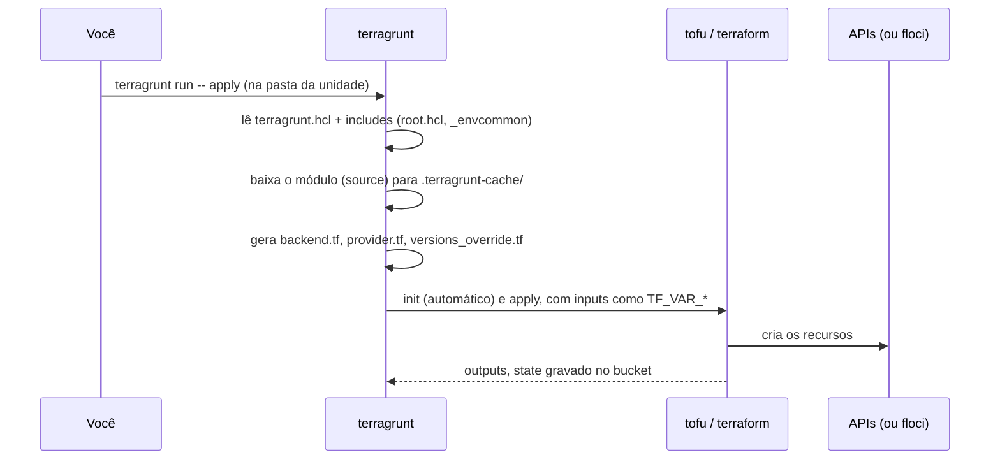
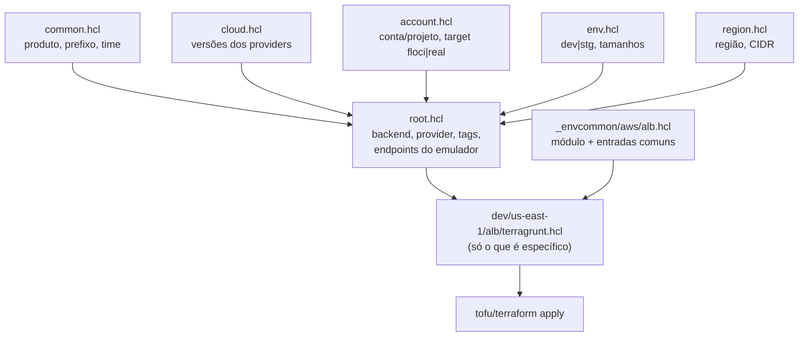
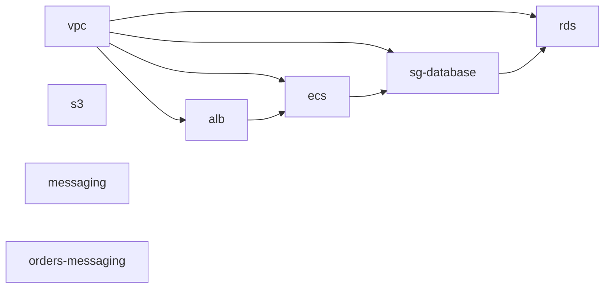

<!-- TOC -->

- [06 - Terragrunt](#06---terragrunt)
  - [O problema](#o-problema)
  - [Conceitos](#conceitos)
  - [Integrando o Terragrunt ao Terraform e ao OpenTofu](#integrando-o-terragrunt-ao-terraform-e-ao-opentofu)
  - [Do zero: uma unidade](#do-zero-uma-unidade)
  - [A hierarquia nuvem / conta / ambiente / região](#a-hierarquia-nuvem--conta--ambiente--região)
  - [root.hcl: o que toda unidade herda](#roothcl-o-que-toda-unidade-herda)
    - [remote\_state: um state por unidade, sem repetir](#remote_state-um-state-por-unidade-sem-repetir)
    - [generate: provider e versões](#generate-provider-e-versões)
    - [extra\_arguments: emulador ou nuvem real](#extra_arguments-emulador-ou-nuvem-real)
  - [\_envcommon: DRY entre ambientes](#_envcommon-dry-entre-ambientes)
  - [Módulos públicos e módulos próprios](#módulos-públicos-e-módulos-próprios)
  - [dependency: ligando unidades](#dependency-ligando-unidades)
  - [run --all: muitas unidades de uma vez](#run---all-muitas-unidades-de-uma-vez)
  - [exclude: unidades que não rodam em todo lugar](#exclude-unidades-que-não-rodam-em-todo-lugar)
  - [Versões de provider por unidade](#versões-de-provider-por-unidade)
  - [Adicionando uma conta ou projeto real](#adicionando-uma-conta-ou-projeto-real)
  - [Comandos do dia a dia](#comandos-do-dia-a-dia)
  - [Armadilhas que encontramos](#armadilhas-que-encontramos)
  - [Referências](#referências)

<!-- TOC -->

# 06 - Terragrunt

## O problema

Com Terraform/OpenTofu puro, cada ambiente/região vira um diretório com
`backend.tf`, `providers.tf`, `versions.tf` e as chamadas de módulos -
quase iguais entre si. Com 2 nuvens × 2 ambientes × 6 componentes, são 24
cópias para manter sincronizadas, e você precisa lembrar a ordem certa de
aplicar (a VPC antes do ALB, o ALB antes do ECS...).

O **Terragrunt** resolve três coisas:

1. **DRY** (*Don't Repeat Yourself*): backend, providers e configurações
   comuns escritos **uma vez** e herdados.
2. **Orquestração**: executa muitas unidades respeitando as dependências.
3. **Isolamento**: um state por unidade, sem esforço.

> **Analogia:** pense em uma **franquia de restaurantes**. A matriz
> (`root.hcl`) define o padrão de todas as lojas: fornecedores (providers),
> cofre (backend), uniforme (tags). O manual de cada prato
> (`_envcommon/*.hcl`) vale para todas as lojas. Cada loja (unidade) só
> diz o que é dela: o endereço (região) e o tamanho (ambiente). E o
> gerente (`run --all`) sabe que a cozinha precisa estar pronta antes de
> abrir o salão (dependências).

## Conceitos

| Termo | Neste repositório |
|---|---|
| **Unidade** (*unit*) | um diretório com `terragrunt.hcl` = uma chamada de módulo = um state. Ex.: `live/aws/floci-sandbox/dev/us-east-1/vpc` |
| **Stack** | um conjunto de unidades executadas juntas. Aqui, implícita: qualquer diretório com unidades abaixo (`live/aws/floci-sandbox/dev`). O Terragrunt também suporta stacks explícitas (`terragrunt.stack.hcl`), não usadas nesta trilha |
| `include` | herda outro arquivo de configuração (o `root.hcl`, um `_envcommon`) |
| `inputs` | valores das variáveis do módulo (viram `TF_VAR_*` em JSON) |
| `terraform { source }` | qual módulo a unidade chama |
| `dependency` | lê os outputs de outra unidade |
| `generate` | escreve um `.tf` (provider, versões) ao lado do módulo antes de rodar |
| `remote_state` | configura (e pode criar) o backend do state |

## Integrando o Terragrunt ao Terraform e ao OpenTofu

O Terragrunt **chama** o binário do Terraform ou do OpenTofu. Qual deles,
em ordem de precedência (documentação de `terraform_binary`):

1. a opção `--tf-path` na linha de comando;
2. a variável `TG_TF_PATH`;
3. o atributo `terraform_binary` no `terragrunt.hcl`;
4. o padrão: `tofu`.

```bash
terragrunt run --all --tf-path tofu -- plan
TG_TF_PATH=terraform terragrunt run --all -- plan
make tg-plan TF=terraform        # o Makefile repassa --tf-path
```

Este repositório aplicou todas as stacks com `tofu` 1.13.1 e repetiu o
ciclo `apply`/`destroy` da stack AWS `dev` com `terraform` 1.16.5. Também
observamos o `terraform` ler, sem diferenças, o state que o `tofu` gravou
(stack GCP `dev`). Ainda assim, em um projeto real escolha **um** binário
e mantenha-o. A tabela oficial de compatibilidade do
Terragrunt (consultada em 03/10/2026) lista testes em CI até OpenTofu
1.12.x e Terraform 1.14.x; a própria documentação diz que, na prática, a
compatibilidade é mais ampla - por isso as versões mais novas foram
verificadas aqui rodando de verdade.



## Do zero: uma unidade

O menor Terragrunt possível (do *Quick Start* oficial) é um
`terragrunt.hcl` vazio ao lado de um `main.tf`: o Terragrunt passa a
executar o `init` sozinho (*auto-init*). O passo seguinte é tirar o código
da unidade e apontar para um módulo:

```hcl
# terragrunt.hcl
terraform {
  source = "tfr:///terraform-aws-modules/vpc/aws?version=6.7.3"
}

inputs = {
  name = "lt-dev-vpc"
  cidr = "10.10.0.0/16"
}
```

Uma unidade, então, **não tem código Terraform**: só diz qual módulo usar
e com quais valores.

## A hierarquia nuvem / conta / ambiente / região

```text
live/
├── root.hcl                     # herdado por TODAS as unidades
├── common.hcl                   # produto, prefixo "lt", time
├── _envcommon/                  # configuração comum de cada componente
│   ├── aws/ vpc.hcl s3.hcl messaging.hcl alb.hcl ecs.hcl sg-database.hcl rds.hcl
│   └── gcp/ network.hcl gcs.hcl messaging.hcl cloud-run.hcl cloud-sql.hcl
├── aws/
│   ├── cloud.hcl                # versões de provider da AWS
│   └── floci-sandbox/           # uma CONTA (aqui, o floci)
│       ├── account.hcl          # account_id, target = "floci" | "real"
│       ├── dev/
│       │   ├── env.hcl          # environment, tamanhos, porta do ALB no floci
│       │   └── us-east-1/
│       │       ├── region.hcl   # região, CIDR, zonas
│       │       ├── vpc/terragrunt.hcl          ← unidades
│       │       ├── alb/ ecs/ sg-database/ rds/ s3/ messaging/ orders-messaging/
│       └── stg/us-west-2/...
└── gcp/
    ├── cloud.hcl
    └── floci-local/             # um PROJETO (aqui, o floci-gcp)
        ├── account.hcl
        ├── dev/us-central1/ network/ gcs/ messaging/ orders-messaging/ cloud-run/ cloud-sql/
        └── stg/us-east1/...
```

Cada arquivo responde a uma pergunta, e cada nível só sabe o que é dele:



Para criar o ambiente `prd` em `sa-east-1`, por exemplo, você copia uma
pasta de ambiente, ajusta `env.hcl` e `region.hcl` - as unidades não mudam.

## root.hcl: o que toda unidade herda

Cada unidade começa com:

```hcl
include "root" {
  path   = find_in_parent_folders("root.hcl")
  expose = true     # permite usar include.root.locals.* nesta unidade
}
```

O [`live/root.hcl`](../live/root.hcl) lê os arquivos da hierarquia com
`read_terragrunt_config(find_in_parent_folders("env.hcl"))` e monta
`locals` como `name_prefix = "lt-dev"`, as tags e os labels. Ele também
contém os blocos abaixo.

### remote_state: um state por unidade, sem repetir

```hcl
remote_state {
  backend = { aws = "s3", gcp = "gcs" }[local.cloud]
  config  = { aws = local.s3_backend, gcp = local.gcs_backend }[local.cloud]
  generate = {
    path      = "backend.tf"
    if_exists = "overwrite_terragrunt"
  }
}
```

A `key` do S3 (ou o `prefix` do GCS) é `path_relative_to_include()` - o
caminho da unidade, como `aws/floci-sandbox/dev/us-east-1/vpc/tf.tfstate`.
Cada unidade ganha o seu state automaticamente.

> Por que `{ aws = ..., gcp = ... }[local.cloud]` em vez de
> `local.cloud == "aws" ? ... : ...`? Porque a condicional exige que os
> dois lados tenham o **mesmo tipo**, e as configurações de S3 e GCS têm
> atributos diferentes (`Inconsistent conditional result types` -
> [TROUBLESHOOTING](TROUBLESHOOTING.md#inconsistent-conditional-result-types)).

Em uma conta real, crie o bucket (com versionamento e criptografia) na
primeira execução:

```bash
terragrunt run --all --backend-bootstrap -- plan
```

### generate: provider e versões

O módulo não tem bloco `provider` ([lição 05](05-modulos.md)); o root gera
um `provider.tf` com a região, `allowed_account_ids` e as tags padrão, e
um `versions_override.tf` que fixa a versão exata do provider. O sufixo
`_override` usa o mecanismo de *override files* do Terraform/OpenTofu: o
módulo já tem um `versions.tf`, e o override substitui apenas a restrição
de versão do provider indicado, mantendo o resto
([TROUBLESHOOTING](TROUBLESHOOTING.md#versionstf-already-exists-and-was-not-generated-by-terragrunt)).

### extra_arguments: emulador ou nuvem real

```hcl
terraform {
  extra_arguments "cloud_endpoints" {
    commands = concat(get_terraform_commands_that_need_vars(), ["init", "output", ...])
    env_vars = local.tf_env   # depende da nuvem e do target da conta
  }
}
```

| | AWS | GCP |
|---|---|---|
| `target = "floci"` | `AWS_ENDPOINT_URL`, credenciais `test` | `GOOGLE_*_CUSTOM_ENDPOINT`, token falso |
| `target = "real"` | `AWS_IGNORE_CONFIGURED_ENDPOINT_URLS=true` | `GOOGLE_*_CUSTOM_ENDPOINT` vazios |

Assim, **a conta decide para onde as chamadas vão** - e variáveis do floci
esquecidas no seu shell não desviam uma conta real.

> **Não coloque `inputs` globais no root.** O Terragrunt passa cada input a
> **todo** módulo; se um módulo público tiver uma variável com o mesmo
> nome, ele a recebe. Um `name_prefix` global chegou à variável
> `name_prefix` do módulo ALB e causou `"name": conflicts with name_prefix`
> ([TROUBLESHOOTING](TROUBLESHOOTING.md#name-conflicts-with-name_prefix-no-módulo-alb)).

## _envcommon: DRY entre ambientes

O padrão vem da documentação oficial de *includes* (pasta `_env`): a
configuração de um componente que se repete em todos os ambientes vai para
um arquivo comum, incluído por cada unidade:

```hcl
# live/aws/floci-sandbox/dev/us-east-1/alb/terragrunt.hcl  (a unidade inteira!)
include "root" {
  path   = find_in_parent_folders("root.hcl")
  expose = true
}

include "envcommon" {
  path           = "${dirname(find_in_parent_folders("root.hcl"))}/_envcommon/aws/alb.hcl"
  expose         = true
  merge_strategy = "deep"
}
```

O [`_envcommon/aws/alb.hcl`](../live/_envcommon/aws/alb.hcl) traz o
`source`, a `dependency` da VPC e as entradas, usando os arquivos da
hierarquia para o que muda (nome com o ambiente, porta do listener).

Dois detalhes importantes, ambos observados:

- **`merge_strategy = "deep"`**: com o merge padrão (*shallow*), o bloco
  `terraform { source }` do `_envcommon` substituiria por inteiro o bloco
  `terraform { extra_arguments }` do root. Com *deep*, os dois se somam.
- **O `_envcommon` não pode ler o `root.hcl`** com `read_terragrunt_config`:
  um arquivo lido assim resolve `find_in_parent_folders()` a partir da
  **própria** pasta (`live/`), não da unidade. Por isso as configurações de
  produto ficam em [`live/common.hcl`](../live/common.hcl), que não procura
  nada e pode ser lido por todos.

## Módulos públicos e módulos próprios

| Origem | `source` na unidade / `_envcommon` |
|---|---|
| módulo público do registry | `tfr:///terraform-aws-modules/vpc/aws?version=6.7.3` |
| submódulo público | `tfr:///GoogleCloudPlatform/cloud-run/google//modules/v2?version=0.34.1` |
| wrapper de módulo público | `tfr:///terraform-aws-modules/s3-bucket/aws//wrappers?version=5.16.1` |
| módulo próprio, mesmo repositório | `${get_repo_root()}/modules/aws-messaging` |
| wrapper do módulo próprio | `${get_repo_root()}/modules/aws-messaging//wrappers` |
| módulo próprio, outro repositório | `git::https://github.com/aeciopires/terraform.git//modules/aws-messaging/wrappers?ref=<tag>` |

O `//` diz ao Terragrunt **o que copiar** (tudo antes) e **onde rodar**
(depois). Para o wrapper, o diretório inteiro do módulo precisa ser
copiado, porque o wrapper chama `source = "../"`.

## dependency: ligando unidades

```hcl
dependency "vpc" {
  config_path = "../vpc"

  # valores falsos para plan/validate antes de a VPC existir
  mock_outputs = {
    vpc_id         = "vpc-00000000"
    public_subnets = ["subnet-00000001", "subnet-00000002"]
  }
  mock_outputs_allowed_terraform_commands = ["init", "validate", "plan"]
}

inputs = {
  vpc_id  = dependency.vpc.outputs.vpc_id
  subnets = dependency.vpc.outputs.public_subnets
}
```

O Terragrunt monta um **grafo** (DAG) com essas dependências. O da stack
AWS de cada ambiente:



`s3`, `messaging` e `orders-messaging` não dependem de nada e rodam em
paralelo com a VPC. Veja o grafo real com `make tg-graph CLOUD=aws ENV=dev`.

## run --all: muitas unidades de uma vez

```bash
cd live/aws/floci-sandbox/dev
terragrunt run --all -- plan       # todas as unidades abaixo, em ordem
terragrunt run --all -- apply      # pede confirmação uma vez (ou --non-interactive)
terragrunt run --all -- destroy    # ordem inversa: rds antes de vpc
terragrunt run --all --filter 'vpc' -- plan                  # só unidades chamadas vpc
terragrunt run --all --filter './aws/**/dev/**' -- plan      # a partir de live/: só dev da AWS
```

## exclude: unidades que não rodam em todo lugar

O floci-gcp 0.9.0 não emula o Compute Engine, então as unidades `network`
e `cloud-sql` do GCP só funcionam em um projeto real. Em vez de removê-las,
o `_envcommon` as **exclui** quando a conta é o emulador:

```hcl
exclude {
  if                   = local.is_floci
  actions              = ["all"]
  no_run               = true    # também ignora "terragrunt plan" dentro da unidade
  exclude_dependencies = false
}
```

O resumo do `run --all` mostra `Excluded 2` por ambiente.

## Versões de provider por unidade

O [`live/gcp/cloud.hcl`](../live/gcp/cloud.hcl) fixa o provider Google
8.5.0 para a nuvem toda, mas o módulo público do Cloud Run (0.34.1) aceita
apenas `google < 8`. A exceção fica no mesmo arquivo, por nome de unidade,
e o `root.hcl` a aplica:

```hcl
provider_version_overrides = {
  cloud-run = {
    google      = "7.46.1"
    google-beta = "7.46.1"
  }
}
```

(A primeira tentativa - redefinir o bloco `generate "versions"` no
`_envcommon` - falha com `Detected generate blocks with the same name`
quando o merge é *deep*.)

## Adicionando uma conta ou projeto real

1. Copie a conta do emulador:
   ```bash
   cp -r live/aws/floci-sandbox live/aws/minha-conta-dev
   ```
2. Em `live/aws/minha-conta-dev/account.hcl`, mude `account_name`,
   `account_id` (12 dígitos), `target = "real"` e `state_region`. (GCP:
   `project_id`, `project_number` ou `null`, `target = "real"`,
   `state_location`.)
3. Em `env.hcl`, `floci_alb_port` passa a ser ignorado (o ALB usa 80).
4. Autentique-se **em um terminal sem o `.env`**: `aws sso login` /
   `AWS_PROFILE=...` ou `gcloud auth application-default login`.
5. Planeje, criando o bucket de state:
   ```bash
   cd live/aws/minha-conta-dev/dev
   terragrunt run --all --backend-bootstrap -- plan
   ```
6. Leia o plano com calma e só então `apply`. Recursos reais **custam**
   (NAT Gateway, ALB, RDS, Cloud SQL...). Destrua ao terminar.

O `allowed_account_ids` do provider gerado impede aplicar em outra conta
por engano.

## Comandos do dia a dia

```bash
terragrunt list --working-dir live                            # unidades
terragrunt dag graph --working-dir live/aws/floci-sandbox/dev # grafo (DOT)
terragrunt render --format json --working-dir <unidade>       # config final, com includes resolvidos
terragrunt hcl fmt --working-dir live                         # formata os .hcl
terragrunt run -- output -json                                # dentro de uma unidade
terragrunt run --all -- output                                # de todas as unidades
terragrunt run --all -- plan -detailed-exitcode               # drift: código 2 = há mudanças
```

## Armadilhas que encontramos

Todas com sintoma, causa e solução no [TROUBLESHOOTING](TROUBLESHOOTING.md):
inputs globais colidindo com variáveis de módulos; `.terraform/` local
copiado junto com o módulo; testes do módulo carregados pelo `init`;
`generate` duplicado; condicionais com objetos diferentes; e o
`--backend-bootstrap` no floci-gcp.

## Referências

- Terragrunt - Quick Start: <https://docs.terragrunt.com/getting-started/quick-start/>
- Terminologia (unit, stack): <https://docs.terragrunt.com/getting-started/terminology/>
- Includes (e o padrão `_env`): <https://docs.terragrunt.com/features/units/includes/>
- State backend: <https://docs.terragrunt.com/features/units/state-backend/>
- Blocos (`terraform`, `remote_state`, `include`, `dependency`, `generate`, `exclude`): <https://docs.terragrunt.com/reference/hcl/blocks/>
- Atributos (`inputs`, `terraform_binary`): <https://docs.terragrunt.com/reference/hcl/attributes/>
- Funções (`find_in_parent_folders`, `read_terragrunt_config`, `get_repo_root`): <https://docs.terragrunt.com/reference/hcl/functions/>
- Migrando do `terragrunt.hcl` raiz para `root.hcl`: <https://docs.terragrunt.com/migrate/migrating-from-root-terragrunt-hcl/>
- Compatibilidade de versões: <https://docs.terragrunt.com/reference/supported-versions/>
- Override files: <https://developer.hashicorp.com/terraform/language/files/override>
