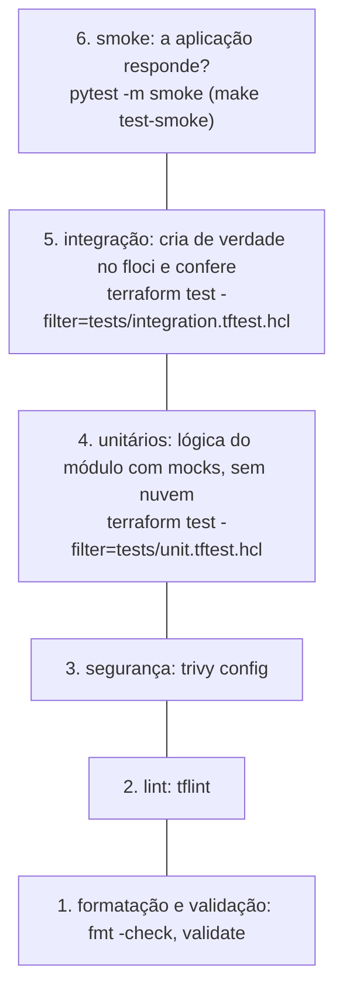

<!-- TOC -->

- [07 - Testes](#07---testes)
  - [A pirâmide de testes de IaC](#a-pirâmide-de-testes-de-iac)
  - [1. Formatação e validação](#1-formatação-e-validação)
  - [2. Lint com TFLint](#2-lint-com-tflint)
  - [3. Segurança com Trivy](#3-segurança-com-trivy)
  - [4. Testes unitários com terraform test e mocks](#4-testes-unitários-com-terraform-test-e-mocks)
  - [5. Testes de integração nos emuladores](#5-testes-de-integração-nos-emuladores)
  - [6. Smoke tests](#6-smoke-tests)
  - [Detecção de drift](#detecção-de-drift)
  - [Testes dos scripts Python](#testes-dos-scripts-python)
  - [pre-commit](#pre-commit)
  - [Tudo de uma vez](#tudo-de-uma-vez)
  - [Referências](#referências)

<!-- TOC -->

# 07 - Testes

## A pirâmide de testes de IaC

> **Analogia:** antes de um avião decolar há várias checagens, das mais
> rápidas às mais caras: olhar a lista de itens (formatação), o *checklist*
> de cabine (validação e lint), a inspeção de segurança (trivy), o teste de
> motores no solo (testes unitários com *mocks*), o voo de teste em um
> simulador (integração no floci) e, por fim, a confirmação de que os
> passageiros chegaram (*smoke tests*).



Quanto mais embaixo, mais rápido, mais barato e mais vezes deve rodar.
Os níveis 1 a 4 (`make test`) não precisam de nuvem nem de emulador.

## 1. Formatação e validação

```bash
terraform fmt -recursive -check -diff modules labs    # falha se algo não estiver formatado
terragrunt hcl fmt --check --working-dir live
cd modules/aws-messaging && terraform init -backend=false && terraform validate
```

`validate` confere sintaxe, referências e tipos - sem chamar APIs.

## 2. Lint com TFLint

O TFLint encontra o que o `validate` não vê: variáveis sem `description`,
declarações não usadas, nomes fora do padrão `snake_case`, versões não
fixadas e, com os *rulesets* da AWS e do Google, valores inválidos (tipos
de instância, regiões). Configuração em [`.tflint.hcl`](../.tflint.hcl):

```bash
tflint --init --config "$PWD/.tflint.hcl"            # baixa os plugins (uma vez)
tflint --chdir modules/aws-messaging --config "$PWD/.tflint.hcl"
make lint                                            # todos os diretórios
```

Para ver o tflint funcionando, rode-o em um exemplo legado (Terraform 0.11):
`tflint --chdir aws_docker_openproject/modules/application --config "$PWD/.tflint.hcl"`
encontra 43 problemas.

## 3. Segurança com Trivy

O `trivy config` procura configurações inseguras (bucket público, tópico
sem criptografia, porta 22 aberta para a internet...):

```bash
trivy config --severity HIGH,CRITICAL modules        # make security
trivy config --severity MEDIUM,HIGH,CRITICAL labs    # os labs têm achados de propósito
```

Um achado **não** é uma ordem: é um convite a decidir conscientemente. No
módulo `aws-messaging`, o trivy apontou `AWS-0095` (tópico SNS sem
criptografia). A decisão foi oferecer a variável `kms_master_key_id` (as
filas já são criptografadas com SSE-SQS) e registrar o motivo ao lado do
recurso, com a supressão *inline* documentada pelo trivy:

```hcl
# Topic encryption is opt-in (kms_master_key_id): a customer managed KMS key
# has a monthly cost and a key policy that every publisher must be allowed
# by. ...
#trivy:ignore:AWS-0095
resource "aws_sns_topic" "this" {
```

Nos labs os achados (`AWS-0095`, `AWS-0132` - S3 sem chave KMS gerenciada
pelo cliente) ficam visíveis de propósito, para você praticar a leitura.

## 4. Testes unitários com terraform test e mocks

O comando `test` existe no Terraform desde a 1.6 e no OpenTofu desde a 1.6;
os *mocks* (`mock_provider`, `mock_resource`, `mock_data`) chegaram no
Terraform 1.7 e no OpenTofu 1.8. Um arquivo `.tftest.hcl` tem blocos `run`;
cada um executa `plan` ou `apply` e verifica `assert`s.

Com `mock_provider`, o provider de verdade é trocado por um falso que
inventa os atributos calculados (ARNs, IDs). Assim até `command = apply`
roda **sem nuvem e sem credenciais**, em segundos:

```hcl
# modules/aws-messaging/tests/unit.tftest.hcl
mock_provider "aws" {
  # o provider valida ARNs; os valores aleatórios do mock não passariam
  mock_resource "aws_sns_topic" {
    defaults = { arn = "arn:aws:sns:us-east-1:123456789012:mock-topic" }
  }
}

variables {
  name   = "unit-orders"
  queues = { billing = { max_receive_count = 3 }, shipping = { create_dlq = false } }
}

run "creates_topic_queues_and_dlqs" {
  command = apply

  assert {
    condition     = keys(aws_sqs_queue.dlq) == ["billing"]
    error_message = "Only queues with create_dlq = true get a dead-letter queue."
  }
}

run "rejects_invalid_name" {
  command = plan
  variables { name = "invalid name with spaces" }
  expect_failures = [var.name]       # o teste PASSA se a validação falhar
}
```

```bash
cd modules/aws-messaging
terraform init -backend=false
terraform test -filter=tests/unit.tftest.hcl          # ou: tofu test ...
make test-unit                                        # módulos, wrappers e labs
make test-unit TF=terraform
```

O que testar em um módulo:

| Tipo de verificação | Exemplo neste repositório |
|---|---|
| convenção de nomes | `<name>-<fila>-dlq` |
| lógica condicional | `create_topic = false` não cria tópico nem assinaturas |
| entradas chegam aos recursos | `max_receive_count` aparece na `redrive_policy` |
| segurança por padrão | filas com SSE-SQS; política só para o tópico |
| validações | `expect_failures = [var.queues]` com valores fora dos limites da AWS |
| wrapper | `defaults` preenchem o que falta; itens sobrescrevem |

> **Uma pegadinha real:** o `init` também carrega os testes em `tests/`.
> Um teste que chamava `./wrappers` a partir da raiz do módulo quebrava
> quando o Terragrunt gerava um `provider.tf` na raiz. Por isso os testes do
> wrapper ficam em `wrappers/tests/`
> ([TROUBLESHOOTING](TROUBLESHOOTING.md#module-is-incompatible-with-count-for_each-enabled-and-depends_on)).

**Faça o teste falhar de propósito:** troque `"-dlq"` por `"-dead"` no
`main.tf` e rode de novo. Um teste que nunca falha não testa nada.

## 5. Testes de integração nos emuladores

O mesmo formato, mas **sem mock**: o teste cria os recursos de verdade no
floci, confere o que a API devolveu e destrói tudo no fim:

```hcl
# modules/aws-messaging/tests/integration.tftest.hcl
run "apply_and_check_real_resources" {
  command = apply

  assert {
    condition     = can(regex("^arn:aws:sns:[a-z0-9-]+:[0-9]{12}:it-orders$", output.topic_arn))
    error_message = "The topic ARN returned by the API must be well formed."
  }
}
```

```bash
make floci-start
set -a; source .env; set +a
cd modules/aws-messaging && terraform test -filter=tests/integration.tftest.hcl
make test-integration       # módulos e labs
```

Apontando para uma conta real (sem o `.env`), o mesmo teste vira um teste
de aceitação na nuvem - cobrado.

## 6. Smoke tests

Depois de `make tg-apply ENV=dev`, os testes em
[`tests/smoke/test_stacks.py`](../tests/smoke/test_stacks.py) (pytest)
conferem o que uma pessoa conferiria à mão: os recursos existem com os
nomes esperados, o ALB devolve HTTP 200 vindo do nginx no ECS e o Cloud Run
também.

```bash
make tg-apply ENV=dev
make test-smoke
```

## Detecção de drift

Após um `apply`, um novo `plan` deveria dizer `No changes` (idempotência).
`plan -detailed-exitcode` sai com **0** (sem mudanças), **1** (erro) ou
**2** (há mudanças) - ideal para automação:

```bash
make tg-drift CLOUD=gcp ENV=dev     # sai 0
make tg-drift CLOUD=aws ENV=dev     # sai 2 no floci - veja abaixo
```

No floci 2.1.0, três unidades AWS sempre mostram mudanças por
comportamento do emulador (`ecs`, `rds`, `sg-database` - detalhes no
[`REQUIREMENTS.md`, seção 10](../REQUIREMENTS.md#10-floci-vs-nuvem-real)).
Saber **por que** um plano não está limpo é parte do trabalho.

## Testes dos scripts Python

O script [`scripts/list_resources.py`](../scripts/list_resources.py) tem
testes unitários com *fakes* (sem nuvem), lint (ruff), tipos (mypy) e
cobertura mínima de 80%:

```bash
uv run pytest            # testes unitários (os smoke ficam de fora por padrão)
make test-python         # ruff + mypy + pytest com cobertura
```

## pre-commit

O [`.pre-commit-config.yaml`](../.pre-commit-config.yaml) roda formatação,
terraform-docs, tflint, trivy, ruff e shellcheck a cada `git commit`:

```bash
pre-commit install          # uma vez
pre-commit run -a           # em todos os arquivos versionados
```

## Tudo de uma vez

| Alvo | O que roda | Precisa de emulador? |
|---|---|---|
| `make test` | fmt-check, validate, lint, security, docs-check, test-unit, test-python | não |
| `make test-integration` | testes de integração de módulos e labs | sim |
| `make test-smoke` | smoke tests | sim, com `tg-apply` feito |
| `make test-all` | `make test` com `tofu` **e** `terraform`, mais a integração | sim |

## Referências

- Terraform - testes: <https://developer.hashicorp.com/terraform/language/tests>
- Terraform - mocks: <https://developer.hashicorp.com/terraform/language/tests/mocking>
- OpenTofu - `tofu test`: <https://opentofu.org/docs/cli/commands/test/>
- Terraform 1.6 (test GA) e 1.7 (mocks): <https://github.com/hashicorp/terraform/blob/v1.7.0/CHANGELOG.md>
- OpenTofu 1.8 (mocks): <https://github.com/opentofu/opentofu/blob/v1.8.0/CHANGELOG.md>
- `plan -detailed-exitcode`: <https://developer.hashicorp.com/terraform/cli/commands/plan#detailed-exitcode>
- TFLint: <https://github.com/terraform-linters/tflint> · ruleset Terraform: <https://github.com/terraform-linters/tflint-ruleset-terraform>
- Trivy - misconfiguration e supressões: <https://trivy.dev/latest/docs/scanner/misconfiguration/>
- pre-commit-terraform: <https://github.com/antonbabenko/pre-commit-terraform>
- pytest: <https://docs.pytest.org>
