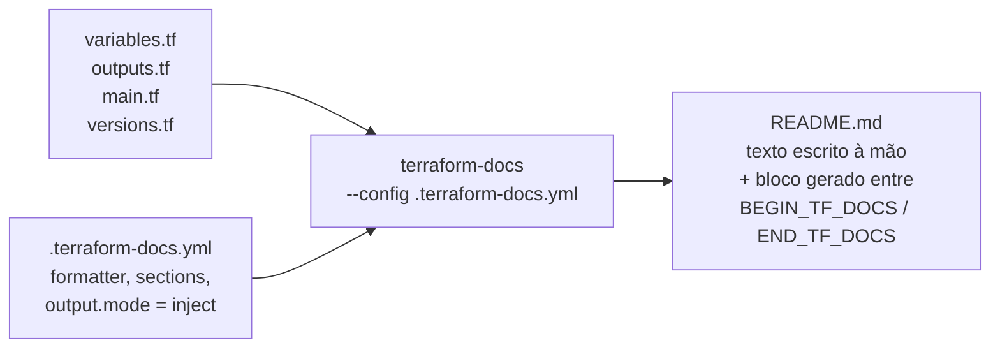

<!-- TOC -->

- [08 - Documentação com terraform-docs](#08---documentação-com-terraform-docs)
  - [Por que gerar a documentação](#por-que-gerar-a-documentação)
  - [Como funciona](#como-funciona)
  - [A configuração deste repositório](#a-configuração-deste-repositório)
  - [Gerando a documentação](#gerando-a-documentação)
  - [Verificando se está atualizada](#verificando-se-está-atualizada)
  - [Automatizando](#automatizando)
    - [Com pre-commit (a cada commit)](#com-pre-commit-a-cada-commit)
    - [Com o Makefile](#com-o-makefile)
    - [Em CI (GitHub Actions)](#em-ci-github-actions)
  - [Escrevendo boas descrições](#escrevendo-boas-descrições)
  - [Referências](#referências)

<!-- TOC -->

# 08 - Documentação com terraform-docs

## Por que gerar a documentação

A tabela de entradas e saídas de um módulo muda toda vez que alguém
adiciona uma variável. Escrita à mão, ela fica desatualizada em semanas.
O [terraform-docs](https://terraform-docs.io) lê o código (`variable`,
`output`, `resource`, `required_providers`) e **gera** essa parte do
README.

> **Analogia:** é a **bula do remédio** impressa pela própria fábrica a
> partir da fórmula: se a fórmula muda, a bula muda junto - ninguém precisa
> lembrar de reescrevê-la.

## Como funciona



No modo **inject**, só o trecho entre os marcadores é reescrito; o resto do
README (descrição, diagrama, exemplos de uso) é seu:

```markdown
# aws-messaging

Fan-out messaging on AWS ... (escrito à mão)

<!-- BEGIN_TF_DOCS -->
(gerado - não edite)
<!-- END_TF_DOCS -->
```

## A configuração deste repositório

Um único [`.terraform-docs.yml`](../.terraform-docs.yml) na raiz serve a
todos os módulos, wrappers e exemplos:

```yaml
formatter: markdown table
version: ">= 0.24.0, < 1.0.0"

sections:
  show: [requirements, providers, modules, resources, inputs, outputs]

output:
  file: README.md
  mode: inject

sort:
  enabled: true
  by: required      # obrigatórias primeiro

settings:
  anchor: true      # links para cada entrada
  default: true
  required: true
  type: true
  lockfile: false   # versões do versions.tf, não de um lock file
```

## Gerando a documentação

```bash
terraform-docs --config .terraform-docs.yml modules/aws-messaging
terraform-docs --config .terraform-docs.yml modules/aws-messaging/wrappers
make docs          # todos os módulos, wrappers e exemplos
```

Saída esperada: `modules/aws-messaging/README.md updated successfully`.

Para ver o resultado **sem gravar**, esvazie o arquivo de saída - o texto
vai para a tela:

```bash
terraform-docs markdown table --output-file "" modules/gcp-messaging | head -30
```

(Sem o `--output-file ""`, o terraform-docs encontra o `.terraform-docs.yml`
da pasta atual e **grava** no README - observado ao escrever esta lição.)

## Verificando se está atualizada

`--output-check` não grava nada: sai com erro se o README estiver
desatualizado. É o que a CI (e o `make test`) deve rodar:

```bash
terraform-docs --config .terraform-docs.yml --output-check modules/aws-messaging
# modules/aws-messaging/README.md is up to date
make docs-check
```

Experimente: adicione uma variável em `modules/aws-messaging/variables.tf`,
rode `make docs-check` (falha), depois `make docs` (corrige).

## Automatizando

### Com pre-commit (a cada commit)

O hook `terraform_docs` do
[pre-commit-terraform](https://github.com/antonbabenko/pre-commit-terraform)
regenera a documentação dos módulos alterados antes de cada commit, usando
o mesmo arquivo de configuração:

```yaml
# .pre-commit-config.yaml
- repo: https://github.com/antonbabenko/pre-commit-terraform
  rev: v1.109.2
  hooks:
    - id: terraform_docs
      files: ^modules/
      args:
        - --hook-config=--path-to-file=README.md
        - --hook-config=--add-to-existing-file=true
        - --hook-config=--create-file-if-not-exist=false
        - --args=--config=.terraform-docs.yml
```

```bash
pre-commit install
git commit -m "..."        # se o README mudou, o commit para; faça git add e repita
```

### Com o Makefile

`make docs` (gera) e `make docs-check` (verifica, parte do `make test`).

### Em CI (GitHub Actions)

A documentação do terraform-docs descreve a action oficial
`terraform-docs/gh-actions`, que gera e pode fazer *push* da documentação
no próprio *pull request*. Uma alternativa mais simples é falhar a CI com
`make docs-check` e deixar a geração para quem abriu o PR.

## Escrevendo boas descrições

O terraform-docs só é tão bom quanto as `description` do código:

- diga **o efeito**, não o tipo: "Whether to create an SNS topic and
  subscribe every queue to it" é melhor que "Boolean flag";
- informe **limites e padrões** da nuvem: "0-43200 (AWS default 30)";
- em objetos complexos, use *heredoc* (`<<-EOT`) e liste cada atributo,
  como em `queues` do [`aws-messaging`](../modules/aws-messaging/variables.tf).

O tflint ([lição 07](07-testes.md)) exige `description` em toda variável e
saída (`terraform_documented_variables`, `terraform_documented_outputs`).

## Referências

- terraform-docs: <https://terraform-docs.io>
- Configuração: <https://terraform-docs.io/user-guide/configuration/>
- Modo inject e marcadores: <https://terraform-docs.io/user-guide/configuration/output/>
- pre-commit: <https://terraform-docs.io/how-to/pre-commit-hooks/>
- GitHub Action: <https://github.com/terraform-docs/gh-actions>
- pre-commit-terraform (`terraform_docs`): <https://github.com/antonbabenko/pre-commit-terraform#terraform_docs>
