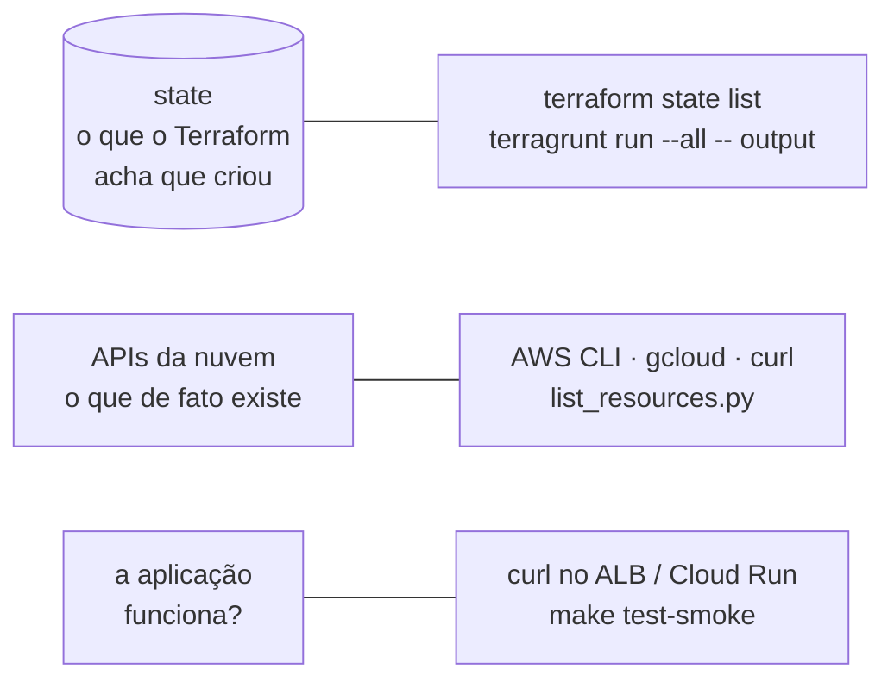

<!-- TOC -->

- [10 - Verificar e listar recursos](#10---verificar-e-listar-recursos)
  - [Três fontes da verdade](#três-fontes-da-verdade)
  - [Pelo Terraform/Terragrunt](#pelo-terraformterragrunt)
  - [Tudo de uma vez: list\_resources.py](#tudo-de-uma-vez-list_resourcespy)
  - [AWS CLI](#aws-cli)
    - [Rede](#rede)
    - [S3](#s3)
    - [SNS e SQS (e um teste de fan-out)](#sns-e-sqs-e-um-teste-de-fan-out)
    - [ALB e ECS](#alb-e-ecs)
    - [RDS](#rds)
  - [Google Cloud](#google-cloud)
    - [gcloud](#gcloud)
    - [REST com curl](#rest-com-curl)
    - [Cloud Run](#cloud-run)
  - [Na nuvem real](#na-nuvem-real)
  - [Referências](#referências)

<!-- TOC -->

# 10 - Verificar e listar recursos

Todos os comandos abaixo foram executados contra floci 2.1.0 e floci-gcp
0.9.0 com a stack `dev` aplicada (`make tg-apply ENV=dev`). A saída
mostrada é a observada. Carregue antes as variáveis do emulador:

```bash
set -a; source .env; set +a
```

## Três fontes da verdade



Se o state e a API discordam, há *drift* ([lição 03](03-state-e-backends.md#drift-quando-a-realidade-muda)).

## Pelo Terraform/Terragrunt

```bash
cd live/aws/floci-sandbox/dev/us-east-1/vpc
terragrunt run -- state list           # endereços no state desta unidade
terragrunt run -- output               # saídas desta unidade

cd ../../..                            # live/aws/floci-sandbox/dev
terragrunt run --all -- output         # saídas de todas as unidades
```

`--log-format bare` deixa a saída igual à do `tofu`/`terraform`, sem os
prefixos de log do Terragrunt - útil para usar com `jq`:

```bash
terragrunt run --log-format bare -- output -json | jq -r 'keys[]'
```

Nos labs (Terraform puro): `terraform state list`, `terraform output`.

## Tudo de uma vez: list_resources.py

O script [`scripts/list_resources.py`](../scripts/list_resources.py) pergunta
a cada serviço e filtra pelo prefixo de nome da convenção. No emulador ele
usa as variáveis do `.env`; sem elas, a nuvem real.

```bash
make list-resources PREFIX=lt-dev
# ou:
uv run python scripts/list_resources.py all --prefix lt-dev
uv run python scripts/list_resources.py aws --prefix lt-dev --region us-east-1 --json
```

```text
CLOUD  KIND                 NAME                                  DETAIL
aws    ecs-cluster          lt-dev-ecs                            arn:aws:ecs:us-east-1:000000000000:cluster/lt-dev-ecs
aws    load-balancer        lt-dev-alb                            lt-dev-alb-24f8cda133e44eef.elb.floci
aws    rds-instance         lt-dev-postgres                       172.27.0.2:7001
aws    s3-bucket            lt-dev-000000000000-us-east-1-assets
aws    sns-topic            lt-dev-orders                         arn:aws:sns:us-east-1:000000000000:lt-dev-orders
aws    sqs-queue            lt-dev-orders-billing-dlq             http://floci:4566/000000000000/lt-dev-orders-billing-dlq
aws    vpc                  lt-dev-vpc                            vpc-3463e0be 10.10.0.0/16
gcp    cloud-run-service    lt-dev-web                            http://lt-dev-web-1efb2c36c23f.us-central1.run.floci-gcp:4588
gcp    gcs-bucket           lt-dev-floci-local-assets             US
gcp    pubsub-subscription  lt-dev-orders-billing
gcp    pubsub-topic         lt-dev-orders
...
```

No floci-gcp 0.9.0 o script avisa `vpc-network: could not list (HTTP Error
404)`: não há Compute Engine nessa versão.

> Por que não filtrar por tag? A API *Resource Groups Tagging*
> (`aws resourcegroupstaggingapi get-resources --tag-filters
> Key=Product,Values=learning-terraform`) é o jeito natural na AWS real, mas
> no floci 2.1.0 ela volta vazia. O prefixo de nome funciona nos dois.

## AWS CLI

### Rede

```bash
aws ec2 describe-vpcs --filters Name=tag:Product,Values=learning-terraform \
  --query 'Vpcs[].{Id:VpcId,Cidr:CidrBlock,Name:Tags[?Key==`Name`]|[0].Value}' --output table

VPC=$(aws ec2 describe-vpcs --filters Name=tag:Name,Values=lt-dev-vpc --query 'Vpcs[0].VpcId' --output text)
aws ec2 describe-subnets --filters Name=vpc-id,Values="$VPC" \
  --query 'Subnets[].{Az:AvailabilityZone,Cidr:CidrBlock,Name:Tags[?Key==`Name`]|[0].Value}' --output table
# |  us-east-1a|  10.10.0.0/24   |  lt-dev-vpc-public-us-east-1a   |
# |  us-east-1a|  10.10.10.0/24  |  lt-dev-vpc-private-us-east-1a  |
```

### S3

```bash
aws s3api list-buckets --query "Buckets[?starts_with(Name, 'lt-dev')].Name" --output text
aws s3api get-bucket-versioning --bucket lt-dev-000000000000-us-east-1-assets      # "Status": "Enabled"
aws s3api get-bucket-encryption --bucket lt-dev-000000000000-us-east-1-assets \
  --query 'ServerSideEncryptionConfiguration.Rules[0].ApplyServerSideEncryptionByDefault'   # AES256
```

### SNS e SQS (e um teste de fan-out)

```bash
aws sqs list-queues --queue-name-prefix lt-dev-orders --output text
aws sns list-subscriptions-by-topic --topic-arn arn:aws:sns:us-east-1:000000000000:lt-dev-orders \
  --query 'Subscriptions[].Endpoint' --output text

Q=$(aws sqs get-queue-url --queue-name lt-dev-orders-billing --query QueueUrl --output text)
aws sqs get-queue-attributes --queue-url "$Q" --attribute-names RedrivePolicy \
  --query Attributes.RedrivePolicy --output text
# {"deadLetterTargetArn":"arn:aws:sqs:us-east-1:000000000000:lt-dev-orders-billing-dlq","maxReceiveCount":3}
```

Publique no tópico e veja o **filtro** de cada assinatura em ação (a fila
`billing` aceita só `order_paid`; `shipping`, `order_paid` e
`order_cancelled`):

```bash
aws sns publish --topic-arn arn:aws:sns:us-east-1:000000000000:lt-dev-orders \
  --message '{"order":42}' \
  --message-attributes '{"type":{"DataType":"String","StringValue":"order_paid"}}'
aws sqs receive-message --queue-url "$Q" --wait-time-seconds 5 --query 'Messages[].Body' --output text
# {"order":42}          <- raw_message_delivery: o corpo chega sem o envelope do SNS

aws sns publish --topic-arn arn:aws:sns:us-east-1:000000000000:lt-dev-orders \
  --message 'cancel' \
  --message-attributes '{"type":{"DataType":"String","StringValue":"order_cancelled"}}'
aws sqs receive-message --queue-url "$Q" --wait-time-seconds 3 --query 'Messages[].Body' --output text
# None                  <- billing não recebe order_cancelled
S=$(aws sqs get-queue-url --queue-name lt-dev-orders-shipping --query QueueUrl --output text)
aws sqs receive-message --queue-url "$S" --wait-time-seconds 3 --max-number-of-messages 10 \
  --query 'Messages[].Body' --output text
# {"order":42}  cancel  <- shipping recebe as duas
```

### ALB e ECS

```bash
aws elbv2 describe-load-balancers --names lt-dev-alb \
  --query 'LoadBalancers[0].{DNS:DNSName,State:State.Code,Scheme:Scheme}' --output table

LB=$(aws elbv2 describe-load-balancers --names lt-dev-alb --query 'LoadBalancers[0].LoadBalancerArn' --output text)
TG=$(aws elbv2 describe-target-groups --load-balancer-arn "$LB" --query 'TargetGroups[0].TargetGroupArn' --output text)
aws elbv2 describe-target-health --target-group-arn "$TG" \
  --query 'TargetHealthDescriptions[].{Target:Target.Id,Port:Target.Port,State:TargetHealth.State}' --output table
# |  80  |  healthy  |  172.27.0.13  |

aws ecs list-services --cluster lt-dev-ecs
aws ecs describe-services --cluster lt-dev-ecs --services web \
  --query 'services[0].{Status:status,Desired:desiredCount,Running:runningCount,TaskDef:taskDefinition}' --output table

curl -s -o /dev/null -w '%{http_code}\n' http://localhost:8080/     # 200 (stg: 8081)
docker ps --filter label=io.floci.service=ecs --format '{{.Names}} {{.Image}}'   # as tarefas são contêineres
```

### RDS

```bash
aws rds describe-db-instances --db-instance-identifier lt-dev-postgres \
  --query 'DBInstances[0].{Engine:Engine,Version:EngineVersion,Class:DBInstanceClass,Status:DBInstanceStatus,Endpoint:Endpoint.Address,Port:Endpoint.Port,Secret:MasterUserSecret.SecretArn}' \
  --output table
```

A senha do usuário mestre foi gerada pelo RDS e está no Secrets Manager
(`MasterUserSecret.SecretArn`). No floci, `Endpoint.Port` é a porta do
proxy (`7001`).

## Google Cloud

### gcloud

O `gcloud` usa os *overrides* de endpoint do `.env`
(`CLOUDSDK_API_ENDPOINT_OVERRIDES_PUBSUB`, `..._STORAGE`) e precisa de um
token qualquer:

```bash
export CLOUDSDK_AUTH_ACCESS_TOKEN_FILE="$PWD/scripts/floci-gcp-token"

gcloud pubsub topics list --filter='labels.product=learning-terraform AND labels.environment=dev' --format='value(name)'
gcloud pubsub subscriptions list --filter='name~lt-dev-orders' \
  --format='table(name.basename(),topic.basename(),deadLetterPolicy.maxDeliveryAttempts)'
# NAME                    TOPIC          MAX_DELIVERY_ATTEMPTS
# lt-dev-orders-billing   lt-dev-orders  10

gcloud pubsub topics publish lt-dev-orders --message='{"order":42}' --attribute=type=order_paid
gcloud pubsub subscriptions pull lt-dev-orders-billing --auto-ack --limit=5 --format='value(message.data)'
# {"order":42}

gcloud storage buckets list --filter='name~^lt-dev' --format='value(name)'
```

### REST com curl

Para APIs que o `gcloud` não alcança no emulador, use a API REST (a mesma
que o provider usa):

```bash
curl -s "$FLOCI_GCP_ENDPOINT/storage/v1/b?project=floci-local" | jq -r '.items[].name'
curl -s "$FLOCI_GCP_ENDPOINT/v1/projects/floci-local/topics" | jq -r '.topics[].name'
curl -s "$FLOCI_GCP_ENDPOINT/v2/projects/floci-local/locations/us-central1/services" | jq -r '.services[] | .name + "  " + .uri'
curl -s "$FLOCI_GCP_ENDPOINT/v1/projects/floci-local" | jq -r .projectNumber
```

### Cloud Run

No floci-gcp o serviço roda em um contêiner Docker real e é invocado pelo
proxy do emulador (documentação do floci-gcp, `docs/services/cloud-run.md`):

```bash
curl -s http://localhost:4588/run/v2/projects/floci-local/locations/us-central1/services/lt-dev-web/ | grep -o '<title>.*</title>'
# <title>Welcome to nginx!</title>
```

## Na nuvem real

Em um terminal **sem** o `.env`, os mesmos comandos funcionam contra a sua
conta. Alguns que só fazem sentido lá:

```bash
# AWS: tudo o que tem a tag Product, de qualquer serviço
aws resourcegroupstaggingapi get-resources --tag-filters Key=Product,Values=learning-terraform \
  --query 'ResourceTagMappingList[].ResourceARN'

# GCP
gcloud compute networks list --filter='name~^lt-dev'
gcloud sql instances list --filter='name~^lt-dev'
gcloud run services list --region us-central1
gcloud asset search-all-resources --scope=projects/<seu-projeto> --query='labels.product=learning-terraform'
```

## Referências

- AWS CLI v2 - referência de comandos: <https://awscli.amazonaws.com/v2/documentation/api/latest/reference/index.html>
- AWS CLI - consultas com `--query` (JMESPath): <https://docs.aws.amazon.com/cli/latest/userguide/cli-usage-filter.html>
- gcloud - referência: <https://cloud.google.com/sdk/gcloud/reference>
- gcloud - filtros e formatos: <https://cloud.google.com/sdk/gcloud/reference/topic/filters>
- gcloud - `api_endpoint_overrides`: <https://cloud.google.com/sdk/gcloud/reference/topic/configurations>
- Cloud Asset Inventory - busca: <https://cloud.google.com/asset-inventory/docs/searching-resources>
- floci-gcp - Cloud Run: <https://github.com/floci-io/floci-gcp/blob/0.9.0/docs/services/cloud-run.md>
