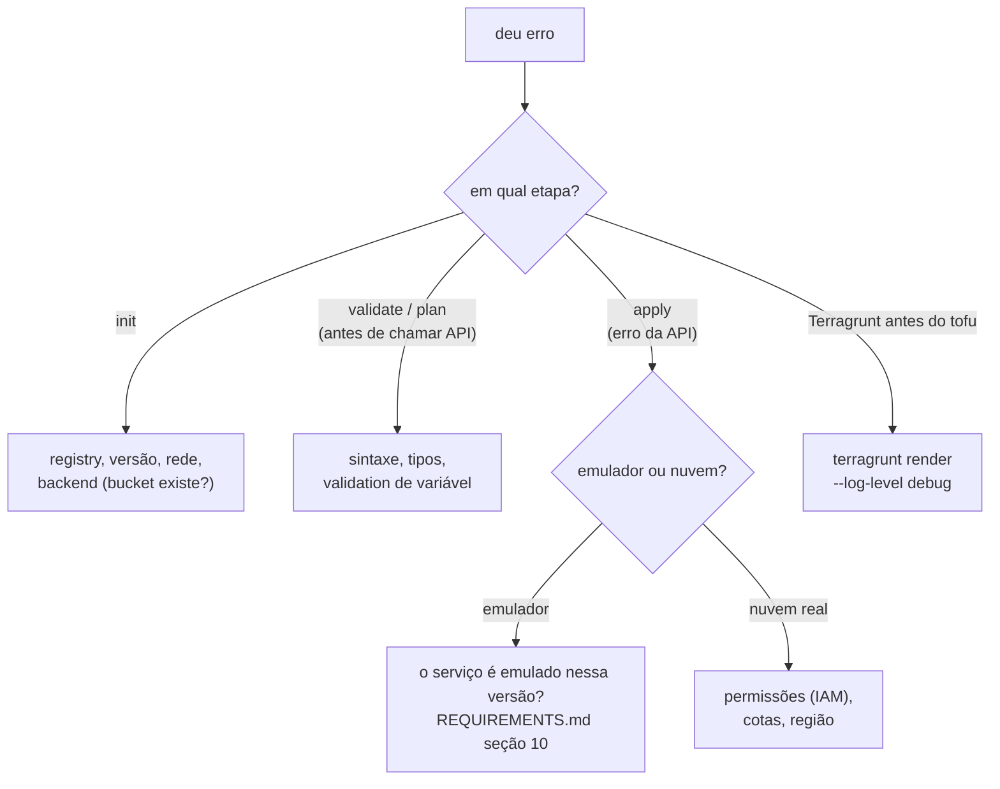

<!-- TOC -->

- [Troubleshooting](#troubleshooting)
  - [Como investigar](#como-investigar)
  - [Emuladores](#emuladores)
    - [lookup \<bucket\>.localhost ... no such host](#lookup-bucketlocalhost--no-such-host)
    - [Uma chamada foi para a nuvem real (401 Invalid Credentials)](#uma-chamada-foi-para-a-nuvem-real-401-invalid-credentials)
    - [Error creating Network: googleapi: got HTTP response code 405](#error-creating-network-googleapi-got-http-response-code-405)
    - [Error reading billing account for project](#error-reading-billing-account-for-project)
    - [could not parse ... as SQS URL (import)](#could-not-parse--as-sqs-url-import)
    - [Cada fila SQS demora cerca de 25 segundos](#cada-fila-sqs-demora-cerca-de-25-segundos)
    - [O plan nunca fica limpo em algumas unidades](#o-plan-nunca-fica-limpo-em-algumas-unidades)
    - [Porta já em uso ao subir os emuladores](#porta-já-em-uso-ao-subir-os-emuladores)
  - [Terraform / OpenTofu](#terraform--opentofu)
    - [unknown provider registry.terraform.io/hashicorp/aws](#unknown-provider-registryterraformiohashicorpaws)
    - [is an invalid ARN: arn: invalid prefix (testes com mock)](#is-an-invalid-arn-arn-invalid-prefix-testes-com-mock)
    - [Module is incompatible with count, for\_each, enabled and depends\_on](#module-is-incompatible-with-count-for_each-enabled-and-depends_on)
  - [Terragrunt](#terragrunt)
    - [name conflicts with name\_prefix no módulo ALB](#name-conflicts-with-name_prefix-no-módulo-alb)
    - [versions.tf already exists and was not generated by terragrunt](#versionstf-already-exists-and-was-not-generated-by-terragrunt)
    - [Detected generate blocks with the same name](#detected-generate-blocks-with-the-same-name)
    - [Inconsistent conditional result types](#inconsistent-conditional-result-types)
    - [Could not find a env.hcl in any of the parent folders of .../live/root.hcl](#could-not-find-a-envhcl-in-any-of-the-parent-folders-of-liveroothcl)
    - [O --backend-bootstrap tenta criar o bucket GCS no Google real](#o---backend-bootstrap-tenta-criar-o-bucket-gcs-no-google-real)
    - [Mudei o módulo local e o Terragrunt não viu](#mudei-o-módulo-local-e-o-terragrunt-não-viu)
    - [Backend configuration changed ao trocar terraform e tofu](#backend-configuration-changed-ao-trocar-terraform-e-tofu)
  - [terraform-docs](#terraform-docs)
    - [O comando de pré-visualização reescreveu o README](#o-comando-de-pré-visualização-reescreveu-o-readme)

<!-- TOC -->

# Troubleshooting

Erros **reais**, encontrados ao construir e testar este repositório com as
versões do [`mise.toml`](../mise.toml), floci 2.1.0 e floci-gcp 0.9.0.

## Como investigar



Ferramentas úteis:

```bash
TF_LOG=DEBUG terraform apply 2>&1 | grep -E 'HTTP Request Sent|rpc.method'   # que API foi chamada, e onde
terragrunt render --format json --working-dir <unidade>                       # a configuração final
terragrunt run --log-level debug -- plan
docker compose logs -f floci          # ou floci-gcp
```

## Emuladores

### lookup \<bucket\>.localhost ... no such host

```text
Error: creating S3 Bucket (lt-test-bucket): ... Put "http://lt-test-bucket.localhost:4566/":
dial tcp: lookup lt-test-bucket.localhost on 1.1.1.1:53: no such host
```

**Causa:** `AWS_ENDPOINT_URL=http://localhost:4566`. O provider acessa o S3
no estilo *virtual-hosted* (`<bucket>.<endpoint>`), e `*.localhost` não
resolve em todo sistema. **Solução:** use
`AWS_ENDPOINT_URL=http://localhost.floci.io:4566` (o domínio da
documentação do floci que resolve para a sua máquina). Com
`s3_use_path_style = true` o bucket passa, mas a API S3 Control (tags)
falha com `lookup 000000000000.localhost`.

### Uma chamada foi para a nuvem real (401 Invalid Credentials)

```text
Error: ... googleapi: Error 401: Request had invalid authentication credentials ...
  "method": "compute.v1.ZonesService.List", "service": "compute.googleapis.com"
```

**Causa:** o módulo usa uma API cujo `GOOGLE_<PRODUTO>_CUSTOM_ENDPOINT` não
foi definido, então o provider chamou o Google real (com o token falso).
**Solução:** defina o endpoint de **toda** API usada - o `.env.example` e o
`live/root.hcl` apontam inclusive o Compute para o floci-gcp, para que um
serviço não emulado falhe localmente.

### Error creating Network: googleapi: got HTTP response code 405

**Causa:** o floci-gcp 0.9.0 não tem a API do Compute Engine (VPC, firewall,
zonas); ela foi adicionada ao projeto depois desse release. **Solução:** as
unidades `network` e `cloud-sql` têm `exclude` quando a conta é o floci
([lição 06](06-terragrunt.md#exclude-unidades-que-não-rodam-em-todo-lugar)).
Rode-as em um projeto real, ou confira se um release mais novo do
floci-gcp já inclui o Compute.

### Error reading billing account for project

```text
Error: Error reading billing account for project "projects/floci-local": googleapi: Error 401
```

**Causa:** o *data source* `google_project` também lê o Cloud Billing, que o
floci-gcp não emula. **Solução:** passe `project_number` ao módulo
`gcp-messaging` (`curl -s http://localhost:4588/v1/projects/floci-local | jq -r .projectNumber`).

### could not parse ... as SQS URL (import)

```text
Error: parsing import ID "http://floci:4566/000000000000/lt-dev-lab02-legacy": could not parse ... as SQS URL
```

**Causa:** o provider AWS espera a URL no formato da AWS; o floci devolve
`http://floci:4566/...`. **Solução:** no floci, pratique `import` com um
bucket S3 (o ID é o nome); na AWS real a fila importa normalmente.

### Cada fila SQS demora cerca de 25 segundos

Não é erro: o log de debug mostra o provider AWS consultando
`GetQueueAttributes` a cada 5 segundos até os atributos se estabilizarem
(espera de propagação, que também acontece na AWS).

### O plan nunca fica limpo em algumas unidades

`ecs` (nova revisão da *task definition*), `rds` (porta 7001 → 5432) e
`sg-database` (regra de saída padrão) mostram mudanças a cada `plan` no
floci 2.1.0. São comportamentos do emulador, descritos no
[`REQUIREMENTS.md`, seção 10](../REQUIREMENTS.md#10-floci-vs-nuvem-real).
`vpc` e os buckets GCS tinham o mesmo problema e foram contornados só no
floci (`manage_default_network_acl`, `bucket_policy_only`).

### Porta já em uso ao subir os emuladores

```text
Bind for 0.0.0.0:4566 failed: port is already allocated
```

**Causa:** outro contêiner (por exemplo, o floci de outro projeto) usa a
porta. **Solução:** no `.env`, mude `FLOCI_AWS_PORT`, `FLOCI_GCP_PORT`
e/ou `FLOCI_ALB_HOST_PORTS`, e ajuste `AWS_ENDPOINT_URL`,
`FLOCI_AWS_ENDPOINT` e `FLOCI_GCP_ENDPOINT` ([`REQUIREMENTS.md`, seção 6](../REQUIREMENTS.md#6-portas-de-rede-usadas)).

## Terraform / OpenTofu

### unknown provider registry.terraform.io/hashicorp/aws

```text
Error: unknown provider registry.terraform.io/hashicorp/aws
```

**Causa:** o diretório foi inicializado com `tofu` (registry
`registry.opentofu.org`) e depois usado com `terraform`, ou o contrário.
**Solução:** apague `.terraform/` e `.terraform.lock.hcl` e rode o `init`
com o binário que vai usar. O `Makefile` usa um `TF_DATA_DIR` temporário em
cada execução para evitar isso.

### is an invalid ARN: arn: invalid prefix (testes com mock)

```text
Error: "topic_arn" (i4ukw9ku) is an invalid ARN: arn: invalid prefix
```

**Causa:** o `mock_provider` inventa strings aleatórias para atributos
calculados, e o recurso que recebe o ARN o valida. **Solução:** dê valores
bem formados com `mock_resource "aws_sns_topic" { defaults = { arn = "arn:aws:sns:..." } }`.

### Module is incompatible with count, for_each, enabled and depends_on

```text
Error: Module is incompatible with count, for_each, enabled and depends_on
  on wrappers/main.tf line 8, in module "wrapper":
The module at module.wrapper is a legacy module which contains its own local provider configurations
```

**Causa (encontrada na unidade `orders-messaging`):** o `init` carrega os
arquivos `tests/*.tftest.hcl` da raiz do módulo; um deles chamava
`./wrappers`, que chama `../` - e a raiz agora tinha um `provider.tf`
gerado pelo Terragrunt. **Solução:** os testes do wrapper ficam em
`wrappers/tests/`. Variante do mesmo problema: um `.terraform/` deixado
dentro de `modules/` por testes locais é copiado pelo Terragrunt junto com
o módulo - o `Makefile` roda os testes com `TF_DATA_DIR` temporário.

## Terragrunt

### name conflicts with name_prefix no módulo ALB

```text
Error: Conflicting configuration arguments
  with aws_lb.this[0], on main.tf line 83: "name": conflicts with name_prefix
```

**Causa:** havia `inputs = { name_prefix = ... }` no `root.hcl`. O
Terragrunt passa todo input como `TF_VAR_<nome>` para todo módulo, e o
módulo ALB tem uma variável `name_prefix`. **Solução:** nenhum `inputs`
global; as unidades usam `include.root.locals.name_prefix`.

### versions.tf already exists and was not generated by terragrunt

**Causa:** o `generate` tentou escrever `versions.tf`, que o módulo já tem.
**Solução:** gerar `versions_override.tf` - um *override file*, que
substitui só a restrição de versão do provider.

### Detected generate blocks with the same name

**Causa:** um `_envcommon` (incluído com `merge_strategy = "deep"`)
redefinia o `generate "versions"` do `root.hcl`. **Solução:** exceções de
versão por unidade em `provider_version_overrides` no `cloud.hcl`.

### Inconsistent conditional result types

```text
The true and false result expressions must have consistent types.
The 'true' value includes object attribute "access_key", which is absent in the 'false' value.
```

**Causa:** `local.is_floci ? { ...muitos atributos... } : {}` ou
`cloud == "aws" ? local.s3_backend : local.gcs_backend`. **Solução:**
indexe um objeto: `{ floci = {...}, real = {} }[local.target]`.

### Could not find a env.hcl in any of the parent folders of .../live/root.hcl

**Causa:** um `_envcommon` fez `read_terragrunt_config(find_in_parent_folders("root.hcl"))`.
Um arquivo lido assim resolve `find_in_parent_folders()` a partir da
própria pasta (`live/`). **Solução:** o `_envcommon` lê os arquivos da
hierarquia diretamente (ele é *incluído*, então a busca parte da unidade) e
as configurações de produto ficam em `live/common.hcl`.

### O --backend-bootstrap tenta criar o bucket GCS no Google real

```text
Create GCS bucket lt-tfstate-floci-local returned an error: ... googleapi: Error 401
```

**Causa:** o cliente GCS do próprio Terragrunt 1.1.6 não usa os endpoints
do floci-gcp; com `--backend-bootstrap` ele tentou criar o bucket no Google
real (sem sucesso, pela credencial falsa), mesmo com `skip_bucket_creation`
ou `disable_init`. **Solução:** no floci, crie o bucket com
`make floci-bootstrap` e não use `--backend-bootstrap`.

### Mudei o módulo local e o Terragrunt não viu

**Causa:** a cópia em `.terragrunt-cache/` é reaproveitada.
**Solução:** `make clean` (ou apague o `.terragrunt-cache` da unidade).

### Backend configuration changed ao trocar terraform e tofu

```text
* Failed to execute "tofu init" in ./us-east-1/vpc/.terragrunt-cache/...
  Error: Backend configuration changed
```

**Causa:** a unidade foi executada com `terraform` e depois com `tofu` (ou
o contrário) usando o mesmo `.terragrunt-cache`. **Solução:** apague os
caches (`make clean`). Os alvos `tg-*` do `Makefile` fazem isso sozinhos
quando o `TF` muda em relação à execução anterior (arquivo `.terragrunt-tf`).

## terraform-docs

### O comando de pré-visualização reescreveu o README

**Causa:** `terraform-docs markdown table <dir>` encontrou o
`.terraform-docs.yml` da pasta atual (com `output.file`) e gravou.
**Solução:** `terraform-docs markdown table --output-file "" <dir>`.
