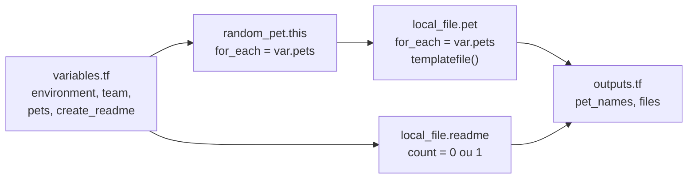

<!-- TOC -->

- [Lab 01 - Primeiros passos (sem nuvem)](#lab-01---primeiros-passos-sem-nuvem)
  - [Objetivo](#objetivo)
  - [O que tem aqui](#o-que-tem-aqui)
  - [Passo a passo](#passo-a-passo)
  - [Exercícios](#exercícios)
  - [Testes](#testes)
  - [Limpeza](#limpeza)

<!-- TOC -->

# Lab 01 - Primeiros passos (sem nuvem)

Lição correspondente: [`docs/02-hcl-basico.md`](../../docs/02-hcl-basico.md).

## Objetivo

Praticar o ciclo `init → plan → apply → destroy` e os blocos da HCL usando
dois providers que **não precisam de nuvem**: `hashicorp/local` (escreve
arquivos) e `hashicorp/random` (gera nomes aleatórios). Funciona com
`terraform` e com `tofu` - troque um pelo outro em qualquer comando.

## O que tem aqui



| Arquivo | Conceito |
|---|---|
| [`versions.tf`](versions.tf) | `required_version`, `required_providers` com versão exata |
| [`variables.tf`](variables.tf) | tipos, `default`, `validation` |
| [`main.tf`](main.tf) | `locals`, `for_each`, `count`, dependência implícita, `templatefile()` |
| [`templates/pet.txt.tftpl`](templates/pet.txt.tftpl) | template com laço `%{ for }` |
| [`outputs.tf`](outputs.tf) | expressões `for` e *splat* (`[*]`) |
| [`terraform.tfvars.example`](terraform.tfvars.example) | valores para outro ambiente |
| [`tests/main.tftest.hcl`](tests/main.tftest.hcl) | testes nativos |

## Passo a passo

```bash
cd labs/01-primeiros-passos

terraform init          # baixa local 2.9.1 e random 3.9.1
terraform fmt -check    # nada a formatar
terraform validate      # Success! The configuration is valid.
terraform plan          # Plan: 5 to add, 0 to change, 0 to destroy.
terraform apply         # digite "yes"
```

Saída (os nomes são aleatórios):

```text
Outputs:

files = [
  "./output/dev/cat.txt",
  "./output/dev/dog.txt",
  "./output/dev/README.txt",
]
pet_names = {
  "cat" = "robust-chamois"
  "dog" = "repeatedly-probable-kit"
}
```

Explore:

```bash
cat output/dev/cat.txt
terraform state list                       # 2 random_pet, 2 local_file.pet, 1 local_file.readme
terraform state show 'random_pet.this["cat"]'
terraform output -json pet_names
terraform apply                            # de novo: "No changes" (idempotência)
```

## Exercícios

1. **Drift e idempotência:** apague `output/dev/dog.txt` à mão e rode
   `terraform plan`: `Plan: 1 to add` - o Terraform percebe e recria só
   aquele arquivo. Rode `terraform apply` para voltar ao normal.
2. **for_each:** `terraform plan -var 'pets={cat=2,dog=3,horse=1}'` cria
   só o `random_pet` e o arquivo de `horse`. Depois
   `terraform plan -var 'pets={dog=3}'` destrói só os de `cat` ("because
   key ["cat"] is not in for_each map") - com `count`, todos "mudariam de
   lugar". Nos dois casos o `README.txt` também é substituído, porque o
   conteúdo dele lista os animais.
3. **count:** `terraform apply -var create_readme=false` destrói só o README.
4. **validation:** `terraform plan -var environment=production` falha antes
   de qualquer mudança, com a mensagem da validação.
5. **tfvars:** `cp terraform.tfvars.example terraform.tfvars` e `terraform
   plan` - o arquivo é lido automaticamente; os arquivos vão para
   `output/stg/`.
6. **console:** `echo 'upper(var.team)' | terraform console`.

## Testes

```bash
terraform test       # ou: tofu test
# tests/main.tftest.hcl... pass
# Success! 5 passed, 0 failed.
```

Os testes usam os providers de verdade (não há nuvem envolvida): três `run`
fazem `plan`, um faz `apply` e confere o conteúdo gerado, e dois provam que
as validações recusam valores inválidos (`expect_failures`). Quebre um de
propósito - por exemplo, mude o caminho em `local.output_dir` - e veja o
teste falhar.

## Limpeza

```bash
terraform destroy    # Destroy complete! Resources: 5 destroyed.
rm -f terraform.tfvars
```
