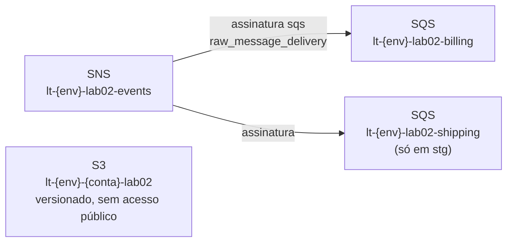

<!-- TOC -->

- [Lab 02 - AWS no floci](#lab-02---aws-no-floci)
  - [Objetivo](#objetivo)
  - [Arquitetura](#arquitetura)
  - [Pré-requisitos](#pré-requisitos)
  - [Passo a passo](#passo-a-passo)
  - [Verifique com a AWS CLI](#verifique-com-a-aws-cli)
  - [Ambientes com .tfvars](#ambientes-com-tfvars)
  - [Exercícios de state](#exercícios-de-state)
  - [Testes](#testes)
  - [Segurança: leia o trivy](#segurança-leia-o-trivy)
  - [Na AWS real (opcional, cobrado)](#na-aws-real-opcional-cobrado)
  - [Limpeza](#limpeza)

<!-- TOC -->

# Lab 02 - AWS no floci

Lições correspondentes: [`docs/03-state-e-backends.md`](../../docs/03-state-e-backends.md)
e [`docs/04-providers-e-floci.md`](../../docs/04-providers-e-floci.md).

## Objetivo

Criar recursos AWS **escritos à mão** (sem módulos) - um bucket S3, um
tópico SNS e filas SQS assinadas nele - no floci, sem nenhuma linha
específica de emulador no código.

## Arquitetura



<details>
<summary>Recursos (versão texto)</summary>

```text
aws_s3_bucket.files                       lt-<env>-<conta>-lab02
aws_s3_bucket_versioning.files            Status = Enabled
aws_s3_bucket_public_access_block.files   todos os bloqueios = true
aws_sns_topic.events                      lt-<env>-lab02-events
aws_sqs_queue.this[<fila>]                lt-<env>-lab02-<fila>, SSE-SQS
aws_sqs_queue_policy.this[<fila>]         sqs:SendMessage só para o tópico
aws_sns_topic_subscription.this[<fila>]   protocol = sqs
```

</details>

## Pré-requisitos

```bash
make floci-start                 # na raiz do repositório
set -a; source .env; set +a      # AWS_ENDPOINT_URL=http://localhost.floci.io:4566 ...
aws sts get-caller-identity --query Account --output text    # 000000000000
```

## Passo a passo

```bash
cd labs/02-aws-floci
terraform init
terraform plan -var-file=envs/dev.tfvars
terraform apply -var-file=envs/dev.tfvars
```

```text
Apply complete! Resources: 7 added, 0 changed, 0 destroyed.

Outputs:

account_id = "000000000000"
bucket_name = "lt-dev-000000000000-lab02"
queue_urls = {
  "billing" = "http://floci:4566/000000000000/lt-dev-lab02-billing"
}
topic_arn = "arn:aws:sns:us-east-1:000000000000:lt-dev-lab02-events"
```

Cada fila e cada política de fila levam cerca de 25 segundos: o provider
espera os atributos da fila se estabilizarem (também na AWS real).

Repare em [`providers.tf`](providers.tf): só `region` e `default_tags`.
Quem leva as chamadas ao floci é a variável `AWS_ENDPOINT_URL`.

## Verifique com a AWS CLI

```bash
aws s3api list-buckets --query "Buckets[?starts_with(Name, 'lt-dev')].Name" --output text
aws s3api get-bucket-versioning --bucket lt-dev-000000000000-lab02
aws sqs list-queues --queue-name-prefix lt-dev-lab02 --output text
aws sns list-subscriptions --query 'Subscriptions[].Endpoint'

# uma mensagem atravessando o fan-out
aws sns publish --topic-arn arn:aws:sns:us-east-1:000000000000:lt-dev-lab02-events --message 'olá'
Q=$(aws sqs get-queue-url --queue-name lt-dev-lab02-billing --query QueueUrl --output text)
aws sqs receive-message --queue-url "$Q" --wait-time-seconds 5 --query 'Messages[].Body' --output text   # olá
```

Mais comandos em [`docs/10-verificar-recursos.md`](../../docs/10-verificar-recursos.md).

## Ambientes com .tfvars

O mesmo código, valores diferentes por ambiente:

```bash
terraform plan -var-file=envs/stg.tfvars      # 2 filas, retenção de 7 dias
```

> **Atenção:** com o mesmo state local, aplicar `stg.tfvars` **substitui**
> o `dev` (é o mesmo conjunto de recursos com outros nomes). Para ter os
> dois ao mesmo tempo é preciso um state por ambiente - com *workspaces*
> ou, como em [`live/`](../../live/README.md), com Terragrunt.

## Exercícios de state

Os três foram executados no floci; os detalhes estão na
[lição 03](../../docs/03-state-e-backends.md).

1. **Drift:** altere a retenção da fila pela CLI e veja o `plan` propor a
   volta:
   ```bash
   aws sqs set-queue-attributes --queue-url "$Q" --attributes MessageRetentionPeriod=60
   terraform plan -var-file=envs/dev.tfvars     # message_retention_seconds = 60 -> 345600
   ```
2. **import:** crie um bucket fora do Terraform e adote-o com um bloco
   `import` (arquivo `exercise_import.tf`, exemplo na lição 03):
   `Plan: 1 to import`. Apague o arquivo e o bucket ao terminar.
3. **moved:** renomeie `aws_sns_topic.events` para `aws_sns_topic.orders`
   (em `main.tf` e `outputs.tf`) e crie um bloco `moved`: o plano diz
   `has moved to` e `0 to destroy`. Sem o bloco, o tópico seria recriado.
   Desfaça a mudança ao terminar.

## Testes

```bash
terraform test -filter=tests/unit.tftest.hcl          # mocks: sem floci, sem credenciais
terraform test -filter=tests/integration.tftest.hcl   # cria no floci, confere e destrói
```

O teste unitário prova a convenção de nomes, o efeito das variáveis por
ambiente e que `prd` não permite apagar bucket com objetos
(`force_destroy = false`).

## Segurança: leia o trivy

```bash
trivy config --severity MEDIUM,HIGH,CRITICAL .
```

Ele aponta, de propósito, `AWS-0095` (tópico SNS sem criptografia) e
`AWS-0132` (S3 sem chave KMS gerenciada pelo cliente). Pense: qual o custo
e o benefício de cada correção? Compare com a decisão registrada no módulo
[`aws-messaging`](../../modules/aws-messaging/main.tf).

## Na AWS real (opcional, cobrado)

Abra um terminal **novo**, sem o `.env`, autentique-se (`aws sso login` ou
`AWS_PROFILE=...`) e rode os mesmos comandos. O custo deste lab é baixo
(SNS, SQS e S3 cobram por uso), mas destrua ao terminar.

## Limpeza

```bash
terraform destroy -var-file=envs/dev.tfvars
```
