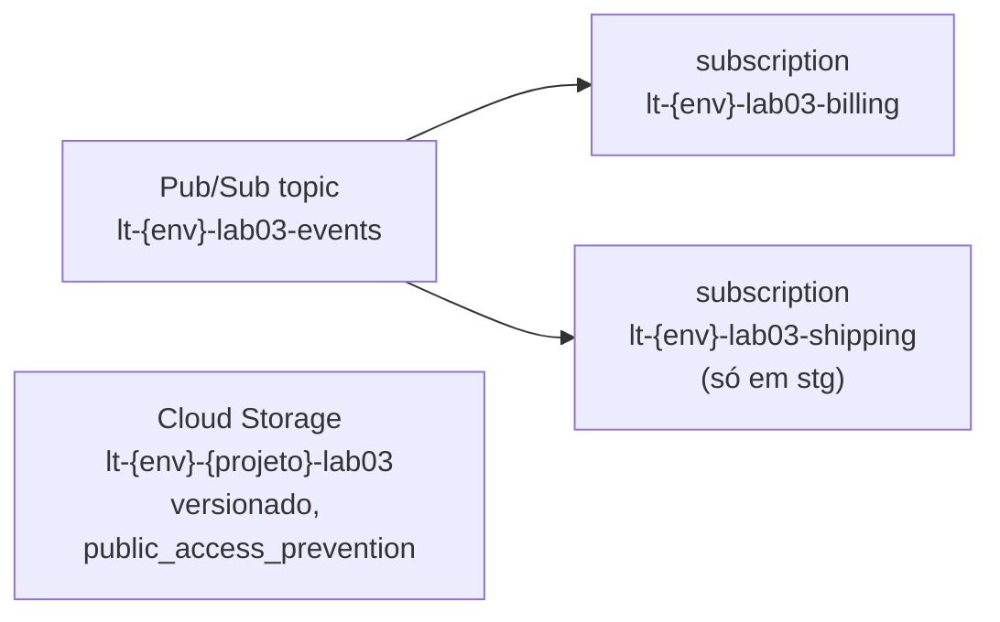

<!-- TOC -->

- [Lab 03 - Google Cloud no floci-gcp](#lab-03---google-cloud-no-floci-gcp)
  - [Objetivo](#objetivo)
  - [Arquitetura](#arquitetura)
  - [Pré-requisitos](#pré-requisitos)
  - [Passo a passo](#passo-a-passo)
  - [Verifique](#verifique)
  - [Testes](#testes)
  - [No GCP real (opcional, cobrado)](#no-gcp-real-opcional-cobrado)
  - [Limpeza](#limpeza)

<!-- TOC -->

# Lab 03 - Google Cloud no floci-gcp

Lição correspondente: [`docs/04-providers-e-floci.md`](../../docs/04-providers-e-floci.md).

## Objetivo

O equivalente GCP do [lab 02](../02-aws-floci/README.md): um bucket do
Cloud Storage e um tópico Pub/Sub com assinaturas, escritos à mão, no
floci-gcp.

## Arquitetura



## Pré-requisitos

```bash
make floci-start                 # na raiz do repositório
set -a; source .env; set +a      # GOOGLE_*_CUSTOM_ENDPOINT=http://localhost:4588/...
```

## Passo a passo

```bash
cd labs/03-gcp-floci
terraform init
terraform apply -var-file=envs/dev.tfvars -var-file=envs/floci.tfvars
```

```text
Outputs:

bucket_name = "lt-dev-floci-local-lab03"
subscription_ids = {
  "billing" = "projects/floci-local/subscriptions/lt-dev-lab03-billing"
}
topic_id = "projects/floci-local/topics/lt-dev-lab03-events"
```

Por que `envs/floci.tfvars`? O floci-gcp 0.9.0 não mantém
`uniform_bucket_level_access = true`, então cada `plan` mostraria uma
mudança. O arquivo desliga essa opção **só** no emulador; na nuvem real o
padrão (`true`, acesso só por IAM) é o recomendado. Esse é o jeito
honesto de lidar com uma limitação do emulador: isolada, explícita e
documentada ([`REQUIREMENTS.md`, seção 10](../../REQUIREMENTS.md#10-floci-vs-nuvem-real)).

## Verifique

```bash
export CLOUDSDK_AUTH_ACCESS_TOKEN_FILE="$(git rev-parse --show-toplevel)/scripts/floci-gcp-token"
gcloud storage buckets list --filter='name~lab03' --format='value(name)'
gcloud pubsub topics list --format='value(name)' --filter='name~lab03'
gcloud pubsub topics publish lt-dev-lab03-events --message='olá'
gcloud pubsub subscriptions pull lt-dev-lab03-billing --auto-ack --format='value(message.data)'   # olá

# sem gcloud, pela API REST:
curl -s "$FLOCI_GCP_ENDPOINT/v1/projects/floci-local/subscriptions" | jq -r '.subscriptions[].name'
```

## Testes

```bash
terraform test -filter=tests/unit.tftest.hcl          # mocks
terraform test -filter=tests/integration.tftest.hcl   # no floci-gcp
```

## No GCP real (opcional, cobrado)

Terminal novo, sem o `.env`:

```bash
gcloud auth application-default login
terraform apply -var-file=envs/dev.tfvars -var project_id=<seu-projeto>
```

## Limpeza

```bash
terraform destroy -var-file=envs/dev.tfvars -var-file=envs/floci.tfvars
```
