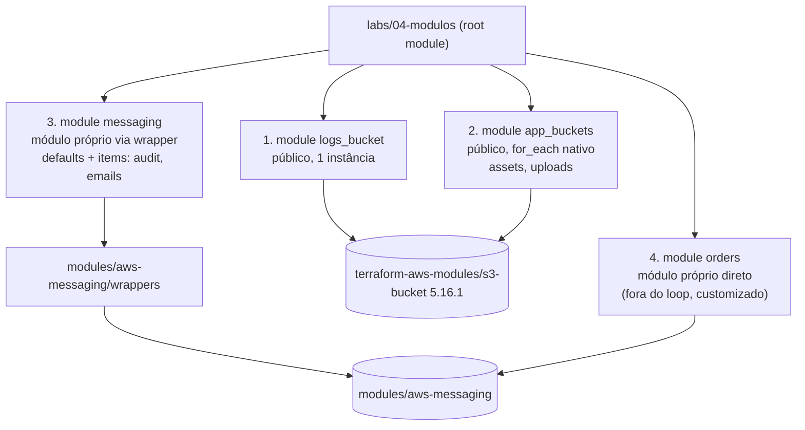

<!-- TOC -->

- [Lab 04 - Consumindo módulos](#lab-04---consumindo-módulos)
  - [Objetivo](#objetivo)
  - [As quatro chamadas](#as-quatro-chamadas)
  - [Passo a passo](#passo-a-passo)
  - [Verifique](#verifique)
  - [Exercícios](#exercícios)
  - [Teste](#teste)
  - [Limpeza](#limpeza)

<!-- TOC -->

# Lab 04 - Consumindo módulos

Lição correspondente: [`docs/05-modulos.md`](../../docs/05-modulos.md).

## Objetivo

Ver, em um único root module, as quatro formas de usar módulos que esta
trilha ensina - com um módulo **público** do Terraform Registry e com o
módulo **próprio** [`modules/aws-messaging`](../../modules/aws-messaging/README.md).

## As quatro chamadas



| # | Bloco | Fonte | Quando usar |
|---|---|---|---|
| 1 | `module "logs_bucket"` | registry, `version = "5.16.1"` | uma instância |
| 2 | `module "app_buckets"` | registry + `for_each` | várias instâncias, variando pouco |
| 3 | `module "messaging"` | `../../modules/aws-messaging/wrappers` | várias instâncias com muitas configurações comuns (e com Terragrunt) |
| 4 | `module "orders"` | `../../modules/aws-messaging` | uma instância muito diferente das demais |

## Passo a passo

```bash
make floci-start                         # na raiz
set -a; source .env; set +a
cd labs/04-modulos
terraform init                           # baixa o módulo público para .terraform/modules
terraform plan
terraform apply
```

```text
Outputs:

app_buckets = {
  "assets" = "lt-dev-000000000000-lab04-assets"
  "uploads" = "lt-dev-000000000000-lab04-uploads"
}
logs_bucket = "lt-dev-000000000000-lab04-logs"
messaging = {
  "lt-dev-lab04-audit" = {
    "queues" = [
      "lt-dev-lab04-audit-worker",
    ]
    "topic_arn" = "arn:aws:sns:us-east-1:000000000000:lt-dev-lab04-audit"
  }
  "lt-dev-lab04-emails" = {
    "queues" = [
      "lt-dev-lab04-emails-worker",
    ]
    "topic_arn" = null
  }
}
orders_topic_arn = "arn:aws:sns:us-east-1:000000000000:lt-dev-lab04-orders"
```

## Verifique

```bash
terraform state list | grep -E '^module\.' | cut -d. -f1-2 | sort -u
# module.app_buckets["assets"]
# module.app_buckets["uploads"]
# module.logs_bucket
# module.messaging
# module.orders
ls .terraform/modules/                  # onde o init guardou os módulos
jq -r '.Modules[] | .Key + " <- " + .Source' .terraform/modules/modules.json
# app_buckets <- registry.terraform.io/terraform-aws-modules/s3-bucket/aws
# messaging <- ../../modules/aws-messaging/wrappers
# messaging.wrapper <- ./..
# orders <- ../../modules/aws-messaging
```

## Exercícios

1. Adicione um item ao wrapper (`"${local.name_prefix}-lab04-alerts" = {}`)
   e rode `plan`: só os recursos do novo item (tópico, fila, DLQ, políticas,
   assinatura) aparecem.
2. Mude `max_receive_count` em `defaults` e veja quais instâncias mudam
   (todas, menos `orders`, que está fora do loop).
3. Troque `version = "5.16.1"` por uma versão inexistente e rode `init`:
   leia o erro do registry.

## Teste

```bash
terraform test       # aplica as quatro chamadas no floci, confere e destrói (~2 min)
```

## Limpeza

```bash
terraform destroy
```
