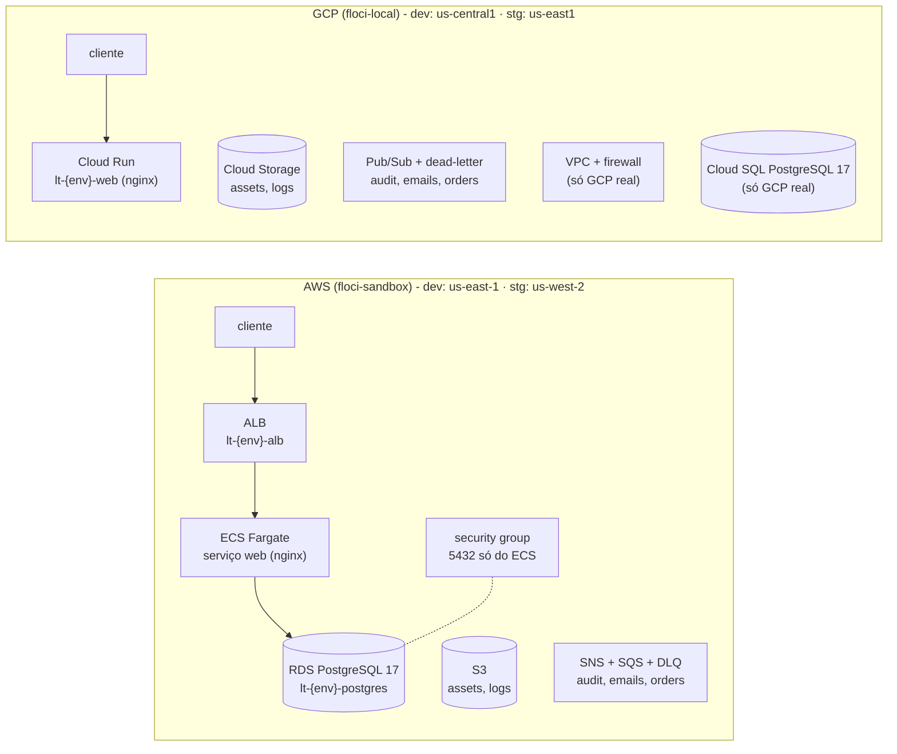

<!-- TOC -->

- [live/ - a stack com Terragrunt](#live---a-stack-com-terragrunt)
  - [O que é criado](#o-que-é-criado)
  - [Mapa dos arquivos](#mapa-dos-arquivos)
  - [Usando](#usando)
  - [Unidades por nuvem](#unidades-por-nuvem)

<!-- TOC -->

# live/ - a stack com Terragrunt

A infraestrutura "de verdade" desta trilha: AWS e GCP, ambientes `dev` e
`stg`, montada com Terragrunt sobre módulos públicos e os módulos próprios
de [`../modules`](../modules/). A explicação completa está na
[lição 06](../docs/06-terragrunt.md).

## O que é criado



## Mapa dos arquivos

```text
live/
├── root.hcl            # backend, provider, versões, endpoints por target - incluído por todas as unidades
├── common.hcl          # produto, prefixo "lt", time, centro de custo
├── _envcommon/{aws,gcp}/<componente>.hcl   # módulo + entradas comuns de cada componente
├── aws/cloud.hcl                            # versões dos providers AWS
├── aws/floci-sandbox/account.hcl            # conta 000000000000, target = "floci"
├── aws/floci-sandbox/<env>/env.hcl          # tamanhos, porta do ALB no floci
├── aws/floci-sandbox/<env>/<região>/region.hcl
├── aws/floci-sandbox/<env>/<região>/<unidade>/terragrunt.hcl
└── gcp/... (mesma estrutura; a "conta" é um projeto)
```

## Usando

```bash
make floci-start floci-bootstrap      # na raiz do repositório

make tg-list                          # todas as unidades
make tg-plan CLOUD=aws ENV=dev        # ou: cd live/aws/floci-sandbox/dev && terragrunt run --all -- plan
make tg-apply ENV=dev                 # AWS + GCP dev
make test-smoke                       # o ALB e o Cloud Run respondem
make tg-drift CLOUD=gcp ENV=dev       # 0 = sem diferenças
make tg-destroy ENV=dev
```

`TF=terraform` usa o Terraform em vez do OpenTofu.

## Unidades por nuvem

| Unidade | Módulo | Depende de |
|---|---|---|
| **AWS** | | |
| `vpc` | `terraform-aws-modules/vpc` 6.7.3 | - |
| `s3` | `terraform-aws-modules/s3-bucket//wrappers` 5.16.1 | - |
| `messaging` | `modules/aws-messaging//wrappers` (próprio, loop) | - |
| `orders-messaging` | `modules/aws-messaging` (próprio, fora do loop) | - |
| `alb` | `terraform-aws-modules/alb` 10.5.1 | `vpc` |
| `ecs` | `terraform-aws-modules/ecs` 7.6.1 | `vpc`, `alb` |
| `sg-database` | `terraform-aws-modules/security-group` 6.0.0 | `vpc`, `ecs` |
| `rds` | `terraform-aws-modules/rds` 7.2.2 | `vpc`, `sg-database` |
| **GCP** | | |
| `network` | `terraform-google-modules/network` 18.3.0 | - (excluída no floci) |
| `gcs` | `terraform-google-modules/cloud-storage` 12.4.0 | - |
| `messaging` | `modules/gcp-messaging//wrappers` (próprio, loop) | - |
| `orders-messaging` | `modules/gcp-messaging` (próprio, fora do loop) | - |
| `cloud-run` | `GoogleCloudPlatform/cloud-run//modules/v2` 0.34.1 (provider 7.46.1) | - |
| `cloud-sql` | `terraform-google-modules/sql-db//modules/postgresql` 28.3.0 | - (excluída no floci) |
