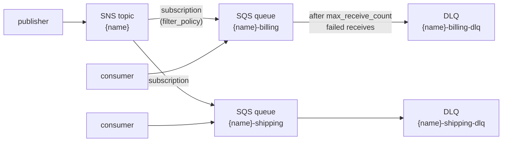

# aws-messaging

Fan-out messaging on AWS: one **Amazon SNS topic** delivering every message
to N **Amazon SQS queues**, each with an optional **dead-letter queue (DLQ)**.
It is the AWS counterpart of [`../gcp-messaging`](../gcp-messaging/README.md).

This module is part of the [learning-terraform](../../README.md) path; the
lesson that builds it step by step is
[`docs/05-modulos.md`](../../docs/05-modulos.md) (pt-BR).



What it creates, per queue key: the queue, its DLQ and redrive policies
(`create_dlq`), a queue policy that lets **only this topic** send to the
queue, and the SNS subscription (`create_topic`). Queues are encrypted with
SQS-owned keys (`sqs_managed_sse_enabled`).

## Usage

### One instance

```hcl
module "orders" {
  source = "github.com/aeciopires/terraform//modules/aws-messaging?ref=<tag>"

  name = "lt-dev-orders"

  queues = {
    billing  = { max_receive_count = 3 }
    shipping = { filter_policy = jsonencode({ type = ["shipping"] }) }
  }

  tags = { Domain = "orders" }
}
```

### Many instances with the wrapper

[`wrappers/`](wrappers/README.md) calls the module once per entry of
`items`; any argument missing from an item comes from `defaults`, then from
the module's own default. This is the pattern the
[terraform-aws-modules](https://github.com/terraform-aws-modules/terraform-aws-lambda/tree/master/wrappers)
use, and it lets one Terragrunt unit manage many instances:

```hcl
# terragrunt.hcl
terraform {
  source = "${get_repo_root()}/modules/aws-messaging/wrappers"
}

inputs = {
  defaults = { queues = { worker = {} } }
  items = {
    audit  = {}
    emails = { create_topic = false }
  }
}
```

See [`examples/complete`](examples/complete/README.md) for both forms.

## Provider configuration

The module has **no provider block**: credentials, region and endpoints
come from the caller. The same code therefore runs against
[floci](https://floci.io) (with `AWS_ENDPOINT_URL=http://localhost.floci.io:4566`
in the environment) and against a real AWS account (without it).

## Tests

| File | What it does | Needs |
|---|---|---|
| [`tests/unit.tftest.hcl`](tests/unit.tftest.hcl) | names, DLQs, redrive, subscriptions, validation errors and the wrapper, with `mock_provider` | nothing |
| [`tests/integration.tftest.hcl`](tests/integration.tftest.hcl) | creates the resources, checks the ARNs and the queue policy, destroys them | floci or an AWS account |

```bash
terraform init -backend=false
terraform test -filter=tests/unit.tftest.hcl          # or: tofu test ...
set -a; source ../../.env; set +a                     # floci endpoints
terraform test -filter=tests/integration.tftest.hcl
```

## Notes

- The AWS provider waits until a new queue's attributes are stable (it
  polls `GetQueueAttributes` every 5 seconds), so each `aws_sqs_queue` and
  queue policy takes about 25 seconds to create - on floci and on AWS.
- Queue names are limited to 80 characters by SQS; the variable validations
  keep `name` to 40 and each queue key to 30 characters.

## Generated documentation

Everything below is generated by [terraform-docs](https://terraform-docs.io)
(`make docs`); do not edit it by hand.

<!-- BEGIN_TF_DOCS -->
## Requirements

| Name | Version |
| ---- | ------- |
| <a name="requirement_terraform"></a> [terraform](#requirement\_terraform) | >= 1.10 |
| <a name="requirement_aws"></a> [aws](#requirement\_aws) | >= 6.0 |

## Providers

| Name | Version |
| ---- | ------- |
| <a name="provider_aws"></a> [aws](#provider\_aws) | >= 6.0 |

## Resources

| Name | Type |
| ---- | ---- |
| [aws_sns_topic.this](https://registry.terraform.io/providers/hashicorp/aws/latest/docs/resources/sns_topic) | resource |
| [aws_sns_topic_subscription.this](https://registry.terraform.io/providers/hashicorp/aws/latest/docs/resources/sns_topic_subscription) | resource |
| [aws_sqs_queue.dlq](https://registry.terraform.io/providers/hashicorp/aws/latest/docs/resources/sqs_queue) | resource |
| [aws_sqs_queue.this](https://registry.terraform.io/providers/hashicorp/aws/latest/docs/resources/sqs_queue) | resource |
| [aws_sqs_queue_policy.this](https://registry.terraform.io/providers/hashicorp/aws/latest/docs/resources/sqs_queue_policy) | resource |
| [aws_sqs_queue_redrive_allow_policy.this](https://registry.terraform.io/providers/hashicorp/aws/latest/docs/resources/sqs_queue_redrive_allow_policy) | resource |
| [aws_sqs_queue_redrive_policy.this](https://registry.terraform.io/providers/hashicorp/aws/latest/docs/resources/sqs_queue_redrive_policy) | resource |

## Inputs

| Name | Description | Type | Default | Required |
| ---- | ----------- | ---- | ------- | :------: |
| <a name="input_name"></a> [name](#input\_name) | Base name of the SNS topic. Each queue is named "<name>-<queue key>" and its dead-letter queue "<name>-<queue key>-dlq". | `string` | n/a | yes |
| <a name="input_create"></a> [create](#input\_create) | Whether to create any resource at all. Lets a caller (or the wrapper) disable one instance without removing its configuration. | `bool` | `true` | no |
| <a name="input_create_topic"></a> [create\_topic](#input\_create\_topic) | Whether to create an SNS topic and subscribe every queue to it (fan-out). When false, only the queues are created. | `bool` | `true` | no |
| <a name="input_kms_master_key_id"></a> [kms\_master\_key\_id](#input\_kms\_master\_key\_id) | KMS key (ID, ARN or alias) that encrypts the SNS topic at rest. null leaves the topic unencrypted; the queues are still encrypted (sqs\_managed\_sse\_enabled). | `string` | `null` | no |
| <a name="input_queues"></a> [queues](#input\_queues) | Queues to create, keyed by a short name. Every attribute is optional:<br/>- visibility\_timeout\_seconds: 0-43200 (AWS default 30).<br/>- message\_retention\_seconds: 60-1209600 (AWS default 345600, 4 days).<br/>- receive\_wait\_time\_seconds: 0-20, long polling (AWS default 0).<br/>- create\_dlq: create a dead-letter queue and a redrive policy (default true).<br/>- max\_receive\_count: receives before a message moves to the DLQ (default 5).<br/>- dlq\_message\_retention\_seconds: retention of the DLQ (default 1209600, 14 days).<br/>- raw\_message\_delivery: SNS delivers the raw message, not the JSON envelope (default true).<br/>- filter\_policy: SNS subscription filter policy, as a JSON string (default null = every message). | <pre>map(object({<br/>    visibility_timeout_seconds    = optional(number, 30)<br/>    message_retention_seconds     = optional(number, 345600)<br/>    receive_wait_time_seconds     = optional(number, 0)<br/>    create_dlq                    = optional(bool, true)<br/>    max_receive_count             = optional(number, 5)<br/>    dlq_message_retention_seconds = optional(number, 1209600)<br/>    raw_message_delivery          = optional(bool, true)<br/>    filter_policy                 = optional(string)<br/>  }))</pre> | `{}` | no |
| <a name="input_sqs_managed_sse_enabled"></a> [sqs\_managed\_sse\_enabled](#input\_sqs\_managed\_sse\_enabled) | Encrypt messages at rest with SQS-owned keys (SSE-SQS) on every queue. | `bool` | `true` | no |
| <a name="input_tags"></a> [tags](#input\_tags) | Tags added to every resource (merged with the provider's default\_tags). | `map(string)` | `{}` | no |

## Outputs

| Name | Description |
| ---- | ----------- |
| <a name="output_dead_letter_queues"></a> [dead\_letter\_queues](#output\_dead\_letter\_queues) | Map of queue key => { name, arn, url } of every dead-letter queue. |
| <a name="output_queues"></a> [queues](#output\_queues) | Map of queue key => { name, arn, url } of every queue. |
| <a name="output_subscription_arns"></a> [subscription\_arns](#output\_subscription\_arns) | Map of queue key => ARN of its SNS subscription. |
| <a name="output_topic_arn"></a> [topic\_arn](#output\_topic\_arn) | ARN of the SNS topic (null when create\_topic = false). |
| <a name="output_topic_name"></a> [topic\_name](#output\_topic\_name) | Name of the SNS topic (null when create\_topic = false). |
<!-- END_TF_DOCS -->
