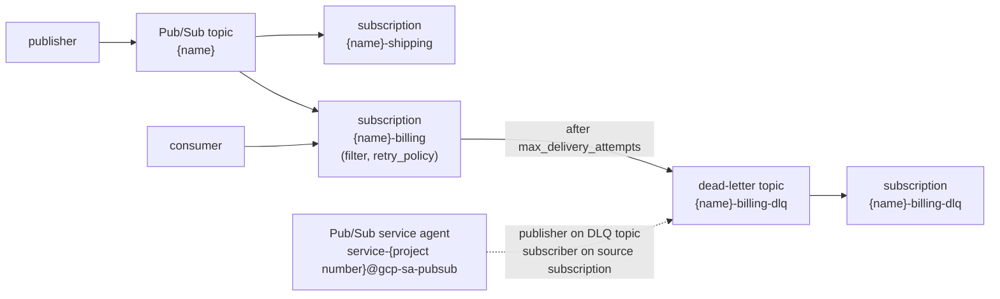

# gcp-messaging

Fan-out messaging on Google Cloud: one **Pub/Sub topic** with N **pull
subscriptions**, each with an optional **dead-letter topic**. It is the GCP
counterpart of [`../aws-messaging`](../aws-messaging/README.md).

This module is part of the [learning-terraform](../../README.md) path; the
lesson that builds it step by step is
[`docs/05-modulos.md`](../../docs/05-modulos.md) (pt-BR).



What it creates, per subscription key: the subscription with its retry
policy, and (`create_dead_letter`) a dead-letter topic, a subscription that
keeps the dead-lettered messages and the two IAM bindings Pub/Sub requires
for dead-lettering ([handling message failures](https://cloud.google.com/pubsub/docs/handling-failures)).

## Usage

### One instance

```hcl
module "orders" {
  source = "github.com/aeciopires/terraform//modules/gcp-messaging?ref=<tag>"

  project_id = "my-project"
  name       = "lt-dev-orders"

  subscriptions = {
    billing  = { max_delivery_attempts = 10 }
    shipping = { filter = "attributes.type = \"shipping\"" }
  }

  labels = { domain = "orders" }
}
```

### Many instances with the wrapper

[`wrappers/`](wrappers/README.md) calls the module once per entry of
`items`, filling missing arguments from `defaults` - see
[`examples/complete`](examples/complete/README.md) and the Terragrunt unit
in [`live/gcp`](../../live/gcp).

## Provider configuration

The module has **no provider block**. With `GOOGLE_*_CUSTOM_ENDPOINT`
variables in the environment (see [`.env.example`](../../.env.example)) the
Google provider talks to [floci-gcp](https://github.com/floci-io/floci-gcp);
without them, to the real Google Cloud APIs.

`project_number` is optional: when it is null the module looks it up with
the `google_project` data source, which also reads the project's billing
information. floci-gcp 0.9.0 does not emulate Cloud Billing, so on floci
pass the number explicitly (`curl -s http://localhost:4588/v1/projects/<id>`
returns it as `projectNumber`).

## Tests

| File | What it does | Needs |
|---|---|---|
| [`tests/unit.tftest.hcl`](tests/unit.tftest.hcl) | names, dead-letter policies, IAM members, validation errors and the wrapper, with `mock_provider` | nothing |
| [`tests/integration.tftest.hcl`](tests/integration.tftest.hcl) | creates the resources, checks their IDs and the dead-letter wiring, destroys them | floci-gcp or a GCP project |

```bash
terraform init -backend=false
terraform test -filter=tests/unit.tftest.hcl          # or: tofu test ...
set -a; source ../../.env; set +a                     # floci-gcp endpoints
terraform test -filter=tests/integration.tftest.hcl
```

## Generated documentation

Everything below is generated by [terraform-docs](https://terraform-docs.io)
(`make docs`); do not edit it by hand.

<!-- BEGIN_TF_DOCS -->
## Requirements

| Name | Version |
| ---- | ------- |
| <a name="requirement_terraform"></a> [terraform](#requirement\_terraform) | >= 1.10 |
| <a name="requirement_google"></a> [google](#requirement\_google) | >= 7.0 |

## Providers

| Name | Version |
| ---- | ------- |
| <a name="provider_google"></a> [google](#provider\_google) | >= 7.0 |

## Resources

| Name | Type |
| ---- | ---- |
| [google_pubsub_subscription.dead_letter](https://registry.terraform.io/providers/hashicorp/google/latest/docs/resources/pubsub_subscription) | resource |
| [google_pubsub_subscription.this](https://registry.terraform.io/providers/hashicorp/google/latest/docs/resources/pubsub_subscription) | resource |
| [google_pubsub_subscription_iam_member.dead_letter_subscriber](https://registry.terraform.io/providers/hashicorp/google/latest/docs/resources/pubsub_subscription_iam_member) | resource |
| [google_pubsub_topic.dead_letter](https://registry.terraform.io/providers/hashicorp/google/latest/docs/resources/pubsub_topic) | resource |
| [google_pubsub_topic.this](https://registry.terraform.io/providers/hashicorp/google/latest/docs/resources/pubsub_topic) | resource |
| [google_pubsub_topic_iam_member.dead_letter_publisher](https://registry.terraform.io/providers/hashicorp/google/latest/docs/resources/pubsub_topic_iam_member) | resource |

## Inputs

| Name | Description | Type | Default | Required |
| ---- | ----------- | ---- | ------- | :------: |
| <a name="input_name"></a> [name](#input\_name) | Name of the Pub/Sub topic. Each subscription is named "<name>-<subscription key>"; dead-letter topics "<name>-<subscription key>-dlq". | `string` | n/a | yes |
| <a name="input_project_id"></a> [project\_id](#input\_project\_id) | ID of the GCP project where every resource is created. | `string` | n/a | yes |
| <a name="input_create"></a> [create](#input\_create) | Whether to create any resource at all. Lets a caller (or the wrapper) disable one instance without removing its configuration. | `bool` | `true` | no |
| <a name="input_grant_dead_letter_permissions"></a> [grant\_dead\_letter\_permissions](#input\_grant\_dead\_letter\_permissions) | Grant the Pub/Sub service agent publisher on each dead-letter topic and subscriber on each source subscription, as Pub/Sub requires for dead-lettering. | `bool` | `true` | no |
| <a name="input_labels"></a> [labels](#input\_labels) | Labels added to every resource (merged with the provider's default\_labels). Keys and values: lower case. | `map(string)` | `{}` | no |
| <a name="input_message_retention_duration"></a> [message\_retention\_duration](#input\_message\_retention\_duration) | How long the topic keeps messages, e.g. "86400s". null keeps the Pub/Sub default (no topic retention). | `string` | `null` | no |
| <a name="input_project_number"></a> [project\_number](#input\_project\_number) | Number of the project, used to build the Pub/Sub service agent e-mail. null looks it up with the google\_project data source (which also reads the project's billing info). | `string` | `null` | no |
| <a name="input_subscriptions"></a> [subscriptions](#input\_subscriptions) | Pull subscriptions to create, keyed by a short name. Every attribute is optional:<br/>- ack\_deadline\_seconds: 10-600 (default 20).<br/>- message\_retention\_duration: e.g. "604800s" (default, 7 days).<br/>- filter: Pub/Sub filter expression on message attributes (default null = every message).<br/>- create\_dead\_letter: create a dead-letter topic and policy (default true).<br/>- max\_delivery\_attempts: 5-100 deliveries before dead-lettering (default 5).<br/>- minimum\_backoff / maximum\_backoff: retry policy, e.g. "10s" / "600s". | <pre>map(object({<br/>    ack_deadline_seconds       = optional(number, 20)<br/>    message_retention_duration = optional(string, "604800s")<br/>    filter                     = optional(string)<br/>    create_dead_letter         = optional(bool, true)<br/>    max_delivery_attempts      = optional(number, 5)<br/>    minimum_backoff            = optional(string, "10s")<br/>    maximum_backoff            = optional(string, "600s")<br/>  }))</pre> | `{}` | no |

## Outputs

| Name | Description |
| ---- | ----------- |
| <a name="output_dead_letter_topics"></a> [dead\_letter\_topics](#output\_dead\_letter\_topics) | Map of subscription key => { name, id } of every dead-letter topic. |
| <a name="output_subscriptions"></a> [subscriptions](#output\_subscriptions) | Map of subscription key => { name, id } of every subscription. |
| <a name="output_topic_id"></a> [topic\_id](#output\_topic\_id) | ID of the topic (projects/{project}/topics/{name}); null when create = false. |
| <a name="output_topic_name"></a> [topic\_name](#output\_topic\_name) | Name of the topic; null when create = false. |
<!-- END_TF_DOCS -->
